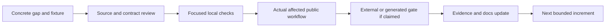

# Ferrule Compatibility and Product Roadmap

Updated: 2026-10-10

## Goal

Ferrule is an independent, portable data-mapping platform with an open project
model, a native visual editor, a CLI, host APIs, and generated Rust/C# libraries.
The goal is broad behavioral and workflow compatibility for applicable `.mfd`
designs while preserving Ferrule-native capabilities and public defaults.

Compatibility covers values, order, failures, artifacts, and external effects
for a specified format, feature, backend, platform, and workflow. Importing a
design or exporting it again does not establish all of those promises. The
[conformance inventory](conformance/README.md) remains incomplete; there is no
supported whole-product parity percentage.

Choose or claim an independent lane in [Parallel work](docs/parallel-work.md),
which links scoped issues, ownership, dependencies, and shared verification rules.

This roadmap is an execution plan. The complete earlier technical baseline and
scorecard are preserved in [the dated history](docs/compatibility-baseline.md).

## Current Baseline

Status snapshot: 2026-10-10 10:53:09 UTC, against merged main
[`0c7b2ca`](https://github.com/DeandreT/ferrule/commit/0c7b2ca080ac5855230ae6cc4b7f78c53b628dd2).
The [live coordination issue](https://github.com/DeandreT/ferrule/issues/89) tracks
later ownership and qualification changes. This two-document refresh is
[#299](https://github.com/DeandreT/ferrule/issues/299). The preceding
[#271](https://github.com/DeandreT/ferrule/issues/271) refresh merged in
[#280](https://github.com/DeandreT/ferrule/pull/280), with three successful hosted jobs. The earlier
[#252](https://github.com/DeandreT/ferrule/issues/252) snapshot merged in
[#255](https://github.com/DeandreT/ferrule/pull/255); its dependency maps remain dated views.
Memory-study [#249](https://github.com/DeandreT/ferrule/pull/249) and host-policy
[#251](https://github.com/DeandreT/ferrule/pull/251) are merged with three successful
hosted jobs each. Selected JSON APIs and their test-comparator correction are
merged in [#262](https://github.com/DeandreT/ferrule/pull/262): all 229 independent
native/Rust/C# calls pass. Bounded generated C# X12 options are merged in
[#265](https://github.com/DeandreT/ferrule/pull/265). Both later PRs also have three
successful hosted jobs. The #248 allocation campaign has eight measurements,
eight independent verifiers and four trace decoders accepted. Its report source and
one full rendered diagram are independently reviewed; the bounded report is
merged in [#279](https://github.com/DeandreT/ferrule/pull/279), with three successful hosted jobs.

#203's fixtures are merged in [#266](https://github.com/DeandreT/ferrule/pull/266),
with all three hosted jobs successful. The 24 public interpreter comparisons,
51 typed export refusals and 237 interchange library tests pass; fresh combined-
main 24+51 checks, workspace strict warnings and formatting pass. The test-only
parent-envelope correction #264 is closed. No faithful saved form is admitted.
The selected JSON guide [#270](https://github.com/DeandreT/ferrule/pull/270) is merged
in this main, closing #261. All three hosted jobs and fresh combined-main strict
warnings and formatting pass. Issue/PR observations were fetched individually;
they are not a claim that all remote state was observed simultaneously.

#263's earlier 41 simulated controller-policy controls remain separate from
#268's independently accepted 126 XML-oracle observations: 68 helper, 41 byte
compatibility and 17 admission checks. After the read-only staging correction
[#281](https://github.com/DeandreT/ferrule/issues/281), a saved-metadata fixture
failed before its expected rejection; [#283](https://github.com/DeandreT/ferrule/issues/283)
corrected it, and the same 41+17 controls passed fresh runs. The unchanged helper's
68 observations are inherited, not rerun or added to the distinct total.
The neutral [checkpoint report](docs/conformance/native-saved-design-reopen.md)
is merged in [#287](https://github.com/DeandreT/ferrule/pull/287), with three successful
hosted jobs. Read-only preparation passed, but the first native phase timed out at
180 seconds with a 398-byte XML artifact and no first save or reopen. Later read-only
#285 diagnostics also timed out; #291's presentation experiment refused its visible-UI
requirement. All 16 modeled query controls pass. The new read-only observer's
exception-path closure gap is tracked in [#302](https://github.com/DeandreT/ferrule/issues/302);
its correction is source-reviewed and all three exception models match in a completed
root-owned run, now independently accepted. These mocked branches do not
prove a live helper, thread or cleanup path; fresh observer qualification remains
pending. Live ownership/query/acknowledgment and native save/reopen
remain unproved. Source review and proven cleanup do not turn these retained negatives
into a completed native cycle.
#253's three tests / 11 internal controls, all 344 engine tests, ordinary engine
build and corrected workspace strict/format checks pass. The test-only let-chain
prerequisite [#277](https://github.com/DeandreT/ferrule/issues/277) preserves the original
warning failure and all observations. Both are merged in
[#278](https://github.com/DeandreT/ferrule/pull/278), with three successful hosted jobs.
The borrowed construction marker is not allocator telemetry or public/native parity.
#201's accepted corpus contains 28 controls (10 admitted and 18 refused), 87 snapshots
and 92 canvas tables. Three focused tests plan 29 duplication attempts. After #297
restored the locked dependency, [#298](https://github.com/DeandreT/ferrule/issues/298)'s
reviewed test-capture correction compiled and formatting passed. The first focused
unit then failed at an independent input edit: the Project changed to the new source,
but the test driver left the old canvas wire. The independently reviewed negative
retained nine primary local engine previews, zero named previews, two duplication
actions and 19 state records; 16 of 17 reached snapshot assertions matched before
the wire failure. [#300](https://github.com/DeandreT/ferrule/issues/300) corrects the
test driver's wire action and whole-checkpoint restoration;
[#301](https://github.com/DeandreT/ferrule/issues/301) corrects the frozen named-context
dispatch. The first paired source successor's type/module-path gaps and a later
pre-compilation invocation refusal remain separate from the actual wire failure.
The revised test-only source is independently reviewed, applied and formatted.
A fresh root-owned selected test now passes all ten admitted cases and all 67 local
engine previews (61 primary and six named), preserving the unchanged literals.
Independent review of those complete results is pending in this dated snapshot.
The refusal and keyboard tests, full GUI suite and two Main/Named physical sessions
with ten checkpoint pairs remain pending qualification here. Public-codec
materialization and all 29 modeled policy controls remain independently accepted.
#288's admitted child output route retained the complete ten-case run; later gates
still require fresh resource/source admission. These local engine previews do not
establish physical session or native saved/reopen parity.
No faithful new sequence saved
form is admitted. Earlier #173/#175, #182/#187 and #212/#215
snapshots remain historical records. This refresh preserves all three existing
Mermaid fence bodies and their earlier rendering/zoom limits; the current table
and prose dependencies do not establish a fresh render of those historical maps.
Compact GUI #194 and guidance #210
are merged in [#214](https://github.com/DeandreT/ferrule/pull/214). Fresh strict
warnings, formatting, one affected unit check and the production build pass;
earlier focused/full GUI and web-demo crate suites are retained separately.
Finite desktop inspection and editor-driven identity Rust/C# generation pass.
The two generated public String JSON calls each match the complete 172-byte
independent golden with normal owned host closure; earlier GUI parts needed owned
helper cleanup. Three earlier diagram fences rendered as three SVGs and six PNGs
with owned helper cleanup. The #212 final two parallel diagrams rendered as two SVGs
and four PNGs with owned helper cleanup; the unchanged roadmap fence reuses its
earlier rendered evidence. That historical current map needs scrolling or zoom at
1200 pixels, and the complete map's labels need zoom. All three hosted #214 jobs
ran zero validation steps because
of the account billing/spending restriction; those failures are not passes.

| Area | Available now | Boundary to keep visible |
| --- | --- | --- |
| Mapping | Typed graphs and scopes; nested iteration, filters, grouping, sorting, windows, aggregates, bounded ordered scalar filter/map sequences, multi-source inner joins, UDFs, dynamic properties, and ordered targets | Scalar sequence native/Rust/C# execution and the compact GUI increment are qualified in #190/#192/#193/#194; saved-design interchange, broader desktop workflows and general higher-order shapes remain separate |
| Error order | Global pre-target failure rules plus lazy, expression-owned Raise; bounded item-ordered XML exception import is explicit opt-in | Global and item-ordered failures are different; strict native export refuses unproved ordering |
| Native editor | Compact icons with full hover/details, primary/named/function canvases, undo/layout, Preview/Run/debugging, stage snapshots, and guarded import/export | Local widget tests do not establish every desktop chooser/platform workflow |
| Setup | Schema/layout import, CSV/fixed-width/FlexText/SQLite/Protocol Buffers setup, and flat XLSX worksheet settings | The flat workbook wizard does not author advanced hierarchical layouts |
| Formats | XML, JSON, JSON5, tabular, database, EDI, structured text, binary, and document adapters | Direction and exact subset are in [Supported formats](docs/formats.md); some adapters are input-only |
| JSON Schema | Per-resource reference policies, required-only object-reference siblings, exact intervals in String-or-Int and String-or-Float fields, signed-integer Float bound normalization, redundant scalar composition type siblings, and outer scalar composition bounds | Scalar domains and admission rules are in [Supported formats](docs/formats.md); broader compositions and restrictive intersections remain separately scoped |
| Generated libraries | Deterministic Rust and package-free C#; typed, strict JSON, eligible XML, explicit optional JSON5 or bounded flat CSV companions, [flat CSV input to singular X12](docs/code-generation.md#flat-csv-input-to-x12), and [static JSON/X12 selected-document companions](docs/design/generated-x12-csharp.md#static-named-documents-and-selected-output) | Every static endpoint retains its own admitted boundary; supported emission, compiled calls, physical resource checks, and external execution are separate gates |
| Large files | Per-boundary byte/item/work budgets, CSV temporary-row release and borrowed ordinary JSON output text | Input/target trees and output Strings remain materialized; the [historical output-set study](docs/performance/json-output-set-memory.md) and [matched writer comparison](docs/performance/borrowed-json-output-memory.md) establish no total-RAM cap or streaming |
| `.mfd` | Repair-oriented default import, strict executable admission, native/extension export profiles, bounded serial chains, and guarded multi-source joins | General stage graphs, unsupported contexts, and unknown profiles remain explicit |

See [Architecture](docs/architecture.md), [Code generation](docs/code-generation.md),
[Memory use](docs/memory-and-limits.md), and [`.mfd` interoperability](docs/mfd-interop.md)
for the contracts behind these summaries.

## Current Priorities

Check a box only when that specific gate has evidence. A checked implementation
box does not close its later desktop, generated, or external-runtime gates.

### 1. Complete the flat workbook user workflow

- [x] Add Source/Target workbook configuration over a flat imported schema:
  sheet, header/data row, physical columns, optional paths, and target headers.
- [x] Keep New Mapping usable in a small viewport with outer scrolling; cover
  real control interaction and saved format options in local tests.
- [x] Complete the normal Linux desktop schema-selection, configuration, and
  create/save/reopen workflow for an eight-field flat workbook fixture. Real
  file choosers, an ordinary GUI executable, 1200 × 800 / 1200 × 760 windows,
  and complete saved-project/layout comparisons are covered in the
  [desktop report](docs/qualification/flat-workbook-desktop-2026-10-08.md).
- [x] Retain failures and closure observations independently of the qualified
  [#92](https://github.com/DeandreT/ferrule/issues/92) desktop workflow, merged in
  [#132](https://github.com/DeandreT/ferrule/pull/132).

Exit: a user can choose both schemas, reach Configure/Create without an enlarged
viewport, save and reopen the mapping, and recover the same worksheet settings.
Physical workbook cell tests and desktop persistence are separate evidence.

### 2. Close exception-ordering and integer edge qualification

- [x] Keep global FailureRule semantics distinct from expression-owned Raise.
- [x] Reject unproved global failure ordering in strict native export before
  artifact publication, with a conservative useful total-expression subset.
- [x] Expose opt-in item-ordered import without changing the legacy default;
  preserve raw message positions separately from filtered target positions.
- [x] Admit the bounded transparent XML scope-variable shape only after exact
  owner, branch, schema, consumer, and position checks.
- [x] Replay nine strict saved signed-integer edge designs: three successful
  typed/content results and six exact global failure messages.
- [x] Qualify the corresponding generated public APIs with independent full
  typed/serialized results, lazy messages, and wrapper-cause checks.
- [x] Align required-property versus undeclared-property JSON failure precedence
  in native/Rust/C# direct runtime routes in
  [#171](https://github.com/DeandreT/ferrule/issues/171), merged in
  [#172](https://github.com/DeandreT/ferrule/pull/172). Thirty direct observations,
  affected native/Rust suites and all 178 C# smoke groups pass. The separate
  #169 compiled cohort passes its strict mapping witness and is merged in #174.
- [ ] Resolve native XML root schema annotations in
  [#93](https://github.com/DeandreT/ferrule/issues/93) and retain the separately
  observed failure-publication differences. Controls and saved metadata remain
  unobserved; the latest attempt refused before settings inspection.
- [ ] Expand accepted shapes only with a concrete owner/order proof and
  counterexamples for ambiguous, shared, or fallible branches.

Exit: each claimed profile binds original inputs, expected values or errors,
produced/partial artifacts, and saved-design replay. Native partial publication
and I/O remain separately reported; schema-conforming mapping totality is not
an unrestricted publication-parity promise.

### 3. Finish generated boundary cohorts

- [x] Add bounded flat-primary CSV companions for static named inputs and
  eligible per-driver typed dynamic loaders without changing ordinary APIs.
- [x] Qualify the bounded strict-imported item-ordered public-host cohort:
  14 cases across ten public routes in each of Rust and C#, with four fresh
  XML success writer oracles.
- [x] Verify the seven-design integer-edge cohort's original default formats
  and separate explicit XML adapters against actual emitted schemas and APIs:
  312 calls across Rust/C#, 28 hosts, and six fresh full writer oracles.
  `.xml` path hints alone do not enable XML companions.
- [x] Preserve exact names, wrapper causes, lazy failures, full output bytes,
  and complete original outcomes for those qualified cohorts.
- [x] Qualify static XML input combined bytes at 256 MiB and +1, with declared
  input census and per-document error precedence:
  [#116](https://github.com/DeandreT/ferrule/issues/116), merged in
  [#131](https://github.com/DeandreT/ferrule/pull/131).
- [x] Qualify document-list XML output combined bytes at 256 MiB and +1, retaining
  the failing member and original cause without returning partial results:
  [#117](https://github.com/DeandreT/ferrule/issues/117), merged in
  [#137](https://github.com/DeandreT/ferrule/pull/137).
- [x] Qualify actual XML loader callbacks at the 4,096-artifact boundary and the
  next reservation, refused before its callback:
  [#118](https://github.com/DeandreT/ferrule/issues/118), merged in
  [#138](https://github.com/DeandreT/ferrule/pull/138).
- [x] Qualify a lazy last-row mapping exception before admission of an otherwise
  4,097-artifact mixed XML output set:
  [#119](https://github.com/DeandreT/ferrule/issues/119), merged in
  [#139](https://github.com/DeandreT/ferrule/pull/139).

- [x] Keep direct Rust Program emission warning-free with unused expressions in
  [#157](https://github.com/DeandreT/ferrule/issues/157), merged in
  [#168](https://github.com/DeandreT/ferrule/pull/168). All 110 emitter tests, three
  warnings-denied generated hosts and 11 public calls pass; validation order and
  ordinary strict JSON output remain unchanged.
- [x] Run the finite required-only reference cohort in
  [#169](https://github.com/DeandreT/ferrule/issues/169) after #100/#170 and
  #171/#172: 183 native observations and all 297 Rust / 297 C# public and typed
  calls pass across nine profiles, 16 mappings and 66 cases. Complete outcomes,
  text/byte routes and the strict error-order witness pass; earlier compiler
  and authored expected-text failures are retained separately. Scoped strict lint passes.
- [x] Complete #169's 23 owning CLI checks, scoped strict lint, formatting and
  original-outcome capture controls, merged in
  [#174](https://github.com/DeandreT/ferrule/pull/174). Fourteen harness controls
  retain complete originals, including 13 intentional mismatches and a later
  valid control. This closes #100's generated acceptance for the exact subset;
  broader profiles remain separate. Hosted jobs executed no validation steps
  because of the account billing/spending-limit restriction.

- [x] Qualify generated Rust scalar filter/map execution in
  [#192](https://github.com/DeandreT/ferrule/issues/192), merged in
  [#206](https://github.com/DeandreT/ferrule/pull/206): 188 public calls and 30
  separately reported direct runtime controls pass across 40 compiled profiles
  and seven static/decode controls. All 365 library tests, three legacy compiled
  regressions and seven local gates pass; original compiler/lint failures remain
  retained.
- [x] Qualify generated C# scalar filter/map execution in
  [#193](https://github.com/DeandreT/ferrule/issues/193), merged in
  [#208](https://github.com/DeandreT/ferrule/pull/208): 172 public calls across 43
  profiles, 35 separate direct controls, 432 library tests and 179 C# smoke groups
  pass through eight local steps. Eager stage order, captures, positions, limits,
  cancellation and complete typed causes are bounded to the admitted contract.
- [x] Fix filtered legacy Rust sequence aggregate generation in
  [#199](https://github.com/DeandreT/ferrule/issues/199), merged in
  [#209](https://github.com/DeandreT/ferrule/pull/209): the original argument-type
  compiler failure is retained; 15 independent native observations, 45 compiled
  typed/text/byte calls, 114 Rust tests and six local steps pass. Native values
  are independently compared, not used to manufacture generated expectations.
- [x] Qualify additive generated typed target selection in
  [#198](https://github.com/DeandreT/ferrule/issues/198), merged in
  [#219](https://github.com/DeandreT/ferrule/pull/219): all 90 independent
  native/Rust/C# comparisons, 435 owning library tests, three existing compiled
  regressions and exact-manifest, strict-warning and formatting checks pass.
  Complete static named-input admission and global failure rules remain enforced;
  selected construction and dynamic loaders stay lazy, with shared counters.
  Ordinary all-output APIs remain available. Selected JSON overloads are #218;
  JSON5 selection and GUI integration remain outside this increment.
- [x] Qualify the test-only artifact-retention change in
  [#205](https://github.com/DeandreT/ferrule/issues/205), merged in
  [#216](https://github.com/DeandreT/ferrule/pull/216): five matched tests and
  two intentional failing-comparison controls retain complete originals. Raw logs
  change from 137,823,450 to 124,980 bytes; retained files change from 876,481 to
  6,110,354 bytes. Two admission logs increase. These are log/file observations,
  not memory savings, and unrecorded historical error details are not inferred.
- [x] Repair the hosted nightly lint findings in
  [#220](https://github.com/DeandreT/ferrule/issues/220)/[#222](https://github.com/DeandreT/ferrule/pull/222),
  then the exact generated C# test inventories and opt-in successful retention in
  [#223](https://github.com/DeandreT/ferrule/issues/223)/[#228](https://github.com/DeandreT/ferrule/pull/228) and
  [#225](https://github.com/DeandreT/ferrule/issues/225)/[#229](https://github.com/DeandreT/ferrule/pull/229).
  Original mapping-job failures remain retained; the latter PRs each have three
  successful hosted jobs. This maintenance changes no mapping semantics.
- [x] Qualify the three older generated CLI wrappers' shared-cache and retained-original
  behavior in [#217](https://github.com/DeandreT/ferrule/issues/217): nine helper controls,
  three paired Rust/C# regressions, three default-cleanup repeats and three
  intentional configuration refusals pass. The dedicated host cache grows by
  93,835,264 bytes; no duplicate cache is required. Merged in
  [#251](https://github.com/DeandreT/ferrule/pull/251) after #249; all three hosted
  jobs succeed. Existing default isolation and production behavior remain unchanged.
- [x] Qualify selected-target JSON boundary APIs in
  [#218](https://github.com/DeandreT/ferrule/issues/218), merged in
  [#262](https://github.com/DeandreT/ferrule/pull/262). All 229 independently checked
  calls pass: 76 native, 76 Rust and 77 C#, across the frozen 40 recipes.
  Public JSON results precede separately labeled decoded-wire observations;
  schema/name, UTF-8, static admission, lazy loaders and existing limits remain
  explicit. The original 15 C# comparator mismatches (11 small and four size
  controls) remain failures; the test-only structured-error-detail correction
  [#257](https://github.com/DeandreT/ferrule/issues/257) is qualified in the same merge.
  JSON5, filesystem/GUI selection and resource-policy expansion remain excluded.
- [x] Publish the API guide in [#261](https://github.com/DeandreT/ferrule/issues/261)/
  [#270](https://github.com/DeandreT/ferrule/pull/270). Independent source and diagram
  visual review, all three hosted jobs and fresh combined-main strict/format checks pass.
  The guide owns only [Code generation](docs/code-generation.md), not another API increment.

These new sequence cohorts retain their own finite profiles and complete original
failures. They do not close broader desktop workflows, external saved-design
execution or whole-product compatibility gates. Earlier hosted jobs for the
sequence increments ran zero validation steps under a billing/spending restriction;
those failures remain distinct from later jobs. Hosted execution has resumed:
[#228](https://github.com/DeandreT/ferrule/pull/228), [#229](https://github.com/DeandreT/ferrule/pull/229) and
[#238](https://github.com/DeandreT/ferrule/pull/238) each have three successful jobs.
Other earlier mapping-job failures remain retained; pending PRs are not passes.

The four XML public-host cohorts above include small prerequisites and
separate opt-in boundary runs. The [XML qualification index](docs/generated-xml-qualification-index.md)
and [memory observations](docs/memory-and-limits.md#compiled-xml-host-observations)
were refreshed in [#133](https://github.com/DeandreT/ferrule/issues/133), merged in
[#147](https://github.com/DeandreT/ferrule/pull/147). Helper-only checks, external
execution, other designs, and a universal RAM guarantee remain separate.

Exit: compiled public calls agree with independent oracles under their declared
adapter profile. Neither a lowering pass nor one host cohort certifies every
survey design or backend.

### 4. Resolve JSON5 native metadata before widening export

- [x] Support bounded local JSON5 parsing and output while retaining typed
  JSON-schema mapping behavior.
- [ ] Observe the external application's JSON5 setting and saved metadata in
  isolated checkbox and filename controls.
- [ ] Identify an exact import/export representation before changing admission.
- [x] Keep ordinary generated JSON adapters strict JSON; JSON5 uses separate
  explicit eligible APIs and tests.
- [x] Add bounded pure syntax normalization for Rust in
  [#134](https://github.com/DeandreT/ferrule/issues/134)/
  [#140](https://github.com/DeandreT/ferrule/pull/140) and package-free C# in
  [#136](https://github.com/DeandreT/ferrule/issues/136)/
  [#146](https://github.com/DeandreT/ferrule/pull/146). The shared authored cases
  and focused scaled-limit controls pass; generated adapters and default large
  resource caps are separate gates. Unquoted identifiers use the initial ASCII
  subset; Unicode identifier membership remains
  [#135](https://github.com/DeandreT/ferrule/issues/135).
- [x] Complete shared closed-object eligibility in
  [#141](https://github.com/DeandreT/ferrule/issues/141) with its descriptor
  duplicate guard [#148](https://github.com/DeandreT/ferrule/issues/148), merged
  together in [#151](https://github.com/DeandreT/ferrule/pull/151). Focused and
  complete affected policy checks, formatting and strict warnings pass. The
  [companion contract](docs/generated-json5-contract.md) keeps ordinary codecs
  and lowering unchanged; this policy does not enable generated public APIs.
- [x] Add explicit opt-in Rust and C# companions against the committed policy in
  [#142](https://github.com/DeandreT/ferrule/issues/142), merged in
  [#153](https://github.com/DeandreT/ferrule/pull/153), and
  [#143](https://github.com/DeandreT/ferrule/issues/143), merged in
  [#155](https://github.com/DeandreT/ferrule/pull/155). Their local codec/emitter
  checks preserve ordinary strict JSON APIs and default artifact sets.
- [x] Add explicit CLI generation and qualify all 184 small compiled public calls
  in [#144](https://github.com/DeandreT/ferrule/issues/144), merged in
  [#156](https://github.com/DeandreT/ferrule/pull/156): 17 representation and six
  mapping/context cases across four routes per language. This public cohort is
  distinct from the 75-case pure syntax inventory.
- [x] Qualify all 48 opt-in physical byte-boundary calls in
  [#145](https://github.com/DeandreT/ferrule/issues/145), merged in
  [#159](https://github.com/DeandreT/ferrule/pull/159), after all 184 small
  prerequisites. Original input, normalized input and strict output exact/+1
  workloads retain full results, typed causes and normal process closure.
  Whole-host RSS observations are workload-specific, without a RAM ceiling
  or streaming guarantee.

- [x] Reject nonfinite native JSON5 tokens before nullable projection in
  [#130](https://github.com/DeandreT/ferrule/issues/130), merged in
  [#164](https://github.com/DeandreT/ferrule/pull/164). All 190 native controls,
  58 CLI calls and the full affected suite pass. The original nullable witness
  and corrected outcomes are retained; legitimate null and finite values remain
  distinct from nonfinite tokens, including ignored or overwritten members.
- [x] Count original native JSON5 input bytes, including the leading BOM, on both
  file and text routes in [#163](https://github.com/DeandreT/ferrule/issues/163),
  merged in [#167](https://github.com/DeandreT/ferrule/pull/167). All 45 small
  controls and eight serial physical exact/+1 calls pass. This qualifies the
  input-byte boundary, without a process-memory or streaming guarantee.

Generated companions and native metadata are independent contracts. The
[guide refresh](https://github.com/DeandreT/ferrule/issues/154) is merged in
[PR #161](https://github.com/DeandreT/ferrule/pull/161), including the measured
whole-host memory ranges. The initial generated companion scope in
[#96](https://github.com/DeandreT/ferrule/issues/96) is complete and closed.
Separate allocation attribution in
[#160](https://github.com/DeandreT/ferrule/issues/160) is available, with no
production optimization included. Native token admission and original-byte
accounting are now separately qualified in #130/#163; generated-host evidence
does not establish native component metadata or desktop behavior. The JSON5
metadata lane [#106](https://github.com/DeandreT/ferrule/issues/106) remains open.

Exit: a self-authored fixture demonstrates metadata, values, errors, and a saved
round trip. A `.json5` filename is not enough to infer a native component flag.

### 5. Deepen memory and authoring coverage without changing contracts

- [x] Release ordinary CSV temporary formatted rows without adding a filesystem
  64 MiB output cap or changing validation/publication order.
- [x] Document materialization and route-specific limits rather than a universal
  memory ceiling.
- [x] Release filesystem inputs and dynamic-source caches after evaluation and
  the publication check, before selected/all-target serialization.
- [x] Add searchable mapping-path, main-mapping-path, and stable run-time values
  to primary, named-target, and function canvases, with compact presentation,
  edit locks, history, and checked node-ID allocation.
- [x] Author computed source-property reads from supported open scalar objects
  on primary and named-target canvases, with compact icons, explicit object
  selection, real wire interactions, edit locks, and undo/redo.
- [x] Author current-document-path reads for primary local XML file sets on
  primary and named-target canvases, with compact presentation, real wiring,
  exact resolved/portable path behavior, edit locks, and undo/redo.
- [x] Author XML text serialization from supported primary source groups, with
  an explicit source picker, compact presentation, real wiring and settings,
  preserved imported metadata, edit locks, and undo/redo.
- [x] Author computed-value Aggregate editing for primary and named-target
  canvases, with an explicit per-item value mode, preserved stored fields,
  and separate parent-context delimiter/index inputs.
- [x] Qualify the local computed-value Aggregate controls, real wiring, edit locks,
  node-ID refusal, undo/redo, saved projects, and Preview; retain eager Count
  and Item at error controls and parent-argument context checks.
- [x] Record matched many-row and wide-row trials for input lifetime under a
  normal debug profile, retaining both repeats, full outputs and regressions;
  [report the workload-dependent results](docs/performance/filesystem-input-lifetime-2026-10-07.md).
- [x] Independently review the bounded JSON output-set benchmark design in
  [#107](https://github.com/DeandreT/ferrule/issues/107): many small rows and one
  wide value, one versus primary-plus-named outputs, and two matched repetitions.
- [x] Complete #107's eight normal-development-profile filesystem measurements,
  eight separate verifiers and twelve complete output-document comparisons,
  merged in [#185](https://github.com/DeandreT/ferrule/pull/185). The
  [individual-run report](docs/performance/json-output-set-memory.md) records
  120.3–194.6 MiB process peaks and four matched second-output increases of
  31.2–39.4 MiB, with original outcomes and normal closure. Two workloads and
  two repetitions establish neither statistical significance nor a RAM cap.
  All three hosted jobs executed zero validation steps because of the account
  billing/spending restriction; local qualification remains separate.
- [x] Remove the ordinary JSON writer's intermediate owned `serde_json::Value`
  tree in [#184](https://github.com/DeandreT/ferrule/issues/184), merged in
  [#200](https://github.com/DeandreT/ferrule/pull/200), while preserving the returned
  pretty String, APIs, exact bytes, validation/errors and publication. All 398
  scoped regression tests and 126 complete writer-comparison calls pass.
  The [matched report](docs/performance/borrowed-json-output-memory.md) retains
  eight fresh original/candidate comparisons and separate verifiers: process
  peaks are 8.7–40.4 MiB lower only for these fixtures. Container metadata and
  validation snapshots can still allocate; this is neither allocation-exclusive
  attribution, a RAM ceiling nor streaming. Engine targets, input parsing,
  JSON5, generated runtimes and allocator policy remain unchanged.
- [x] Qualify local Value map **Input conversion** editing on main, named-target,
  and function canvases: preserve typed imported tables/defaults and compact
  geometry; check all five choices, locks, history, save/reopen, and Preview.
  Four interaction groups and the full 703-test GUI suite pass, along with
  formatting, fresh workspace warning checks, and the normal GUI build. That
  input-conversion increment kept edited cells as text; typed-cell authoring is
  the separate #97 increment below.
- [x] Add and locally qualify **Computed properties** editing for singular
  ordinary JSON target objects with String, Int, Float, or Bool additional
  values on main and named-target canvases, including static constructed
  descendants. Preserve ordered names/values and read-only unsupported imported
  shapes; check real controls, locks, history, save/reopen, and Preview.
  Six interaction groups and the full 709-test GUI suite pass, along with
  formatting, fresh workspace warning checks, and the normal GUI build.
  Normal desktop workflow and broader target shapes remain pending.
- [x] Preserve finite project Float bits and align generated C# JSON rounding
  in the separate [#111](https://github.com/DeandreT/ferrule/issues/111)/
  [#112](https://github.com/DeandreT/ferrule/issues/112) increment, merged in
  [#120](https://github.com/DeandreT/ferrule/pull/120). Focused persistence and
  boundary checks, generated public hosts, C# runtime smoke, full workspace
  tests, fresh lint, formatting, and the normal build pass. Other Value map,
  desktop, and metadata gates remain separate.
- [x] Complete the separate Value map conversion/null increments: isolated integer
  conversion in [#91](https://github.com/DeandreT/ferrule/issues/91), merged in
  [#123](https://github.com/DeandreT/ferrule/pull/123), and ordinary declared
  JSON-null matching in [#113](https://github.com/DeandreT/ferrule/issues/113),
  merged in [#126](https://github.com/DeandreT/ferrule/pull/126). Preserve their
  distinct contexts and complete interpreter/generated outcomes; the ordinary
  compiled mapping control already passed before the direct-helper correction.
- [x] Preserve enabled absent Value map defaults through save/reload and history
  in [#114](https://github.com/DeandreT/ferrule/issues/114), merged in
  [#127](https://github.com/DeandreT/ferrule/pull/127). Legacy missing/null defaults
  keep their disabled meaning; older readers may reject the new absent marker.
- [x] Qualify typed String, Int, finite Float, Bool and absent table/default editing
  in [#97](https://github.com/DeandreT/ferrule/issues/97), merged in
  [#128](https://github.com/DeandreT/ferrule/pull/128) after #91/#114. Local controls
  preserve imported values, prevent invalid draft commits, and check locks,
  history, save/reopen, Preview and compact geometry. Normal desktop authoring
  remains a separate gate.
- [x] Complete local and normal desktop setup for the primary transposed workbook
  source in [#98](https://github.com/DeandreT/ferrule/issues/98), merged in
  [#150](https://github.com/DeandreT/ferrule/pull/150). Local wizard regressions,
  formatting and warning checks pass. The six-phase desktop create/save/reopen
  workflow at 1200 × 800 / 1200 × 760 passes complete Project comparisons and
  saved/reopened body equality. Workbook execution was checked separately in
  local tests; desktop execution, hierarchical and named-source setup are not
  claimed.
- [x] Keep absent browser target-binding endpoints disconnected in
  [#165](https://github.com/DeandreT/ferrule/issues/165), merged in
  [#166](https://github.com/DeandreT/ferrule/pull/166). All eight layout cases,
  38 browser-crate tests and the release WebAssembly build pass; complete
  Projects and valid target-input indexes remain unchanged.
- [x] Merge bounded browser history in
  [#99](https://github.com/DeandreT/ferrule/issues/99)/
  [#178](https://github.com/DeandreT/ferrule/pull/178) after 43 web tests and a
  fresh WebAssembly build, preserving applied-project, draft-text and
  source/output boundaries.
- [x] Qualify #99's finite edit/apply/undo/redo and download workflow with
  132 native browser commands and 34 GUID-completed downloads. Thirty-two
  public-helper matches pass; two original helper refusals remain retained and
  their compact draft downloads qualify separately by complete-byte comparison.
  The campaign does not claim exit 0 or helper passes for those two. Owned
  descendant cleanup was needed; final closure was proven.
- [x] Collapse only an exact retained coalescing baseline in
  [#177](https://github.com/DeandreT/ferrule/issues/177), merged in
  [#179](https://github.com/DeandreT/ferrule/pull/179). All 45 web tests, scoped
  strict lint and formatting pass; discarded redo and distinct focus sessions
  remain explicit. This increment does not claim a fresh browser campaign.
- [x] Display the applied target schema name in
  [#176](https://github.com/DeandreT/ferrule/issues/176), merged in
  [#181](https://github.com/DeandreT/ferrule/pull/181). All 45 web tests and fresh
  WebAssembly pass; 24 actual native browser commands and two complete typed
  and byte-checked downloads qualify applied titles in wide/compact views.
  Owned descendant cleanup was needed; final closure was proven.
- [x] Qualify Fit against measured whole-node bounds in
  [#180](https://github.com/DeandreT/ferrule/issues/180), merged in
  [#195](https://github.com/DeandreT/ferrule/pull/195): 54 unique web tests, fresh
  WebAssembly, 12 wide/compact Fit checkpoints, 66 browser commands and two
  complete checked downloads pass. Only the view transform changes; Project,
  bindings, wires and saved positions stay intact. Owned cleanup was needed
  before final closure; normal closure was false. Earlier failures are retained.
- [x] Independently review the 21-role compact scalar sequence editor source in
  [#194](https://github.com/DeandreT/ferrule/issues/194), including the one-sentence
  generation guidance correction [#210](https://github.com/DeandreT/ferrule/issues/210).
  Both are merged in [#214](https://github.com/DeandreT/ferrule/pull/214). The narrow
  correction for two absent test-fixture wires preserves every strict snapshot
  assertion; the exact properties test passes all three consumers.
- [x] Complete #194's earlier 20 focused checks, 742 GUI tests and 31 web-demo
  crate tests. Final source passes fresh workspace strict warnings after 454
  required source timestamp refreshes, formatting, one affected unit check already
  in the 742-test suite, and the fresh production build. Repeated checks do not
  increase unique test totals; crate tests are distinct from actual browser UI.
- [x] Observe current-item properties at 1200 × 900 and responsive scope selection
  from 900 × 700 to 1200 × 900 on the identity mapping. Those finite desktop parts
  exit 0 with owned helper cleanup; they do not establish correct compact Fit.
- [x] Generate identity Rust and C# libraries through the ordinary editor dialog.
  Both finite generation parts exit 0 with owned helper cleanup.
- [x] Qualify one public String JSON call per generated identity library against
  the complete independently authored 172-byte golden. All five host commands
  exit 0 with normal owned closure and no cleanup. This is an identity fixture
  check, separate from the GUI parts' cleanup observations.
  Local native/Preview recipe checks and these finite desktop/host parts do not
  qualify all 13 physical workflows or all 39 design cases. Broader pointer,
  save/reload and history coverage remains separate. Constant-7 controls do not
  prove real parent-frame positions. Independent document copies are in scope;
  same-project duplication is #201.
- [ ] Qualify the accepted atomic sequence-consumer duplication proposal in
  [#201](https://github.com/DeandreT/ferrule/issues/201), assigned to DeandreT. The frozen
  contract has 28 controls (10 admitted and 18 refused), 87 snapshots and 92 canvas
  tables. Three focused tests plan 29 duplication attempts. #298's accepted capture
  compiled; the first focused unit retained nine primary previews and two duplication
  actions before its test driver left a stale canvas wire. #300's wire/checkpoint
  correction and #301's named dispatch are reviewed, applied and formatted; their
  source negatives and a later invocation refusal are preserved separately.
  A fresh root-owned selected test passes all ten admitted cases and 67 local engine
  previews (61 primary / six named), with independent result review pending as of this
  snapshot. Refusal, keyboard, full GUI and two Main/Named physical sessions with ten
  checkpoint pairs remain pending qualification here.
  Codec materialization and modeled policy 29 pass independently. The source is adopted
  on a separate feature branch, preserving #213's Fit hooks; #288's admitted child route
  retains the completed ten-case originals and needs fresh admission for later gates.
  General clipboard and arbitrary graph copying are excluded.
- [x] Qualify the test-only GUI frame diagnostic change in
  [#211](https://github.com/DeandreT/ferrule/issues/211), merged in
  [#232](https://github.com/DeandreT/ferrule/pull/232): the same 20 tests retain
  complete mapping outcomes and control evidence while logs change from 538.6 MB
  to 23.6 MB (95.6%). This is a log-size comparison, separate from process memory
  and production behavior.
- [x] Fit complete desktop node bounds in
  [#213](https://github.com/DeandreT/ferrule/issues/213), merged in
  [#238](https://github.com/DeandreT/ferrule/pull/238): nine focused Fit tests,
  the popup regression, all 749 GUI tests, fresh strict warnings, formatting and
  the production build pass. Four finite alternate-display parts cover main,
  named, single and empty views at 900 × 700 / 1200 × 900 without saved-data changes.
  GUI processes close normally; private bus helpers need owned cleanup. Browser
  Fit, factories/icons, model/history and broader authoring remain separate.

- [ ] For every new wizard, verify ordinary viewport reachability and normal
  desktop save/reopen, as well as state-method tests.

Exit: a change remains usable and contract-compatible, with measurements limited
to the recorded route/profile and no inferred streaming or universal benefit.

## Workstreams

### 0. Versioned Conformance and Compatibility Profiles

- [x] Publish a separate JSON object-schema proposal and validate its independent
  operation/profile/dimension cells in
  [#94](https://github.com/DeandreT/ferrule/issues/94), merged in
  [#129](https://github.com/DeandreT/ferrule/pull/129): 48 Unverified, 176 Unassessed
  and no Supported cells. The protected survey and incomplete-inventory status
  are unchanged; this is not a capability promotion.
- [ ] Complete the applicable inventory before a whole-profile claim.
- [ ] Track import, interpreter, external export execution, self-roundtrip,
  GUI/debugging, and each generated backend independently.
- [ ] Record schema dialect, platform, runtime, driver, and application version.
- [ ] Keep unknown, blocked, partial, and unsupported cells explicit.

### A. Mapping Semantics and Interoperability

- [x] Expose single-project CLI executable import admission independently of
  row-error-order semantics, with refusal before destination publication in
  the [MFD import contract](docs/mfd-interop.md#import).

#### A1. Executable `.mfd` Common Profile

- [x] Support nested cloned target groups with unique declared ancestor owners
  and exact binding provenance in [#239](https://github.com/DeandreT/ferrule/issues/239),
  following the [import contract](docs/mfd-interop.md). Unequal child partitions
  retain declaration order and relative anchors; every replaced placeholder
  binding survives exactly once in its assigned descendant subtree, with one
  original binding index per retained binding. Unknown ownership, ambiguous
  provenance, unclaimed or controlled placeholders retain refusal. Singular
  targets with multiple distinct feeds require the separate semantic contract
  in [#241](https://github.com/DeandreT/ferrule/issues/241).
- [ ] Extend one concrete supported-path mismatch at a time, with a self-authored
  triggering design and preserved refusal controls.
- [x] Support standard GUID text formatting in
  [#269](https://github.com/DeandreT/ferrule/issues/269), with strict ASCII-hex
  admission, preserved case, native saved-function round trips, and complete
  native/generated value and error contracts.
- [x] Retain modern required-only object reference siblings natively in
  [#100](https://github.com/DeandreT/ferrule/issues/100), native increment merged in
  [#170](https://github.com/DeandreT/ferrule/pull/170). Seven focused groups and
  388 JSON tests pass, with one existing physical-resource test ignored. Proven
  object/object-null profiles preserve ordered presence and each resource's
  dialect; unsupported assertions, shapes and undeclared new names still refuse.
  Required lists and merged sets are bounded to 256 only in this admitted subset.
  Generated qualification #169 is merged in #174, completing #100's exact
  native/generated subset; general composition boundaries remain open.
- [x] Qualify the exact String-or-Int IntegerRange contract in
  [#101](https://github.com/DeandreT/ferrule/issues/101), merged in
  [#183](https://github.com/DeandreT/ferrule/pull/183): three IR and four native
  groups, 202 direct calls per language and all 179 C# smoke groups pass.
  String behavior and strict Contains remain independent of integer intervals.
- [x] Complete #101's seven-mapping compiled cohort: all 152 text/byte calls,
  including named input/output success and refusal cases, match full oracles.
  All 797 affected Rust checks, scoped warnings and formatting pass, with one
  existing resource test ignored. The original native error-text oracle failure
  and its source-reviewed correction remain retained; the optional full catalog
  cancellation and hosted zero-step billing failures are separate. Broader
  scalar-union profiles remain unsupported or independently scoped.
- [ ] Close remaining XML root/type/namespace and JSON composition boundaries
  only when the IR can preserve them exactly.
- [ ] Preserve repair imports and legacy extension round trips while keeping
  strict executable/native admission atomic.

#### A2. N-to-M Endpoint and Stage Model

- [ ] Extend beyond the bounded serial-chain/native fan-out profile with exact
  driver, schema, owner, and stage-priority evidence.
- [ ] Add general service-host and stage-graph import/export incrementally.
- [ ] Preserve applied stage snapshots, local draft history, path rebasing,
  cancellation, and main-project independence. The GUI already edits stage
  mappings; general imported graph shapes remain the open boundary.

#### A3. Functions and Reusable Mappings

- [ ] Extend catalog-backed functions and reusable contexts with matching
  validation, interpreter, Rust, C#, and authoring contracts.
- [x] Publish the reviewed bounded scalar-sequence contract and all 39 complete
  proposed literals in [#102](https://github.com/DeandreT/ferrule/issues/102),
  merged in [#188](https://github.com/DeandreT/ferrule/pull/188). The
  [design](docs/design/scalar-sequence-composition.md) and
  [literal corpus](docs/design/fixtures/scalar-filter-map-v1.json) contain 37
  feature cases and two legacy controls. Design approval alone is not execution
  evidence; general higher-order/nested collections are excluded.
- [x] Merge guarded model/codec/ownership admission in
  [#189](https://github.com/DeandreT/ferrule/issues/189)/
  [#197](https://github.com/DeandreT/ferrule/pull/197): 1,759 distinct scoped
  regressions pass. Both private owners, ordered captures, stage signatures,
  legacy serialization and typed unsupported guards remain explicit.
- [x] Execute the admitted scalar sequence natively in
  [#190](https://github.com/DeandreT/ferrule/issues/190)/
  [#202](https://github.com/DeandreT/ferrule/pull/202): all 37 frozen feature cases,
  two legacy controls and 1,011 distinct scoped regressions pass. Captures run
  once in order, selected mappers remain lazy within eager construction, and
  output positions are dense. Feature-specific shared item/work counters and
  cancellation do not impose a RAM or wall-time bound on legacy execution.
- [x] Retain stage UDF roots and private contexts in common lowering in
  [#191](https://github.com/DeandreT/ferrule/issues/191)/
  [#204](https://github.com/DeandreT/ferrule/pull/204): 62 complete comparisons and
  497 distinct library tests pass. This common qualification remains separate
  from the compiled Rust/C# cohorts recorded above.
- [x] Align ordinary and nested generated scalar-UDF argument error order in
  [#186](https://github.com/DeandreT/ferrule/issues/186)/
  [#196](https://github.com/DeandreT/ferrule/pull/196): all 18 compiled calls per
  language match frozen expectations after the original four mismatches per
  language were retained. Evaluate all arguments left to right before adaptation;
  interpreter/coercion/frame policy is unchanged.
- [x] Qualify eager ordered Boolean calls with at least two operands in
  [#237](https://github.com/DeandreT/ferrule/issues/237)/[#245](https://github.com/DeandreT/ferrule/pull/245).
  Zero/one-operand calls still refuse; broader nullable logical semantics and
  external equivalence remain separate.
- [ ] Define explicit same-scope singular-target multiple-feed semantics in
  [#241](https://github.com/DeandreT/ferrule/issues/241) before admitting them. Preserve
  distinct expressions and the existing duplicate-binding refusal; #239's
  declared ancestor branches do not supply an inferred winner.
- [x] Qualify #203's 24 independently authored public interpreter observations
  and 51 separate typed export refusals. All 237 interchange library tests,
  workspace strict warnings and formatting pass on the focused fixture candidate.
  [#264](https://github.com/DeandreT/ferrule/issues/264) corrects only the physical
  parent-position test envelope; the original failed run and frozen oracles remain.
- [x] Publish those fixtures in [#266](https://github.com/DeandreT/ferrule/pull/266).
  All three hosted jobs and fresh combined-main 24+51 / strict / format checks pass;
  #264 is closed. Repeated fixture runs do not increase the distinct totals.
- [ ] Define a faithful saved form in [#203](https://github.com/DeandreT/ferrule/issues/203).
  Public Ferrule observations and typed refusal do not establish external saved-
  design execution or save/reopen. Exact stage/capture/position/error preservation
  is required before importer/exporter implementation. XML annotations and JSON5
  metadata remain separate contracts.
- [x] Qualify #263's 13 simulated controller-policy groups / 41 subcases with
  independent expectations and complete failure retention. This is simulation,
  separate from its external owner's normal closure and any native application.
- [ ] Qualify one admitted native saved-file reopen/execute/save2 cycle in
  [#263](https://github.com/DeandreT/ferrule/issues/263), after complete independent
  XML oracles from [#268](https://github.com/DeandreT/ferrule/issues/268).
  #268's original 68 helper, 17 admission and 41 byte-compatibility observations
  pass independent review. #281's read-only staging and #283's saved-metadata fixture
  repairs preserve the failed controls; corrected 41+17 reruns pass, with helper 68
  inherited separately. The [checkpoint report](docs/conformance/native-saved-design-reopen.md)
  is merged in [#287](https://github.com/DeandreT/ferrule/pull/287). Native execution
  timed out before first save; #285 diagnostics and #291's presentation experiment
  retain separate negatives. Exact owned-window proof and the full save/reopen cycle
  remain pending. No filter/map seed or faithful saved form is inferred from XML parsing.
- [x] Qualify internal capture/stage/counter observations from #203's frozen fixture
  in [#253](https://github.com/DeandreT/ferrule/issues/253): three tests / 11 controls,
  all 344 engine tests, an ordinary engine build and corrected workspace strict/
  format checks pass locally. Complete original and corrected observations are
  independently accepted. The borrowed test-only sink preserves public APIs and
  budgets; its construction marker establishes code-path reach, not allocator telemetry.
- [x] Publish #253 with its single test-helper let-chain prerequisite
  [#277](https://github.com/DeandreT/ferrule/issues/277) in
  [#278](https://github.com/DeandreT/ferrule/pull/278), with three successful hosted jobs.
  The original strict-warning failure remains retained; these internal checks do not
  establish public/native or saved-file parity.
- [x] Measure large captures and eager mapped outputs in
  [#207](https://github.com/DeandreT/ferrule/issues/207): all 72 measured native/Rust/C#
  runs and 72 separate complete verifiers pass. The
  [report](docs/performance/scalar-sequence-memory.md) retains both repetitions,
  36 matched pairs and whole-process counter limits. Allocation profiling is
  [#248](https://github.com/DeandreT/ferrule/issues/248); production optimization,
  new resource policy, streaming and universal memory claims remain outside this study.
  Merged in [#249](https://github.com/DeandreT/ferrule/pull/249). Its Linux-only
  observation guard [#242](https://github.com/DeandreT/ferrule/issues/242) and study-workspace
  packaging repair [#246](https://github.com/DeandreT/ferrule/issues/246) are qualified within
  that increment; other-platform execution is not claimed.
- [x] Complete #248's finite generated C# allocation campaign using #207's
  merged fixtures: eight measurements, eight independent output verifiers and
  four post-closure trace decoders are independently accepted. Both numeric and
  large-capture repetitions retain complete outputs and sampled allocation stacks.
- [x] Publish [#248](https://github.com/DeandreT/ferrule/issues/248)'s bounded report in
  [#279](https://github.com/DeandreT/ferrule/pull/279), with three successful hosted jobs.
  Report source/data and one full rendered diagram are independently reviewed;
  the 100% viewport requires scrolling. Owned browser-helper cleanup was needed:
  closure is proven, but normal cleanup-free closure is not claimed. Allocation
  samples are not an exact object ledger; trace perturbation and whole-process RSS
  remain separate. No exact phase clock, peak/capture cause, production optimization
  or new budget is inferred.

### B. Visual Authoring and Debugging

- [ ] Cover supported advanced schemas/layouts with ordinary user-facing setup.
- [ ] Retain short readable summaries, full hover/details, reachable pins, and
  canvas positions as new nodes and controls are added.
- [ ] Deepen connector/source-row inspection and context-aware debugging using
  retained real inputs, not invented preview state.

### C. Connectors and Format Breadth

- [x] Inspect existing SQLite table and foreign-key metadata through read-only
  connections, with MFD fallback behavior and refusal of write-required recovery
  documented in the [metadata contract](docs/formats.md#sqlite-metadata-inspection),
  merged in [#233](https://github.com/DeandreT/ferrule/issues/233)/[#236](https://github.com/DeandreT/ferrule/pull/236).
  WAL shared-memory sidecars can still occur; read-only admission is not universal
  filesystem isolation.
- [ ] Add a typed query/write model before general database mutation modes.
- [ ] Extend adapters and transport only with confinement, cancellation,
  original-error, resource, and publication contracts.
- [ ] Keep input-only adapters and unsupported schema/configuration variants
  explicit in the format matrix.

### D. Generated Execution

- [x] Qualify opt-in bounded generated C# raw X12 004010 adapters in
  [#221](https://github.com/DeandreT/ferrule/issues/221)/[#226](https://github.com/DeandreT/ferrule/pull/226), and
  native fixed-width ISA output encoding in
  [#224](https://github.com/DeandreT/ferrule/issues/224)/[#230](https://github.com/DeandreT/ferrule/pull/230).
  Synthetic 940/JSON/945 controls remain separate from trading-partner certification;
  ordinary typed/JSON APIs and caller-supplied controls are preserved.
- [x] Qualify bounded generated C# 004010 format options in
  [#250](https://github.com/DeandreT/ferrule/issues/250), merged in
  [#265](https://github.com/DeandreT/ferrule/pull/265), with three successful hosted jobs.
  Directional parsing, inactive repetition metadata, Float implied decimals,
  lexical output and supplied-context completion preserve strict defaults and
  typed/JSON APIs. Repeated-element syntax, external I/O, durable
  control allocation and trading-partner certification remain excluded.
- [x] Support canonical generated C# `00501`/`005010` and `00604`/`006040`
  single-envelope scalar-element profiles in
  [#272](https://github.com/DeandreT/ferrule/issues/272), with exact declared version
  agreement and active ISA11 repetition delimiters. Repeated element values
  and implementation references require separate contracts.
- [x] Support explicit generated C# grouped transaction ownership in
  [#273](https://github.com/DeandreT/ferrule/issues/273): one interchange with
  declared repeated GS/GE and ST/SE owners, exact counts/controls and occurrence
  paths, and private supplied-context completion of declared trailer slots.
  The [envelope contract](docs/design/generated-x12-csharp.md#declared-grouped-envelopes)
  retains singleton defaults and whole-document limits.
- [ ] Grow compile-and-call coverage for applicable mappings and public adapters.
- [ ] Add other language/backend targets as independent implementations and
  gates; the current emitters are Rust and C#.

### E. Product, Packaging, and Automation

- [x] Retain actionable atomic-publication refusals in
  [#227](https://github.com/DeandreT/ferrule/issues/227)/[#231](https://github.com/DeandreT/ferrule/pull/231);
  no non-atomic fallback is added. MFD resource reads are confined through nested
  schemas and discovered modules in [#234](https://github.com/DeandreT/ferrule/issues/234)/
  [#243](https://github.com/DeandreT/ferrule/pull/243), and explicit single-project
  executable import admission is available in [#235](https://github.com/DeandreT/ferrule/issues/235)/
  [#240](https://github.com/DeandreT/ferrule/pull/240). Static admission is distinct
  from execution parity; pipeline profile combinations remain refused.
- [ ] Diagnose and repair the actual Pages deployment HTTP 404 in the available
  [#247](https://github.com/DeandreT/ferrule/issues/247) lane. The successful site build
  does not establish publication; workflow/configuration work stays separate from
  site content and mapping implementation.
- [ ] Package reproducible runtimes and examples with clear host boundaries.
- [ ] Design reusable libraries, projects, configuration, and automation without
  implying compatibility with another product's proprietary package format.
- [ ] Treat optional services and external server deployment as separately
  versioned profiles, not prerequisites for ordinary mapping.

## Release Gates

A broad milestone remains open until all its applicable cells are qualified.
Detailed historical exit criteria remain in the [recorded roadmap](docs/compatibility-baseline.md#release-gates).

| Gate | Evidence required |
| --- | --- |
| M0 — Measurable contract | Complete applicable inventory, independent evidence cells, and honest unknowns |
| M1 — Trustworthy native interchange | Strict import, local values/errors, export, external execution, and saved replay |
| M2 — General semantic foundation | Composable value/context/stage invariants and backward-compatible execution |
| M3 — Complete authoring and debugging | Real controls, locks/history, normal viewport, save/reopen, preview/run, and cancellation |
| M4 — Enterprise execution breadth | Applicable formats/connectors, external effects, rollback/faults, and measured resource envelopes |
| M5 — Full compatibility and product parity | All applicable generated and product-workflow cells qualified; blocked/unknown cells narrow the claim |

Failure at a gate keeps its original observations and narrows the claim; a
later correction does not erase the earlier result. See
[Development and verification](docs/development.md) for practical checklists.

## Compatibility Boundaries

- All checked-in fixtures are self-authored. External behavior and licensed
  resources remain separately controlled evidence, not copied repository data.
- Pixel-identical UI and byte-identical design serialization are not required;
  values, ordering, editable structure, failures, and applicable workflows are.
- Strict admission is useful only when it preserves the accepted semantics.
  Unsupported or unproved shapes must retain a typed refusal before publication.
- Ferrule-native capabilities stay available outside the strict native profile.
- Standard Boolean `and` and `or` calls accept two or more strict Bool operands
  with eager left-to-right evaluation and ordered type checking. The
  [variadic Boolean contract](docs/design/variadic-boolean-calls.md) keeps broader
  nullable logical compatibility separately qualified.
- A local round trip, a green test total, or a nearby qualified feature does not
  close an unknown capability or establish full-product compatibility.

## Scorecard

The [dated scorecard](docs/compatibility-baseline.md#scorecard) preserves earlier
cohort counts and limits. Current claims belong in their focused contracts and
versioned evidence cells; do not add unrelated totals or convert them into a
parity percentage.

## Primary References

Use the current source and focused contract documents linked above. The
[historical reference topics](docs/compatibility-baseline.md#primary-references)
remain preserved. Any external compatibility update must bind the exact
primary documentation and application version used for that update.
