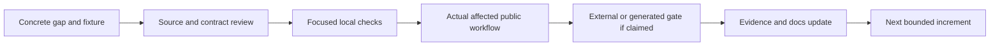

# Ferrule Compatibility and Product Roadmap

Updated: 2026-10-07

## Goal

Ferrule is an independent, portable data-mapping platform with an open project
model, a native visual editor, a CLI, host APIs, and generated Rust/C# libraries.
The goal is broad behavioral and workflow compatibility for applicable `.mfd`
designs while preserving Ferrule-native capabilities and public defaults.

Compatibility covers values, order, failures, artifacts, and external effects
for a specified format, feature, backend, platform, and workflow. Importing a
design or exporting it again does not establish all of those promises. The
[conformance inventory](conformance/README.md) remains incomplete; there is no
supported whole-product parity percentage.

This roadmap is an execution plan. The complete earlier technical baseline and
scorecard are preserved in [the dated history](docs/compatibility-baseline.md).

## Current Baseline

| Area | Available now | Boundary to keep visible |
| --- | --- | --- |
| Mapping | Typed graphs and scopes; nested iteration, filters, grouping, sorting, windows, aggregates, generated sequences, multi-source inner joins, UDFs, dynamic properties, and ordered targets | Each context and format has an explicit validation subset |
| Error order | Global pre-target failure rules plus lazy, expression-owned Raise; bounded item-ordered XML exception import is explicit opt-in | Global and item-ordered failures are different; strict native export refuses unproved ordering |
| Native editor | Compact icons with full hover/details, primary/named/function canvases, undo/layout, Preview/Run/debugging, stage snapshots, and guarded import/export | Local widget tests do not establish every desktop chooser/platform workflow |
| Setup | Schema/layout import, CSV/fixed-width/FlexText/SQLite/Protocol Buffers setup, and flat XLSX worksheet settings | The flat workbook wizard does not author advanced hierarchical layouts |
| Formats | XML, JSON, JSON5, tabular, database, EDI, structured text, binary, and document adapters | Direction and exact subset are in [Supported formats](docs/formats.md); some adapters are input-only |
| Generated libraries | Deterministic Rust and package-free C#; typed, strict JSON, eligible XML, and optional bounded flat CSV companions | Supported emission, compiled calls, and external execution are separate gates |
| Large files | Per-boundary byte/item/work budgets and CSV temporary-row release | Input/target trees and serialized buffers remain materialized; there is no total-RAM cap |
| `.mfd` | Repair-oriented default import, strict executable admission, native/extension export profiles, bounded serial chains, and guarded multi-source joins | General stage graphs, unsupported contexts, and unknown profiles remain explicit |

See [Architecture](docs/architecture.md), [Code generation](docs/code-generation.md),
[Memory use](docs/memory-and-limits.md), and [`.mfd` interoperability](docs/mfd-interop.md)
for the contracts behind these summaries.

## Current Priorities

Check a box only when that specific gate has evidence. A checked implementation
box does not close its later desktop, generated, or external-runtime gates.

### 1. Complete the flat workbook user workflow

- [x] Add Source/Target workbook configuration over a flat imported schema:
  sheet, header/data row, physical columns, optional paths, and target headers.
- [x] Keep New Mapping usable in a small viewport with outer scrolling; cover
  real control interaction and saved format options in local tests.
- [ ] Complete the normal desktop create/save/reopen workflow using real file
  choosers and an ordinary GUI executable; validate the saved complete project.
- [ ] Retain failures and closure observations independently of a later success.

Exit: a user can choose both schemas, reach Configure/Create without an enlarged
viewport, save and reopen the mapping, and recover the same worksheet settings.
Physical workbook cell tests and desktop persistence are separate evidence.

### 2. Close exception-ordering and integer edge qualification

- [x] Keep global FailureRule semantics distinct from expression-owned Raise.
- [x] Reject unproved global failure ordering in strict native export before
  artifact publication, with a conservative useful total-expression subset.
- [x] Expose opt-in item-ordered import without changing the legacy default;
  preserve raw message positions separately from filtered target positions.
- [x] Admit the bounded transparent XML scope-variable shape only after exact
  owner, branch, schema, consumer, and position checks.
- [x] Replay nine strict saved signed-integer edge designs: three successful
  typed/content results and six exact global failure messages.
- [x] Qualify the corresponding generated public APIs with independent full
  typed/serialized results, lazy messages, and wrapper-cause checks.
- [ ] Resolve native XML root schema annotations and retain the separately
  observed failure-publication differences.
- [ ] Expand accepted shapes only with a concrete owner/order proof and
  counterexamples for ambiguous, shared, or fallible branches.

Exit: each claimed profile binds original inputs, expected values or errors,
produced/partial artifacts, and saved-design replay. Native partial publication
and I/O remain separately reported; schema-conforming mapping totality is not
an unrestricted publication-parity promise.

### 3. Finish generated boundary cohorts

- [x] Add bounded flat-primary CSV companions for static named inputs and
  eligible per-driver typed dynamic loaders without changing ordinary APIs.
- [x] Qualify the bounded strict-imported item-ordered public-host cohort:
  14 cases across ten public routes in each of Rust and C#, with four fresh
  XML success writer oracles.
- [x] Verify the seven-design integer-edge cohort's original default formats
  and separate explicit XML adapters against actual emitted schemas and APIs:
  312 calls across Rust/C#, 28 hosts, and six fresh full writer oracles.
  `.xml` path hints alone do not enable XML companions.
- [x] Preserve exact names, wrapper causes, lazy failures, full output bytes,
  and complete original outcomes for those qualified cohorts.

Exit: compiled public calls agree with independent oracles under their declared
adapter profile. Neither a lowering pass nor one host cohort certifies every
survey design or backend.

### 4. Resolve JSON5 native metadata before widening export

- [x] Support bounded local JSON5 parsing and output while retaining typed
  JSON-schema mapping behavior.
- [ ] Observe the external application's JSON5 setting and saved metadata in
  isolated checkbox and filename controls.
- [ ] Identify an exact import/export representation before changing admission.
- [ ] Keep generated JSON adapters strict JSON unless a separate eligible API
  and tests are implemented.

Exit: a self-authored fixture demonstrates metadata, values, errors, and a saved
round trip. A `.json5` filename is not enough to infer a native component flag.

### 5. Deepen memory and authoring coverage without changing contracts

- [x] Release ordinary CSV temporary formatted rows without adding a filesystem
  64 MiB output cap or changing validation/publication order.
- [x] Document materialization and route-specific limits rather than a universal
  memory ceiling.
- [x] Release filesystem inputs and dynamic-source caches after evaluation and
  the publication check, before selected/all-target serialization.
- [x] Add searchable mapping-path, main-mapping-path, and stable run-time values
  to primary, named-target, and function canvases, with compact presentation,
  edit locks, history, and checked node-ID allocation.
- [x] Author computed source-property reads from supported open scalar objects
  on primary and named-target canvases, with compact icons, explicit object
  selection, real wire interactions, edit locks, and undo/redo.
- [x] Record matched many-row and wide-row trials for input lifetime under a
  normal debug profile, retaining both repeats, full outputs and regressions;
  [report the workload-dependent results](docs/performance/filesystem-input-lifetime-2026-10-07.md).
- [ ] Choose the next GUI authoring gap from an existing executable mapping;
  preserve compact headers, complete hover/pin identities, locks, and history.
- [ ] For every new wizard, verify ordinary viewport reachability and normal
  desktop save/reopen, as well as state-method tests.

Exit: a change remains usable and contract-compatible, with measurements limited
to the recorded route/profile and no inferred streaming or universal benefit.

## Workstreams

### 0. Versioned Conformance and Compatibility Profiles

- [ ] Complete the applicable inventory before a whole-profile claim.
- [ ] Track import, interpreter, external export execution, self-roundtrip,
  GUI/debugging, and each generated backend independently.
- [ ] Record schema dialect, platform, runtime, driver, and application version.
- [ ] Keep unknown, blocked, partial, and unsupported cells explicit.

### A. Mapping Semantics and Interoperability

#### A1. Executable `.mfd` Common Profile

- [ ] Extend one concrete supported-path mismatch at a time, with a self-authored
  triggering design and preserved refusal controls.
- [ ] Close remaining XML root/type/namespace and JSON composition boundaries
  only when the IR can preserve them exactly.
- [ ] Preserve repair imports and legacy extension round trips while keeping
  strict executable/native admission atomic.

#### A2. N-to-M Endpoint and Stage Model

- [ ] Extend beyond the bounded serial-chain/native fan-out profile with exact
  driver, schema, owner, and stage-priority evidence.
- [ ] Add general service-host and stage-graph import/export incrementally.
- [ ] Preserve applied stage snapshots, local draft history, path rebasing,
  cancellation, and main-project independence. The GUI already edits stage
  mappings; general imported graph shapes remain the open boundary.

#### A3. Functions and Reusable Mappings

- [ ] Extend catalog-backed functions and reusable contexts with matching
  validation, interpreter, Rust, C#, and authoring contracts.
- [ ] Treat first-class sequence/higher-order composition as a distinct feature,
  rather than widening an existing scalar call implicitly.

### B. Visual Authoring and Debugging

- [ ] Cover supported advanced schemas/layouts with ordinary user-facing setup.
- [ ] Retain short readable summaries, full hover/details, reachable pins, and
  canvas positions as new nodes and controls are added.
- [ ] Deepen connector/source-row inspection and context-aware debugging using
  retained real inputs, not invented preview state.

### C. Connectors and Format Breadth

- [ ] Add a typed query/write model before general database mutation modes.
- [ ] Extend adapters and transport only with confinement, cancellation,
  original-error, resource, and publication contracts.
- [ ] Keep input-only adapters and unsupported schema/configuration variants
  explicit in the format matrix.

### D. Generated Execution

- [ ] Grow compile-and-call coverage for applicable mappings and public adapters.
- [ ] Add other language/backend targets as independent implementations and
  gates; the current emitters are Rust and C#.

### E. Product, Packaging, and Automation

- [ ] Package reproducible runtimes and examples with clear host boundaries.
- [ ] Design reusable libraries, projects, configuration, and automation without
  implying compatibility with another product's proprietary package format.
- [ ] Treat optional services and external server deployment as separately
  versioned profiles, not prerequisites for ordinary mapping.

## Release Gates

A broad milestone remains open until all its applicable cells are qualified.
Detailed historical exit criteria remain in the [recorded roadmap](docs/compatibility-baseline.md#release-gates).

| Gate | Evidence required |
| --- | --- |
| M0 — Measurable contract | Complete applicable inventory, independent evidence cells, and honest unknowns |
| M1 — Trustworthy native interchange | Strict import, local values/errors, export, external execution, and saved replay |
| M2 — General semantic foundation | Composable value/context/stage invariants and backward-compatible execution |
| M3 — Complete authoring and debugging | Real controls, locks/history, normal viewport, save/reopen, preview/run, and cancellation |
| M4 — Enterprise execution breadth | Applicable formats/connectors, external effects, rollback/faults, and measured resource envelopes |
| M5 — Full compatibility and product parity | All applicable generated and product-workflow cells qualified; blocked/unknown cells narrow the claim |

Failure at a gate keeps its original observations and narrows the claim; a
later correction does not erase the earlier result. See
[Development and verification](docs/development.md) for practical checklists.

## Compatibility Boundaries

- All checked-in fixtures are self-authored. External behavior and licensed
  resources remain separately controlled evidence, not copied repository data.
- Pixel-identical UI and byte-identical design serialization are not required;
  values, ordering, editable structure, failures, and applicable workflows are.
- Strict admission is useful only when it preserves the accepted semantics.
  Unsupported or unproved shapes must retain a typed refusal before publication.
- Ferrule-native capabilities stay available outside the strict native profile.
- A local round trip, a green test total, or a nearby qualified feature does not
  close an unknown capability or establish full-product compatibility.

## Scorecard

The [dated scorecard](docs/compatibility-baseline.md#scorecard) preserves earlier
cohort counts and limits. Current claims belong in their focused contracts and
versioned evidence cells; do not add unrelated totals or convert them into a
parity percentage.

## Primary References

Use the current source and focused contract documents linked above. The
[historical reference topics](docs/compatibility-baseline.md#primary-references)
remain preserved. Any external compatibility update must bind the exact
primary documentation and application version used for that update.
