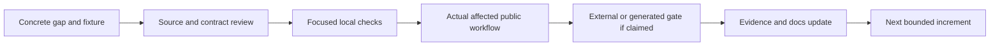

# Ferrule Compatibility and Product Roadmap

Updated: 2026-10-08

## Goal

Ferrule is an independent, portable data-mapping platform with an open project
model, a native visual editor, a CLI, host APIs, and generated Rust/C# libraries.
The goal is broad behavioral and workflow compatibility for applicable `.mfd`
designs while preserving Ferrule-native capabilities and public defaults.

Compatibility covers values, order, failures, artifacts, and external effects
for a specified format, feature, backend, platform, and workflow. Importing a
design or exporting it again does not establish all of those promises. The
[conformance inventory](conformance/README.md) remains incomplete; there is no
supported whole-product parity percentage.

Choose or claim an independent lane in [Parallel work](docs/parallel-work.md),
which links scoped issues, ownership, dependencies, and shared verification rules.

This roadmap is an execution plan. The complete earlier technical baseline and
scorecard are preserved in [the dated history](docs/compatibility-baseline.md).

## Current Baseline

Status snapshot: 2026-10-08 23:03:59 UTC, against merged main
[`3028230`](https://github.com/DeandreT/ferrule/commit/30282307f3c5ef2eee15e4fdf6873c7ca4485614).
The [live coordination issue](https://github.com/DeandreT/ferrule/issues/89) tracks
later ownership and qualification changes. This two-document refresh is
[#182](https://github.com/DeandreT/ferrule/issues/182), separate from implementation
and its execution gates. The earlier #173 snapshot merged in
[#175](https://github.com/DeandreT/ferrule/pull/175). Documentation rendering
remains unverified.

| Area | Available now | Boundary to keep visible |
| --- | --- | --- |
| Mapping | Typed graphs and scopes; nested iteration, filters, grouping, sorting, windows, aggregates, generated sequences, multi-source inner joins, UDFs, dynamic properties, and ordered targets | Each context and format has an explicit validation subset |
| Error order | Global pre-target failure rules plus lazy, expression-owned Raise; bounded item-ordered XML exception import is explicit opt-in | Global and item-ordered failures are different; strict native export refuses unproved ordering |
| Native editor | Compact icons with full hover/details, primary/named/function canvases, undo/layout, Preview/Run/debugging, stage snapshots, and guarded import/export | Local widget tests do not establish every desktop chooser/platform workflow |
| Setup | Schema/layout import, CSV/fixed-width/FlexText/SQLite/Protocol Buffers setup, and flat XLSX worksheet settings | The flat workbook wizard does not author advanced hierarchical layouts |
| Formats | XML, JSON, JSON5, tabular, database, EDI, structured text, binary, and document adapters | Direction and exact subset are in [Supported formats](docs/formats.md); some adapters are input-only |
| JSON Schema | Per-resource reference policies, qualified required-only object-reference siblings, and exact integer intervals in String-or-Int fields | Native and compiled Rust/C# subsets are qualified in [#174](https://github.com/DeandreT/ferrule/pull/174)/[#183](https://github.com/DeandreT/ferrule/pull/183); broader compositions and scalar unions remain separate |
| Generated libraries | Deterministic Rust and package-free C#; typed, strict JSON, eligible XML, and explicit optional JSON5 or bounded flat CSV companions | Supported emission, compiled calls, physical resource checks, and external execution are separate gates |
| Large files | Per-boundary byte/item/work budgets and CSV temporary-row release | Input/target trees and serialized buffers remain materialized; [#107](https://github.com/DeandreT/ferrule/issues/107)/[#185](https://github.com/DeandreT/ferrule/pull/185) measures 120.3–194.6 MiB peaks for two finite JSON workloads; [the report](docs/performance/json-output-set-memory.md) establishes no total-RAM cap |
| `.mfd` | Repair-oriented default import, strict executable admission, native/extension export profiles, bounded serial chains, and guarded multi-source joins | General stage graphs, unsupported contexts, and unknown profiles remain explicit |

See [Architecture](docs/architecture.md), [Code generation](docs/code-generation.md),
[Memory use](docs/memory-and-limits.md), and [`.mfd` interoperability](docs/mfd-interop.md)
for the contracts behind these summaries.

## Current Priorities

Check a box only when that specific gate has evidence. A checked implementation
box does not close its later desktop, generated, or external-runtime gates.

### 1. Complete the flat workbook user workflow

- [x] Add Source/Target workbook configuration over a flat imported schema:
  sheet, header/data row, physical columns, optional paths, and target headers.
- [x] Keep New Mapping usable in a small viewport with outer scrolling; cover
  real control interaction and saved format options in local tests.
- [x] Complete the normal Linux desktop schema-selection, configuration, and
  create/save/reopen workflow for an eight-field flat workbook fixture. Real
  file choosers, an ordinary GUI executable, 1200 × 800 / 1200 × 760 windows,
  and complete saved-project/layout comparisons are covered in the
  [desktop report](docs/qualification/flat-workbook-desktop-2026-10-08.md).
- [x] Retain failures and closure observations independently of the qualified
  [#92](https://github.com/DeandreT/ferrule/issues/92) desktop workflow, merged in
  [#132](https://github.com/DeandreT/ferrule/pull/132).

Exit: a user can choose both schemas, reach Configure/Create without an enlarged
viewport, save and reopen the mapping, and recover the same worksheet settings.
Physical workbook cell tests and desktop persistence are separate evidence.

### 2. Close exception-ordering and integer edge qualification

- [x] Keep global FailureRule semantics distinct from expression-owned Raise.
- [x] Reject unproved global failure ordering in strict native export before
  artifact publication, with a conservative useful total-expression subset.
- [x] Expose opt-in item-ordered import without changing the legacy default;
  preserve raw message positions separately from filtered target positions.
- [x] Admit the bounded transparent XML scope-variable shape only after exact
  owner, branch, schema, consumer, and position checks.
- [x] Replay nine strict saved signed-integer edge designs: three successful
  typed/content results and six exact global failure messages.
- [x] Qualify the corresponding generated public APIs with independent full
  typed/serialized results, lazy messages, and wrapper-cause checks.
- [x] Align required-property versus undeclared-property JSON failure precedence
  in native/Rust/C# direct runtime routes in
  [#171](https://github.com/DeandreT/ferrule/issues/171), merged in
  [#172](https://github.com/DeandreT/ferrule/pull/172). Thirty direct observations,
  affected native/Rust suites and all 178 C# smoke groups pass. The separate
  #169 compiled cohort passes its strict mapping witness and is merged in #174.
- [ ] Resolve native XML root schema annotations in
  [#93](https://github.com/DeandreT/ferrule/issues/93) and retain the separately
  observed failure-publication differences. Controls and saved metadata remain
  unobserved; the latest attempt refused before settings inspection.
- [ ] Expand accepted shapes only with a concrete owner/order proof and
  counterexamples for ambiguous, shared, or fallible branches.

Exit: each claimed profile binds original inputs, expected values or errors,
produced/partial artifacts, and saved-design replay. Native partial publication
and I/O remain separately reported; schema-conforming mapping totality is not
an unrestricted publication-parity promise.

### 3. Finish generated boundary cohorts

- [x] Add bounded flat-primary CSV companions for static named inputs and
  eligible per-driver typed dynamic loaders without changing ordinary APIs.
- [x] Qualify the bounded strict-imported item-ordered public-host cohort:
  14 cases across ten public routes in each of Rust and C#, with four fresh
  XML success writer oracles.
- [x] Verify the seven-design integer-edge cohort's original default formats
  and separate explicit XML adapters against actual emitted schemas and APIs:
  312 calls across Rust/C#, 28 hosts, and six fresh full writer oracles.
  `.xml` path hints alone do not enable XML companions.
- [x] Preserve exact names, wrapper causes, lazy failures, full output bytes,
  and complete original outcomes for those qualified cohorts.
- [x] Qualify static XML input combined bytes at 256 MiB and +1, with declared
  input census and per-document error precedence:
  [#116](https://github.com/DeandreT/ferrule/issues/116), merged in
  [#131](https://github.com/DeandreT/ferrule/pull/131).
- [x] Qualify document-list XML output combined bytes at 256 MiB and +1, retaining
  the failing member and original cause without returning partial results:
  [#117](https://github.com/DeandreT/ferrule/issues/117), merged in
  [#137](https://github.com/DeandreT/ferrule/pull/137).
- [x] Qualify actual XML loader callbacks at the 4,096-artifact boundary and the
  next reservation, refused before its callback:
  [#118](https://github.com/DeandreT/ferrule/issues/118), merged in
  [#138](https://github.com/DeandreT/ferrule/pull/138).
- [x] Qualify a lazy last-row mapping exception before admission of an otherwise
  4,097-artifact mixed XML output set:
  [#119](https://github.com/DeandreT/ferrule/issues/119), merged in
  [#139](https://github.com/DeandreT/ferrule/pull/139).

- [x] Keep direct Rust Program emission warning-free with unused expressions in
  [#157](https://github.com/DeandreT/ferrule/issues/157), merged in
  [#168](https://github.com/DeandreT/ferrule/pull/168). All 110 emitter tests, three
  warnings-denied generated hosts and 11 public calls pass; validation order and
  ordinary strict JSON output remain unchanged.
- [x] Run the finite required-only reference cohort in
  [#169](https://github.com/DeandreT/ferrule/issues/169) after #100/#170 and
  #171/#172: 183 native observations and all 297 Rust / 297 C# public and typed
  calls pass across nine profiles, 16 mappings and 66 cases. Complete outcomes,
  text/byte routes and the strict error-order witness pass; earlier compiler
  and authored expected-text failures are retained separately. Scoped strict lint passes.
- [x] Complete #169's 23 owning CLI checks, scoped strict lint, formatting and
  original-outcome capture controls, merged in
  [#174](https://github.com/DeandreT/ferrule/pull/174). Fourteen harness controls
  retain complete originals, including 13 intentional mismatches and a later
  valid control. This closes #100's generated acceptance for the exact subset;
  broader profiles remain separate. Hosted jobs executed no validation steps
  because of the account billing/spending-limit restriction.

These four authored Rust/C# public-host cohorts include small prerequisites and
separate opt-in boundary runs. The [XML qualification index](docs/generated-xml-qualification-index.md)
and [memory observations](docs/memory-and-limits.md#compiled-xml-host-observations)
were refreshed in [#133](https://github.com/DeandreT/ferrule/issues/133), merged in
[#147](https://github.com/DeandreT/ferrule/pull/147). Helper-only checks, external
execution, other designs, and a universal RAM guarantee remain separate.

Exit: compiled public calls agree with independent oracles under their declared
adapter profile. Neither a lowering pass nor one host cohort certifies every
survey design or backend.

### 4. Resolve JSON5 native metadata before widening export

- [x] Support bounded local JSON5 parsing and output while retaining typed
  JSON-schema mapping behavior.
- [ ] Observe the external application's JSON5 setting and saved metadata in
  isolated checkbox and filename controls.
- [ ] Identify an exact import/export representation before changing admission.
- [x] Keep ordinary generated JSON adapters strict JSON; JSON5 uses separate
  explicit eligible APIs and tests.
- [x] Add bounded pure syntax normalization for Rust in
  [#134](https://github.com/DeandreT/ferrule/issues/134)/
  [#140](https://github.com/DeandreT/ferrule/pull/140) and package-free C# in
  [#136](https://github.com/DeandreT/ferrule/issues/136)/
  [#146](https://github.com/DeandreT/ferrule/pull/146). The shared authored cases
  and focused scaled-limit controls pass; generated adapters and default large
  resource caps are separate gates. Unquoted identifiers use the initial ASCII
  subset; Unicode identifier membership remains
  [#135](https://github.com/DeandreT/ferrule/issues/135).
- [x] Complete shared closed-object eligibility in
  [#141](https://github.com/DeandreT/ferrule/issues/141) with its descriptor
  duplicate guard [#148](https://github.com/DeandreT/ferrule/issues/148), merged
  together in [#151](https://github.com/DeandreT/ferrule/pull/151). Focused and
  complete affected policy checks, formatting and strict warnings pass. The
  [companion contract](docs/generated-json5-contract.md) keeps ordinary codecs
  and lowering unchanged; this policy does not enable generated public APIs.
- [x] Add explicit opt-in Rust and C# companions against the committed policy in
  [#142](https://github.com/DeandreT/ferrule/issues/142), merged in
  [#153](https://github.com/DeandreT/ferrule/pull/153), and
  [#143](https://github.com/DeandreT/ferrule/issues/143), merged in
  [#155](https://github.com/DeandreT/ferrule/pull/155). Their local codec/emitter
  checks preserve ordinary strict JSON APIs and default artifact sets.
- [x] Add explicit CLI generation and qualify all 184 small compiled public calls
  in [#144](https://github.com/DeandreT/ferrule/issues/144), merged in
  [#156](https://github.com/DeandreT/ferrule/pull/156): 17 representation and six
  mapping/context cases across four routes per language. This public cohort is
  distinct from the 75-case pure syntax inventory.
- [x] Qualify all 48 opt-in physical byte-boundary calls in
  [#145](https://github.com/DeandreT/ferrule/issues/145), merged in
  [#159](https://github.com/DeandreT/ferrule/pull/159), after all 184 small
  prerequisites. Original input, normalized input and strict output exact/+1
  workloads retain full results, typed causes and normal process closure.
  Whole-host RSS observations are workload-specific, without a RAM ceiling
  or streaming guarantee.

- [x] Reject nonfinite native JSON5 tokens before nullable projection in
  [#130](https://github.com/DeandreT/ferrule/issues/130), merged in
  [#164](https://github.com/DeandreT/ferrule/pull/164). All 190 native controls,
  58 CLI calls and the full affected suite pass. The original nullable witness
  and corrected outcomes are retained; legitimate null and finite values remain
  distinct from nonfinite tokens, including ignored or overwritten members.
- [x] Count original native JSON5 input bytes, including the leading BOM, on both
  file and text routes in [#163](https://github.com/DeandreT/ferrule/issues/163),
  merged in [#167](https://github.com/DeandreT/ferrule/pull/167). All 45 small
  controls and eight serial physical exact/+1 calls pass. This qualifies the
  input-byte boundary, without a process-memory or streaming guarantee.

Generated companions and native metadata are independent contracts. The
[guide refresh](https://github.com/DeandreT/ferrule/issues/154) is merged in
[PR #161](https://github.com/DeandreT/ferrule/pull/161), including the measured
whole-host memory ranges. The initial generated companion scope in
[#96](https://github.com/DeandreT/ferrule/issues/96) is complete and closed.
Separate allocation attribution in
[#160](https://github.com/DeandreT/ferrule/issues/160) is available, with no
production optimization included. Native token admission and original-byte
accounting are now separately qualified in #130/#163; generated-host evidence
does not establish native component metadata or desktop behavior. The JSON5
metadata lane [#106](https://github.com/DeandreT/ferrule/issues/106) remains open.

Exit: a self-authored fixture demonstrates metadata, values, errors, and a saved
round trip. A `.json5` filename is not enough to infer a native component flag.

### 5. Deepen memory and authoring coverage without changing contracts

- [x] Release ordinary CSV temporary formatted rows without adding a filesystem
  64 MiB output cap or changing validation/publication order.
- [x] Document materialization and route-specific limits rather than a universal
  memory ceiling.
- [x] Release filesystem inputs and dynamic-source caches after evaluation and
  the publication check, before selected/all-target serialization.
- [x] Add searchable mapping-path, main-mapping-path, and stable run-time values
  to primary, named-target, and function canvases, with compact presentation,
  edit locks, history, and checked node-ID allocation.
- [x] Author computed source-property reads from supported open scalar objects
  on primary and named-target canvases, with compact icons, explicit object
  selection, real wire interactions, edit locks, and undo/redo.
- [x] Author current-document-path reads for primary local XML file sets on
  primary and named-target canvases, with compact presentation, real wiring,
  exact resolved/portable path behavior, edit locks, and undo/redo.
- [x] Author XML text serialization from supported primary source groups, with
  an explicit source picker, compact presentation, real wiring and settings,
  preserved imported metadata, edit locks, and undo/redo.
- [x] Author computed-value Aggregate editing for primary and named-target
  canvases, with an explicit per-item value mode, preserved stored fields,
  and separate parent-context delimiter/index inputs.
- [x] Qualify the local computed-value Aggregate controls, real wiring, edit locks,
  node-ID refusal, undo/redo, saved projects, and Preview; retain eager Count
  and Item at error controls and parent-argument context checks.
- [x] Record matched many-row and wide-row trials for input lifetime under a
  normal debug profile, retaining both repeats, full outputs and regressions;
  [report the workload-dependent results](docs/performance/filesystem-input-lifetime-2026-10-07.md).
- [x] Independently review the bounded JSON output-set benchmark design in
  [#107](https://github.com/DeandreT/ferrule/issues/107): many small rows and one
  wide value, one versus primary-plus-named outputs, and two matched repetitions.
- [x] Complete #107's eight normal-development-profile filesystem measurements,
  eight separate verifiers and twelve complete output-document comparisons,
  merged in [#185](https://github.com/DeandreT/ferrule/pull/185). The
  [individual-run report](docs/performance/json-output-set-memory.md) records
  120.3–194.6 MiB process peaks and four matched second-output increases of
  31.2–39.4 MiB, with original outcomes and normal closure. Two workloads and
  two repetitions establish neither statistical significance nor a RAM cap.
  All three hosted jobs executed zero validation steps because of the account
  billing/spending restriction; local qualification remains separate.
- [ ] Investigate removing the ordinary JSON writer's intermediate owned
  `serde_json::Value` tree in the available
  [#184](https://github.com/DeandreT/ferrule/issues/184) lane. Preserve the returned
  pretty String, APIs, exact bytes, validation/errors and publication; compare
  against #107's retained baseline. Engine target ownership, input parsing,
  JSON5, generated runtimes, allocator changes and streaming APIs are excluded.
- [x] Qualify local Value map **Input conversion** editing on main, named-target,
  and function canvases: preserve typed imported tables/defaults and compact
  geometry; check all five choices, locks, history, save/reopen, and Preview.
  Four interaction groups and the full 703-test GUI suite pass, along with
  formatting, fresh workspace warning checks, and the normal GUI build. That
  input-conversion increment kept edited cells as text; typed-cell authoring is
  the separate #97 increment below.
- [x] Add and locally qualify **Computed properties** editing for singular
  ordinary JSON target objects with String, Int, Float, or Bool additional
  values on main and named-target canvases, including static constructed
  descendants. Preserve ordered names/values and read-only unsupported imported
  shapes; check real controls, locks, history, save/reopen, and Preview.
  Six interaction groups and the full 709-test GUI suite pass, along with
  formatting, fresh workspace warning checks, and the normal GUI build.
  Normal desktop workflow and broader target shapes remain pending.
- [x] Preserve finite project Float bits and align generated C# JSON rounding
  in the separate [#111](https://github.com/DeandreT/ferrule/issues/111)/
  [#112](https://github.com/DeandreT/ferrule/issues/112) increment, merged in
  [#120](https://github.com/DeandreT/ferrule/pull/120). Focused persistence and
  boundary checks, generated public hosts, C# runtime smoke, full workspace
  tests, fresh lint, formatting, and the normal build pass. Other Value map,
  desktop, and metadata gates remain separate.
- [x] Complete the separate Value map conversion/null increments: isolated integer
  conversion in [#91](https://github.com/DeandreT/ferrule/issues/91), merged in
  [#123](https://github.com/DeandreT/ferrule/pull/123), and ordinary declared
  JSON-null matching in [#113](https://github.com/DeandreT/ferrule/issues/113),
  merged in [#126](https://github.com/DeandreT/ferrule/pull/126). Preserve their
  distinct contexts and complete interpreter/generated outcomes; the ordinary
  compiled mapping control already passed before the direct-helper correction.
- [x] Preserve enabled absent Value map defaults through save/reload and history
  in [#114](https://github.com/DeandreT/ferrule/issues/114), merged in
  [#127](https://github.com/DeandreT/ferrule/pull/127). Legacy missing/null defaults
  keep their disabled meaning; older readers may reject the new absent marker.
- [x] Qualify typed String, Int, finite Float, Bool and absent table/default editing
  in [#97](https://github.com/DeandreT/ferrule/issues/97), merged in
  [#128](https://github.com/DeandreT/ferrule/pull/128) after #91/#114. Local controls
  preserve imported values, prevent invalid draft commits, and check locks,
  history, save/reopen, Preview and compact geometry. Normal desktop authoring
  remains a separate gate.
- [x] Complete local and normal desktop setup for the primary transposed workbook
  source in [#98](https://github.com/DeandreT/ferrule/issues/98), merged in
  [#150](https://github.com/DeandreT/ferrule/pull/150). Local wizard regressions,
  formatting and warning checks pass. The six-phase desktop create/save/reopen
  workflow at 1200 × 800 / 1200 × 760 passes complete Project comparisons and
  saved/reopened body equality. Workbook execution was checked separately in
  local tests; desktop execution, hierarchical and named-source setup are not
  claimed.
- [x] Keep absent browser target-binding endpoints disconnected in
  [#165](https://github.com/DeandreT/ferrule/issues/165), merged in
  [#166](https://github.com/DeandreT/ferrule/pull/166). All eight layout cases,
  38 browser-crate tests and the release WebAssembly build pass; complete
  Projects and valid target-input indexes remain unchanged.
- [x] Merge bounded browser history in
  [#99](https://github.com/DeandreT/ferrule/issues/99)/
  [#178](https://github.com/DeandreT/ferrule/pull/178) after 43 web tests and a
  fresh WebAssembly build, preserving applied-project, draft-text and
  source/output boundaries.
- [x] Qualify #99's finite edit/apply/undo/redo and download workflow with
  132 native browser commands and 34 GUID-completed downloads. Thirty-two
  public-helper matches pass; two original helper refusals remain retained and
  their compact draft downloads qualify separately by complete-byte comparison.
  The campaign does not claim exit 0 or helper passes for those two. Owned
  descendant cleanup was needed; final closure was proven.
- [x] Collapse only an exact retained coalescing baseline in
  [#177](https://github.com/DeandreT/ferrule/issues/177), merged in
  [#179](https://github.com/DeandreT/ferrule/pull/179). All 45 web tests, scoped
  strict lint and formatting pass; discarded redo and distinct focus sessions
  remain explicit. This increment does not claim a fresh browser campaign.
- [x] Display the applied target schema name in
  [#176](https://github.com/DeandreT/ferrule/issues/176), merged in
  [#181](https://github.com/DeandreT/ferrule/pull/181). All 45 web tests and fresh
  WebAssembly pass; 24 actual native browser commands and two complete typed
  and byte-checked downloads qualify applied titles in wide/compact views.
  Owned descendant cleanup was needed; final closure was proven.
- [ ] Qualify Fit against measured whole-node bounds in the current browser
  canvas in [#180](https://github.com/DeandreT/ferrule/issues/180), following #176.
  Its corrected v2 source is independently accepted; local, runtime and browser
  checks remain unrun at this snapshot. This active lane owns the view transform;
  model/node-layout changes and broader authoring features are separate.
- [ ] For every new wizard, verify ordinary viewport reachability and normal
  desktop save/reopen, as well as state-method tests.

Exit: a change remains usable and contract-compatible, with measurements limited
to the recorded route/profile and no inferred streaming or universal benefit.

## Workstreams

### 0. Versioned Conformance and Compatibility Profiles

- [x] Publish a separate JSON object-schema proposal and validate its independent
  operation/profile/dimension cells in
  [#94](https://github.com/DeandreT/ferrule/issues/94), merged in
  [#129](https://github.com/DeandreT/ferrule/pull/129): 48 Unverified, 176 Unassessed
  and no Supported cells. The protected survey and incomplete-inventory status
  are unchanged; this is not a capability promotion.
- [ ] Complete the applicable inventory before a whole-profile claim.
- [ ] Track import, interpreter, external export execution, self-roundtrip,
  GUI/debugging, and each generated backend independently.
- [ ] Record schema dialect, platform, runtime, driver, and application version.
- [ ] Keep unknown, blocked, partial, and unsupported cells explicit.

### A. Mapping Semantics and Interoperability

#### A1. Executable `.mfd` Common Profile

- [ ] Extend one concrete supported-path mismatch at a time, with a self-authored
  triggering design and preserved refusal controls.
- [x] Retain modern required-only object reference siblings natively in
  [#100](https://github.com/DeandreT/ferrule/issues/100), native increment merged in
  [#170](https://github.com/DeandreT/ferrule/pull/170). Seven focused groups and
  388 JSON tests pass, with one existing physical-resource test ignored. Proven
  object/object-null profiles preserve ordered presence and each resource's
  dialect; unsupported assertions, shapes and undeclared new names still refuse.
  Required lists and merged sets are bounded to 256 only in this admitted subset.
  Generated qualification #169 is merged in #174, completing #100's exact
  native/generated subset; general composition boundaries remain open.
- [x] Qualify the exact String-or-Int IntegerRange contract in
  [#101](https://github.com/DeandreT/ferrule/issues/101), merged in
  [#183](https://github.com/DeandreT/ferrule/pull/183): three IR and four native
  groups, 202 direct calls per language and all 179 C# smoke groups pass.
  String behavior and strict Contains remain independent of integer intervals.
- [x] Complete #101's seven-mapping compiled cohort: all 152 text/byte calls,
  including named input/output success and refusal cases, match full oracles.
  All 797 affected Rust checks, scoped warnings and formatting pass, with one
  existing resource test ignored. The original native error-text oracle failure
  and its source-reviewed correction remain retained; the optional full catalog
  cancellation and hosted zero-step billing failures are separate. Broader
  scalar-union profiles remain unsupported or independently scoped.
- [ ] Close remaining XML root/type/namespace and JSON composition boundaries
  only when the IR can preserve them exactly.
- [ ] Preserve repair imports and legacy extension round trips while keeping
  strict executable/native admission atomic.

#### A2. N-to-M Endpoint and Stage Model

- [ ] Extend beyond the bounded serial-chain/native fan-out profile with exact
  driver, schema, owner, and stage-priority evidence.
- [ ] Add general service-host and stage-graph import/export incrementally.
- [ ] Preserve applied stage snapshots, local draft history, path rebasing,
  cancellation, and main-project independence. The GUI already edits stage
  mappings; general imported graph shapes remain the open boundary.

#### A3. Functions and Reusable Mappings

- [ ] Extend catalog-backed functions and reusable contexts with matching
  validation, interpreter, Rust, C#, and authoring contracts.
- [ ] Agree the bounded scalar-sequence composition contract in the claimed
  design/literal-fixture lane
  [#102](https://github.com/DeandreT/ferrule/issues/102). Existing reducers and
  scalar UDFs remain the baseline; implementation needs separately scoped
  follow-on issues after design review. General higher-order/nested collections
  are excluded from this initial design.
- [ ] Validate the source-derived scalar-UDF argument-error witness in the
  available [#186](https://github.com/DeandreT/ferrule/issues/186) lane before
  aligning the two emitters with interpreter evaluation/adaptation order.
  An early Bool-to-Int argument and later Raise predict different first errors;
  validation and runtime qualification are unrun. Interpreter, coercion, frame,
  sequence and GUI policy changes are excluded.

### B. Visual Authoring and Debugging

- [ ] Cover supported advanced schemas/layouts with ordinary user-facing setup.
- [ ] Retain short readable summaries, full hover/details, reachable pins, and
  canvas positions as new nodes and controls are added.
- [ ] Deepen connector/source-row inspection and context-aware debugging using
  retained real inputs, not invented preview state.

### C. Connectors and Format Breadth

- [ ] Add a typed query/write model before general database mutation modes.
- [ ] Extend adapters and transport only with confinement, cancellation,
  original-error, resource, and publication contracts.
- [ ] Keep input-only adapters and unsupported schema/configuration variants
  explicit in the format matrix.

### D. Generated Execution

- [ ] Grow compile-and-call coverage for applicable mappings and public adapters.
- [ ] Add other language/backend targets as independent implementations and
  gates; the current emitters are Rust and C#.

### E. Product, Packaging, and Automation

- [ ] Package reproducible runtimes and examples with clear host boundaries.
- [ ] Design reusable libraries, projects, configuration, and automation without
  implying compatibility with another product's proprietary package format.
- [ ] Treat optional services and external server deployment as separately
  versioned profiles, not prerequisites for ordinary mapping.

## Release Gates

A broad milestone remains open until all its applicable cells are qualified.
Detailed historical exit criteria remain in the [recorded roadmap](docs/compatibility-baseline.md#release-gates).

| Gate | Evidence required |
| --- | --- |
| M0 — Measurable contract | Complete applicable inventory, independent evidence cells, and honest unknowns |
| M1 — Trustworthy native interchange | Strict import, local values/errors, export, external execution, and saved replay |
| M2 — General semantic foundation | Composable value/context/stage invariants and backward-compatible execution |
| M3 — Complete authoring and debugging | Real controls, locks/history, normal viewport, save/reopen, preview/run, and cancellation |
| M4 — Enterprise execution breadth | Applicable formats/connectors, external effects, rollback/faults, and measured resource envelopes |
| M5 — Full compatibility and product parity | All applicable generated and product-workflow cells qualified; blocked/unknown cells narrow the claim |

Failure at a gate keeps its original observations and narrows the claim; a
later correction does not erase the earlier result. See
[Development and verification](docs/development.md) for practical checklists.

## Compatibility Boundaries

- All checked-in fixtures are self-authored. External behavior and licensed
  resources remain separately controlled evidence, not copied repository data.
- Pixel-identical UI and byte-identical design serialization are not required;
  values, ordering, editable structure, failures, and applicable workflows are.
- Strict admission is useful only when it preserves the accepted semantics.
  Unsupported or unproved shapes must retain a typed refusal before publication.
- Ferrule-native capabilities stay available outside the strict native profile.
- A local round trip, a green test total, or a nearby qualified feature does not
  close an unknown capability or establish full-product compatibility.

## Scorecard

The [dated scorecard](docs/compatibility-baseline.md#scorecard) preserves earlier
cohort counts and limits. Current claims belong in their focused contracts and
versioned evidence cells; do not add unrelated totals or convert them into a
parity percentage.

## Primary References

Use the current source and focused contract documents linked above. The
[historical reference topics](docs/compatibility-baseline.md#primary-references)
remain preserved. Any external compatibility update must bind the exact
primary documentation and application version used for that update.
