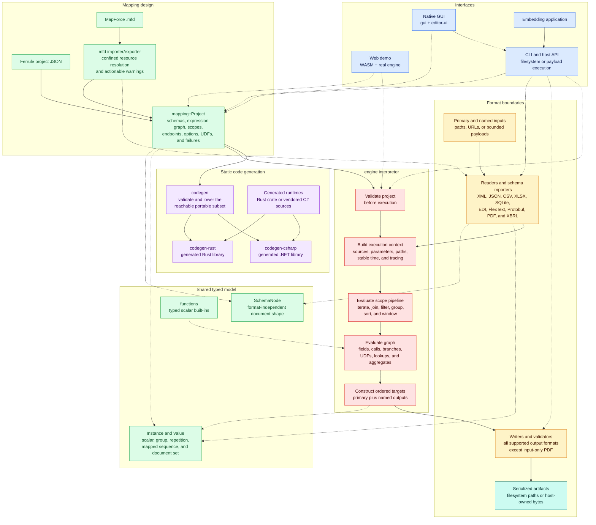

# Mapping Model and Workspace Architecture

## System Architecture

Solid arrows show runtime data flow. Dotted arrows show crate dependencies or
design-time relationships.

## Project Model

A ferrule project is plain JSON built from four main concepts:

1. **Schemas** describe source and target trees. Nodes are named scalar or group
   values and may be repeating, attributes, nullable, fixed, or dynamically
   named where the target format permits it.
2. **Graph nodes** compute scalar values. Nodes read source fields and positions,
   hold constants, call built-in functions, branch lazily, translate value maps,
   perform lookups and joins, reduce collections, and access selected runtime
   values.
3. **Scopes** construct target groups. A scope can iterate source collections,
   generated scalar sequences, document sets, or validated joins, then filter,
   group, sort, window, bind fields, and construct child scopes.
4. **Endpoints** identify the primary input and output plus optional named
   sources and targets. Stored paths can be overridden by the host or CLI.

Library hosts execute through `cli::RunOptions`, which combines path overrides,
bounded typed runtime parameters, and optional tracing. A successful
`RunOutcome` retains every atomically published file in deterministic
primary-then-extra target order. `RunOptions::with_target` can instead evaluate
one primary or named target; unselected target scopes are not evaluated or
published, while the default all-target mode keeps its collision checks.

Hosts that own transport and persistence can instead use
`cli::PayloadRunOptions`. Each input carries bounded bytes plus a logical path
that selects its format and supplies dynamic-source identity. The runner accepts
named static and dynamic secondary documents and returns bounded serialized
`PayloadArtifact` values in the same target order without touching output
paths. It supports the same explicit target selection, including applying a
logical output-path override to the selected named target. SQLite and
update-existing XLSX stay on the filesystem runner because their behavior
depends on persistent prior state.

The CLI exposes that payload boundary as `ferrule run PROJECT - -`: stdin is
the primary document and stdout receives raw bytes only when exactly one
artifact is produced. The configured source and target paths remain the
logical format identities; named sources remain ordinary local paths. This
mode rejects per-item dynamic named sources and all persistent-state operations
before stdout is written.

The `run --trace-json PATH` option streams interpreter events into a private
sibling staging file and publishes it only after successful execution. Each
JSON Lines record has a versioned envelope, deterministic sequence number, and
a tagged node or scope/control event. Failed mappings leave an existing trace
untouched. See [Execution tracing](tracing.md) for the stable wire contract.

During execution, source contexts form a stack. Field resolution begins at the
innermost frame and falls outward, which allows parent values to broadcast into
nested target rows. Repeating source paths can cross several collection levels;
generated sequences and joins use their own typed iteration contexts. Absent
values remain explicit rather than terminating a run.

## Workspace Layout

### Core model and execution

- `crates/ir` - format-independent schema, scalar value, and instance trees
- `crates/mapping` - serialized project, graph, scope, join, and format-option
  model
- `crates/functions` - scalar built-in function library
- `crates/engine` - project validation and mapping interpreter

### Code generation

- `crates/codegen` - backend-neutral lowering, validation, and artifact model
- `crates/codegen-runtime` - runtime primitives linked by generated Rust mappings
- `crates/codegen-rust` - deterministic Rust library emitter
- `crates/codegen-csharp` - deterministic C# library emitter

### Format adapters

- `crates/format-xml`, `format-json`, `format-csv`, and `format-xlsx`
- `crates/format-db`
- `crates/format-edi` and `format-flextext`
- `crates/format-protobuf`, `format-pdf`, and `format-xbrl`

See [Supported formats](formats.md) for adapter direction and boundaries.

### Interfaces and interoperability

- `crates/mfd` - MapForce `.mfd` import and export
- `crates/cli` - headless validation, filesystem and raw-payload execution,
  host run options and ordered artifact reports, schema import, interop, and
  code generation
- `crates/editor-ui` - shared editor presentation and interaction logic
- `crates/gui` - native egui mapping editor
- `crates/web-demo` - WebAssembly playground built around the real mapping
  engine
- `site` - static project site and web-demo deployment shell

## Design Principles

- Format adapters depend on the shared instance model instead of one another.
- Unsupported imports should preserve useful work and emit an actionable warning.
- Runtime errors remain typed and identify the responsible mapping construct.
- Generated mappings contain static scope and expression functions rather than
  embedding the complete project interpreter.
- Project files remain open and inspectable; pre-1.0 public APIs may evolve as
  invalid states move into stronger types.
