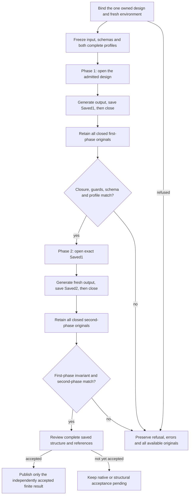

# Native saved-design reopen checkpoint

This checkpoint covers one existing, independently admitted, owned design. It
checks generation, saving, and reopening the exact saved design in two serial
phases. It does not establish a saved representation for new sequence, filter,
map, or capture forms.

The protocol belongs to [#263](https://github.com/DeandreT/ferrule/issues/263).
The complete XML oracle and its controls belong to
[#268](https://github.com/DeandreT/ferrule/issues/268). Their independently reviewed
control results and later preparation/fixture reruns are recorded below. Read-only
preparation completed, but the first real native phase timed out before a native
result or saved artifact. Save/reopen acceptance and the complete saved-design
structural review remain **pending in this checkpoint**. The retained timeout is
being investigated in [#285](https://github.com/DeandreT/ferrule/issues/285); its
cause is unknown.

## Evidence boundaries

| Evidence | Bounded result | What it establishes |
| --- | --- | --- |
| Earlier controller-policy cohort | 13 groups, 41 simulated subcases; all frozen expectations matched | Refusal, retention, and two-phase controller behavior under stubs |
| Original byte-compatibility rerun after the XML-oracle addition | The same 13 groups and 41 frozen simulated subcases; all matched | Conservation of the earlier byte-comparison mode and its controls |
| Original complete XML helper | 34 literal recipes in each of two phases: 68 observations; all expected outcomes matched | Six expected positive observations and 62 expected negative observations of the unchanged helper |
| Original XML admission/controller policy | Seven groups, 17 simulated subcases; all matched | Fourteen refusals before execution-root creation, plus one two-phase success and two retained first-phase refusals |
| Read-only staging repair and preparation | Preparation completed with zero exit; 33 originals retained, a 56-node staged tree, exactly four declared path redirects, and the staged design frozen read-only | Existing source originals remained unchanged; the explicitly owned staging copy was writable only during its declared redirect |
| First compatibility rerun after read-only staging | 41 simulated subcases: 40 matched and one fixture raised `PermissionError` before its expected `AssertionError`; admission rerun stopped unrun | A genuine retained fixture failure, followed by the narrow [#283](https://github.com/DeandreT/ferrule/issues/283) correction |
| Corrected compatibility and admission reruns | The same 41 compatibility and 17 admission subcases all matched in two separate zero-exit owned runs; independent actual review accepted the complete originals | The corrected fixture and admission controls, with the earlier failure preserved |
| First real native phase | Timed out at its 180-second inner deadline; a 398-byte XML artifact was retained; no native success/result, first saved design, or reopen phase | A retained native negative and proven cleanup/closure, with no completed save/reopen acceptance |
| Complete saved-design structural/reference review | **Pending**; no saved design was produced | Requires review of actual saved artifacts and all declared references |

The original XML-oracle checkpoint comprised 126 distinct observations: 68 helper,
41 compatibility, and 17 admission. The earlier policy suite, original
compatibility rerun, failed rerun, and corrected rerun are separate executions of
the same frozen 41 cases; they do not add distinct policy cases. The corrected
41+17 reruns supply 58 fresh control observations. The helper's 68 observations
inherit their earlier acceptance and were not rerun. All of these controls use
simulated application boundaries and do not establish a real saved-file reopen.

The staging repair belongs to [#281](https://github.com/DeandreT/ferrule/issues/281).
It makes only the owned staging copy writable for the exact redirect and freezes
it again before the baseline and native call. The later saved-metadata control
fixture likewise makes only its owned saved copy writable before pinning metadata
and intentionally changing it. Its frozen expected refusal remains unchanged.

Independent review checked the original and corrected controls' complete bodies,
identity metadata, source/tool bindings, retention, refusal ordering, and owned
closure. The failed fixture remains a failure. The successful preparation and
simulated controls remain separate from the first real native negative.

The retained 398-byte artifact matches the independently frozen complete XML
fields and fresh schema URI under the permitted CRLF spelling. This was a manual
complete-body review; the controller did not reach its output-oracle comparison.
The artifact match does not supply the missing native result or saved design.
The inner timeout was 180.001 seconds. The outer owner exited one and needed
cleanup: its normal-closure flag is false, while final owned closure and lease
release are proven, with source/survey guards unchanged. The timeout was not an
outer-owner deadline failure. Neither this closure nor the retained XML identifies
the cause of the native stall.

## Freeze the independent expectation

Expected content comes from the owned input, source/target schemas, and the
independently authored logical expectation. It must be fixed before either
native phase. Prior observed output does not supply the oracle.

The checkpoint's complete expected XML content is:

| Field | Exact expectation |
| --- | --- |
| Document | XML 1.0, UTF-8; no logical nodes before or after the root |
| Root | One element named `Envelope`, with no namespace |
| Selected type | The `type` attribute in the XML Schema-instance namespace resolves to the expanded QName with no namespace and local name `RecordPlus` |
| Data attributes | Exactly the unqualified `Token="token-value"` and `Supplement="supplement-value"` attributes |
| Schema hint | Exactly one `noNamespaceSchemaLocation` attribute in the XML Schema-instance namespace, with the exact fresh staged target-schema URI |
| Namespace declarations | Exactly one nonempty prefix binding for `http://www.w3.org/2001/XMLSchema-instance` |
| Root content | No logical text, element children, comments, processing instructions, entities, or tail content |
| Additional content | No other attributes, namespace declarations, elements, or document nodes |

The base type has no child elements and requires `Token`. Its derived type also
has no child elements and requires `Supplement`. These facts close the entire
expected tree rather than just a selected data signature.

The schema hint is an explicit condition of this checkpoint. Its presence is not
inferred from general schema validity or from earlier output. Actual native
schema-hint compatibility remains pending. Bind its URI from the fresh normalized
staged target-schema location, apply the declared URI encoding, and compare the
complete string exactly. Do not accept an old-root URI or normalize a different
URI into equivalence.

Freeze two complete expectation profiles, with separate first-phase and
reopen-phase identifiers and hashes. Both use the same staged target schema and
the same logical content. The profiles must include the complete document,
namespace, attribute, type, and content fields above. Duplicate profile keys,
extra or missing fields, an incorrect phase, or a stale profile hash refuse
admission. Observed native formatting must not rewrite either profile.

## Permitted lexical differences

The explicit complete-tree mode permits these spellings while retaining every
original byte:

- Presence or absence of one UTF-8 byte-order mark.
- An optional XML 1.0 declaration, optionally declaring `UTF-8` or `utf-8`.
- Attribute order and single versus double quotes.
- Predefined or numeric character references that decode to the same values.
- A different spelling of the single nonempty XML Schema-instance prefix.
- An empty-element tag or an equivalent explicit closing tag.
- XML whitespace outside the root element.

The selected type still has to resolve to the same expanded QName. Padding,
case-folding, or an unbound prefix does not change an invalid type into a match.
Whitespace inside the empty root is logical content and refuses comparison.
An extra, default, unused, or duplicate namespace binding also refuses comparison.

The helper consumes the complete document and preserves recorded comments,
processing instructions, ordered children, expanded names, attribute values,
namespace bindings, and parser errors. Recovery, external network access, DTD
loading, entity resolution, and large-tree relaxation are disabled. DTD or entity
declarations, standalone declarations, XML 1.1, and other declared encodings are
outside the admitted profile.

Complete-tree mode is enabled only by the explicitly accepted oracle admission
and exact helper/profile hashes. Existing byte mode remains the default and
retains its whole-byte comparisons. The mode must be fixed before execution;
switching comparison modes after a failure is not a qualification result.

## Frozen negative controls

The 34 literal recipes consist of three positives and 31 negatives. Each is
checked independently for both phases.

| Negative family | Recipes | Required observation |
| --- | --- | --- |
| Wrong or qualified root; missing or wrong selected type | 4 | Complete-tree mismatch |
| Wrong data, missing required data, extra ordinary or Schema-instance attribute | 4 | Complete-tree mismatch |
| Stale or missing schema URI; extra, duplicate, or wrong namespace binding | 5 | Complete-tree mismatch |
| Text, internal whitespace, unexpected children, both unexpected child orders, comment, or processing instruction | 8 | Complete-tree mismatch |
| Duplicate attribute, trailing document content, or malformed root | 3 | Complete parser error |
| DTD/entity declaration, unbound or padded type QName, XML 1.1, standalone declaration, or non-UTF-8 declaration | 7 | Complete refusal/error record |

Both hypothetical multiple-child orders are refused because the expected tree
has zero children. These controls do not qualify a valid multiple-child ordering
case.

The 17 admission subcases separately check a missing admission receipt; three
unqualified or changed admission conditions; three incorrect helper/profile
hashes; a coherent but wrong fresh-root URI; four extra/missing profile-field
cases; two duplicate-profile-key cases; and three execution branches. The last
three are a simulated complete success, a schema-valid wrong data value, and
malformed XML. The two failures retain the complete first phase and leave the
second phase unrun. Full exception type, message, traceback, parser diagnostics,
raw XML, and expected profile remain available before comparison.

The earlier 41-case policy suite and its byte-compatibility rerun also preserve
precreation refusal, occupied destinations, first-phase errors, exact saved-file
selection, second-phase errors, source/output/metadata mutations, and partial or
incorrect evidence-copy failures. A negative control passes when its frozen
refusal and retention expectations match; the underlying refused operation
remains a refusal.

## Two-phase protocol

### Before the first phase

- [ ] Independently admit exactly one owned design and its declared input,
  schemas, boundaries, and existing saved-form scope.
- [ ] Bind complete source/tool/environment identities and the independently
  accepted control receipts. Confirm the declared native version and isolated
  alternate-display environment without reusing historical process identities.
- [ ] Freeze both complete profiles and the exact fresh schema URI. Check every
  admission receipt and helper/profile hash before creating the execution root.
- [ ] Require fresh absent execution/output/save destinations. Keep the admitted
  source originals unchanged and stage only explicitly owned copies.
- [ ] Bind one exclusive outer owner, declared deadlines, process-birth ownership,
  cleanup obligations, source/survey guards, and sufficient resource headroom.

### First phase and transition

- [ ] Open the admitted design, generate the declared output, save `Saved1` to its
  fresh destination, and close the document and owned host.
- [ ] Retain the complete closed output, saved design, logs, status, errors, and
  identity metadata. Complete evidence-copy and readback checks precede output
  comparison, including on partial, malformed, or failed output.
- [ ] Require the declared host result, owned closure, unchanged staged input and
  sources, complete schema validation, and complete first-phase profile match.
- [ ] Bind the exact `Saved1` path, body, and identity as the second phase's input.
  Its path must differ from the admitted starting design. Do not reopen a seed or an
  alternative file that merely has similar content.
- [ ] If any first-phase condition refuses, retain its complete evidence and do
  not start the second phase.

### Reopen phase and final review

- [ ] Use a second serial owned host to open exact `Saved1`. Generate into a
  different fresh output directory, save `Saved2` to a different fresh path, and
  close the document and host.
- [ ] Retain every complete closed second-phase original before comparison.
  Verify that all guarded first-phase originals remain unchanged through reopen.
- [ ] Require owned closure, input/source guards, complete schema validation, and
  the complete second-phase profile match. A zero process exit alone does not
  supply the other observations.
- [ ] Review the entire actual saved structure and all declared roots, identities,
  links, schema/input/output references, and connection boundaries against the
  independently admitted contract. Record any permitted serializer-only
  differences explicitly rather than dropping unreviewed fields.
- [ ] Obtain a different author's finite original/custody/semantic review before
  replacing the pending result fields below.

## Native results and remaining acceptance

| Required result | Current checkpoint state |
| --- | --- |
| Fresh real-native admission, environment and owned process identities | Complete admitted preparation and ownership originals retained; final negative cleanup/closure independently reviewed |
| First-phase generation, saved artifact, complete XML/schema result and closure | **Timed out** at 180 seconds; 398-byte XML retained; no native success/result or first saved design |
| Exact `Saved1` used as second-phase input | **Unrun**; `Saved1` is absent |
| Second-phase generation, separate saved/output artifacts and closure | **Unrun**; no reopen call or `Saved2` |
| First-phase source/artifact/metadata invariance through reopen | **Pending**; preparation/source invariants through the failure were checked, but no reopen occurred |
| Complete saved-design structural and reference review | **Pending**; no saved design exists |
| Independent finite native acceptance and retained-original custody | The negative and its complete custody/cleanup are accepted as recorded; completed save/reopen acceptance remains **pending** |

All 46 execution originals, three outer-owner originals, and six retained
first-phase copy pairs remain available. The frozen 25-file packet and 33-file
preparation evidence remain unchanged. The historical receipt's filename used a
48-file label; its authoritative list contains 46 execution originals.

Keep the original fixture failure, native timeout, errors, partial output, and
cleanup records intact. Fill the remaining results only from complete fresh
actual evidence and independent review. Parser acceptance, synthetic control
success, a matching retained XML artifact, or successful generation alone does
not establish broader saved-form interoperability or support for new sequence
forms.
