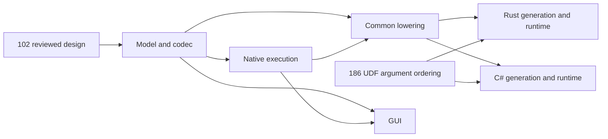

# Ordered scalar filter/map proposal

This is the design deliverable for [#102](https://github.com/DeandreT/ferrule/issues/102). It proposes one additive sequence descriptor, `filter_map_v1`, over the existing inclusive integer generator. Implementation, compiled qualification and GUI support belong to later, separately scoped issues. Current readers, interpreters and emitters do not support this descriptor.

The operation is ordered and eager: generate integers, retain those for which a project-local scalar UDF returns `true`, then map each retained integer through a second scalar UDF. It returns a scalar sequence to an existing sequence consumer. It does not introduce a list into `Value`, a callable value, a new generator, a streaming interface or a general nested collection.

## Current source boundary

The existing [`SequenceExpr`](../../crates/mapping/src/model/graph.rs) has tokenize, length/regex tokenize, generate and recursive-collect variants. [`sequence.rs`](../../crates/engine/src/sequence.rs) materializes generator results; the inclusive integer generator has a 1,000,000-item cap and an empty result for reversed bounds. Existing `Null`/`JsonNull` generator arguments short-circuit to an empty result; a missing `from` defaults to 1. Existing sequence consumers own an empty-path source node and expose a 1-based item position.

[`UserFunction`](../../crates/mapping/src/model/project.rs) already has ordered typed parameters, a private scalar graph and one typed output. The interpreter adapts UDF arguments after evaluating the complete argument vector, limits UDF call depth to 64 and preserves lazy `If`/`Raise` evaluation. Its scalar adapter can pass absence/null markers through a declared scalar type. A typed signature alone therefore does not establish the stricter new output domain below.

There is an existing source-level UDF error-order discrepancy: the interpreter evaluates all arguments before adapting them, while current Rust and C# emitters adapt each argument immediately. [#186](https://github.com/DeandreT/ferrule/issues/186) owns qualification and correction of that discrepancy. It has not been executed as part of this design. Generated filter/map support must satisfy the call order in this note; existing generic UDF parity is not assumed.

## Finite model and wire proposal

```json
{
  "kind": "filter_map_v1",
  "source": { "kind": "generate", "from": 1, "to": 2, "item": 10 },
  "item": 11,
  "predicate": 100,
  "mapper": 101,
  "output_type": "int",
  "captures": [{ "node": 20, "ty": "int" }]
}
```

These numbers are graph/function identities, not inline values. This is a proposed tagged `SequenceExpr` variant, not a new scalar `Node::Call`. Initial admission is limited to a generated scope, `SequenceExists`, `SequenceItemAt` or `SequenceAggregate`. `FailureIteration::Sequence` is an additional existing sequence site, but it explicitly refuses `filter_map_v1` with an unsupported-capability diagnostic in this initial contract; legacy failure-rule generators remain unchanged. Each admitted, reached consumer evaluates a new sequence; there is no shared result cache or change to existing consumer argument order.

| Boundary | Initial admission |
| --- | --- |
| Source | Exactly one existing `Generate`; optional `from`, required `to`; no transform nesting or other generator variants |
| Input item | `Int` with the existing generator's argument coercion and item cap |
| Predicate | Existing project-local UDF, declared `Bool` output; actual adapted result must be `Bool` |
| Mapper | Existing project-local UDF; declared output equals `output_type` |
| Output item | Exactly `Int`, finite `Float`, `Bool` or `String`; exact actual tag must equal `output_type` after the ordinary UDF return adapter |
| Captures | 0–16 ordered parent graph nodes, each declared as one of the four scalar types and checked for an exact tag; `Float` must be finite |
| Stage parameters | Exactly `[item: Int, source_position: Int, capture_0, ...]`, with stable ordered parameter IDs and matching capture types |
| Stage body graph | `Const`, `Unconnected`, `FunctionParameter`, `Call`, `If`, `Raise`, acyclic `UserFunctionCall` |
| Builtins in a stage's transitive UDF graphs | Binary `add`, `multiply`, `divide`, `equal`, `not_equal`, `less_than`, `greater_than`, `concat`, preserving their existing scalar/error semantics |
| Nested UDF signature | At most 18 parameters; the same body/builtin admission applies transitively; ordinary scalar adapters remain in use |

Body intermediates can contain existing scalar absence/null markers and a computation can produce a nonfinite float. They are not successful stage outputs. `Null`, `JsonNull` and `XmlNil` remain distinct; none is an implicit filter result, emitted item or coercion to an empty string. `Group`, `Repeated`, `MappedSequence` and `DocumentSet` are not scalar stage inputs/outputs.

`SourceField`, `Position`, runtime values/parameters, reducers, source documents, joins and other context-sensitive nodes are rejected inside the stage's transitive UDF graphs. Parent data enters only through captures. This restriction applies to UDFs used by this descriptor; it does not narrow ordinary UDF admission elsewhere. A valid `Raise` in an unselected branch is admitted and stays lazy.

The source's `item` and the output `item` must be different, uniquely owned, unframed empty-path `SourceField` node IDs. The inner ID is reserved by the source descriptor and cannot be read by captures or downstream expressions. Stage input is supplied explicitly as a UDF parameter. Only the output ID is exposed to the downstream consumer. Both IDs must participate in duplicate/missing-owner validation; treating `item()` as the output ID cannot silently omit validation of the source ID.

## Evaluation and position contract

Static admission visits the whole descriptor and its transitive UDF graphs, including both sides of an `If`. Runtime selection can skip a valid descriptor; it cannot make an invalid signature, missing callee or prohibited node admissible.

For a reached descriptor, the following order is fixed:

1. Evaluate `from` when present, then `to`, in the parent context. Preserve the existing absent-argument short circuit. Coerce the completed bound values afterward, in lower/upper order; thus an upper expression's error precedes an earlier lower value's coercion error. Validate the primitive range cap, reserve the shared item/work budget, then materialize its integers.
2. Evaluate captures once each, left to right, still in the parent context. Check each exact tag immediately before evaluating the next capture. This happens even when the generated sequence is empty. Parent capture results are retained for the invocation; cloning by ordinary UDF argument adapters is still possible.
3. For each source integer in increasing generator order, invoke the predicate with item, original 1-based source position and the captured values. Apply its ordinary return adapter, then the strict `Bool` boundary check. On `false`, skip the mapper entirely.
4. On `true`, invoke the mapper with the same arguments. Apply its ordinary return adapter, then check exact output tag and float finiteness; append one output item. Stop at the first failure. Complete the whole sequence before starting its consumer.
5. The consumer sees the output owner and dense 1-based output positions. Its existing filter/reducer/index argument order and lazy behavior are unchanged, after eager sequence completion.

Each stage or nested UDF call first evaluates its entire ordered argument vector, then adapts parameters in declaration order, then evaluates the body and adapts its return. A later argument's `Raise` therefore wins over an earlier argument's adaptation failure. Static call-depth/signature admission precedes runtime. Existing runtime cycle/depth checks occur on call entry after arguments are evaluated. The new stage boundary checks happen after the ordinary return adapter, so an ordinary adapter failure keeps its original cause rather than being replaced by an output-tag diagnostic.

The stage's `source_position` is the pre-filter index. It never changes to the dense output position. A parent `Position` node used as a capture resolves before any stage call and retains its parent value. The stage does not push a source frame into a UDF or make an implicit `Position` available there; its diagnostic envelope records the source index. A downstream `Position` resolves through the existing consumer frame. No capture may depend on either private owner or a foreign private sequence owner.

For source `[1,2,3,4,5]`, parent position `7`, predicate `item > 2` and mapper `item * 10 + source_position + parent_position`, the result is `[40,51,62]`. The stage positions are `[3,4,5]`; the consumer positions are `[1,2,3]`. The linked literal fixtures retain these separately.

False predicates and unselected `If` branches suppress their runtime errors. Eager completion means `exists` cannot accept the first output and hide a later mapper failure. A failed invocation has no successful partial sequence; any already computed diagnostic values may be retained as evidence, not consumed or published as success. Mapping exception message absence and an explicitly empty message remain different.

## Limits and cancellation proposal

The following controls are new requirements for this feature, not a claim about existing generated APIs. Defaults are fixed ceilings; a host/test can lower them, never raise them through project serialization. The same counters belong to one run and are shared across reached filter/map descriptors, repeated scopes and primary/named targets. Existing generator/reducer paths outside this feature retain their current policy.

| Control | Proposed limit and exact charge/refusal point |
| --- | --- |
| Primitive source length | Existing `Generate` cap of 1,000,000; check before allocation, preserving its original error |
| Cumulative admitted source items | 1,000,000 across the run; reserve the complete range count before allocation; an empty or absent range reserves zero |
| Work | 10,000,000 units across the run; charge one before every reached graph-node evaluation belonging to this descriptor's source arguments, captures or transitive UDF body, one before each UDF call entry, and one per admitted source item reserved before allocation |
| Stage output items | At most the admitted source count; filter/map cannot expand the sequence |
| UDF depth | Existing 64-call limit; static cycles rejected; no resetting depth for nested calls |
| Composition depth | Exactly one; `source` cannot be another transform |

Repeated graph-node references charge on each evaluation; no memoization is implied. The descriptor dispatch, scalar adaptation and budget comparisons themselves add no units. A single range reservation is atomic: primitive item limit, then cumulative item limit, then remaining work check; failure consumes neither reservation. Successful reservation charges both counters, even if a later capture fails. Later node/call charges refuse before evaluation when `used + 1` exceeds the work limit; the refused charge does not change `used`. Limits do not replace a previously returned original evaluation error.

For explicit range `1..=3`, no captures, constant-true predicate and identity mapper, source argument nodes cost 2 and source items cost 3. Each item costs predicate call/body 2 and mapper call/body 2. With work limit 8, the first mapper's parameter-node charge refuses at `used=8`, `requested=1`; the expected fixture retains that exact boundary. Consumer expressions outside the descriptor are not charged to this feature's work counter.

A run-owned cancellation checker is consulted before every charged node/call, before range allocation/reservation and before each stage item. The checker wins over the budget test at that same boundary. A cancellation prevents later work and successful partial output; an already returned scalar error is retained. A scalar builtin already in progress is not forcibly interrupted. Existing debug hooks are post-node hooks and do not establish this new pre-boundary contract. Native and generated implementations need an explicit scoped checker/budget bridge, without changing legacy paths by accident.

An item count and charged traversal budget are not a total-RAM or hard-time bound. The source and completed derived sequence are materialized, parent strings can be large, UDF arguments can clone strings, and consumer/target/writer lifetimes remain ordinary. Static validation and a single scalar builtin's internal work are outside these counters. No streaming, precise peak-memory attribution or prompt interruption claim follows from these limits.

## Diagnostics and compatibility

New admission diagnostics must identify the descriptor/output owner and the offending field, node or function: unsupported source/nesting, duplicate/missing private owner, prohibited stage node/builtin, missing callee, signature/arity mismatch, capture declaration or excessive capture count. Validate structural source admission before ownership, then capture declarations, predicate signature, mapper signature and transitive stage graphs. Visit the predicate before the mapper, each function's complete node table in node-ID order, and each encountered callee depth-first before continuing that table; retain the call path for cycle/depth refusals. Existing unrelated project validation still precedes runtime and preserves its current order; this note does not define the whole project's first static error.

New runtime diagnostics have a logical envelope containing output owner, phase (`source`, `capture`, `predicate`, `mapper`), optional capture index, original source position, function and graph node, plus the original cause. Capture/predicate/output tag refusals retain expected/found tags and nonfinite float bits; limit refusals retain limit, used and requested values. Cancellation retains the exact boundary. A primitive error, builtin error, UDF adapter error or `MappingException` keeps all of its original fields/message distinction. This is a proposal for logical comparison, not a claim that today's C# exceptions expose new structured fields. Public Rust/C# error adapters require separate review and whole original outcomes before assertions.

The tagged variant is additive. Old project forms and absent optional fields retain their serde behavior and round-trip meaning. A new reader continues to admit supported old sequence descriptors; an old reader rejects the unknown new kind. The new variant has explicit field/type admission and rejects unknown fields in its own body; applying a global unknown-field restriction to legacy variants is outside scope. There is no fallback that silently removes a filter/map or treats its output as a scalar.

The initial design does not require a global project version bump. If the actual codec's capability/version rules require one, that is a model-review decision before implementation. Lowering and emitters must return an explicit unsupported capability for this variant until their typed model, ownership, budgets, cancellation and error ordering are qualified; they must not report an emitted mapping by omitting the operation. Predicate and mapper `FunctionId`s are explicit lowering reachability roots, in addition to the existing main `UserFunctionCall` roots, and retain their transitive reachable callees and ordered signatures. Capture/source `NodeId` dependencies alone do not retain these functions: current [`lower_user_functions`](../../crates/codegen/src/lower.rs) seeds only main graph calls. The common model must preserve both stage IDs and their closure even when they appear nowhere as main scalar calls.

## Literal qualification and follow-on ownership

The [37 proposal cases and two legacy controls](fixtures/scalar-filter-map-v1.json) contain complete proposed descriptor/UDF graphs with independent literal typed expectations. They define prospective test adapters; they are not supported current `Project` files. All candidate and literal runtime execution is **UNRUN**. They cover parent/source/output positions; eager consumer errors; selected/unselected lazy errors; absent versus empty messages; all four output tags; absence/nonfinite refusals; source/capture/call order; cumulative limits; cancellation and static unsupported forms. Future test adapters must construct complete ordinary Projects/instances and retain raw native/compiled output, cause payloads and bytes before comparing these expectations. A proposed fixture is not runtime acceptance.

| Follow-on lane | Source ownership and dependency | Required completion evidence |
| --- | --- | --- |
| Model/codec/ownership | `crates/mapping` variant, UDF admission and wire fixtures; coordinated guard-only edits in every reached exhaustive consumer; depends on this design review | Buildable additive model, new/legacy round trips, both private owners and typed unsupported-capability refusals; no stage execution |
| Native execution | `crates/engine` sequence/context/budget/checker integration; depends on model contract | Literal typed/error/position fixtures and whole outcomes, shared limits across scopes/targets, baseline suites |
| Common lowering | `crates/codegen` model/lowering/validation plus guard-only Rust/C# consumer matches; depends on model and native oracle agreement | Buildable typed model, both stage FunctionId roots/transitive callees, complete source/owner/UDF/capture preservation; typed backend refusal until execution is qualified |
| Rust generation/runtime | Rust emitter plus Rust runtime only; depends on lowering/native fixtures and #186 call-order qualification | Compiled ordinary mapping fixtures with original typed/byte/error comparisons, budgets/cancellation and warnings denied |
| C# generation/runtime | C# emitter plus C# runtime only; same prerequisites | The same compiled fixtures, whole original exceptions/cause comparisons, budgets/cancellation and warnings denied |
| GUI | Editor sequence presentation, ordered capture/stage wiring, save/reload/history; depends on model and native execution | Compact controls, correct ownership/positions, native preview qualification and explicit per-backend capability |

The enums are closed and existing consumers match them exhaustively. A variant-introduction increment therefore owns the minimum coordinated guard-only changes required to keep the whole increment buildable: engine evaluation/validation, common lowering and other reached editor/consumer matches for `SequenceExpr`; both emitter admission/render paths and other reached matches for `GeneratedSequence`. Guards return a typed unsupported-capability diagnostic at a fallible admission boundary or use an explicitly reviewed staged representation. They do not execute the stage, silently substitute an old generator, emit partial mappings or panic on the new form. Actual native execution and each backend implementation remain in their separate lanes; the guard edits belong to the same cohesive enum-introduction PR rather than an unbuildable intermediate commit.



[#89](https://github.com/DeandreT/ferrule/issues/89) coordinates source ownership; it is not an implementation prerequisite. The model and common lowering lanes each have one owner; language lanes can proceed independently after their shared contracts are frozen. Create and assign the bounded follow-on issues after review rather than accumulating these changes on the design branch.

- [x] Define one finite operation and its input/output admission.
- [x] Specify positions, captures, eager/lazy errors and call order with literal expectations.
- [x] Define item/work/depth/cancellation limits and their practical limits.
- [x] Describe legacy serialization and unsupported diagnostics.
- [x] Map interpreter, lowering, Rust, C# and GUI follow-on ownership.
- [x] Complete independent design/fixture review.
- [ ] Create scoped follow-on issues after review.
- [ ] Implement and qualify each lane; no implementation acceptance is recorded here.
