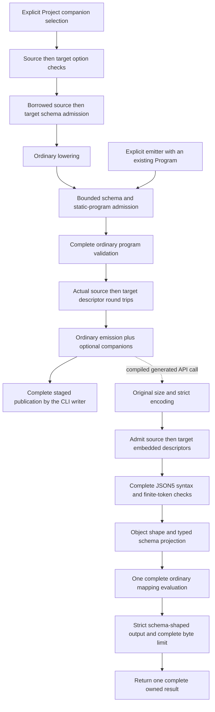

# Generated JSON5 companion contract

JSON5 companions accept one complete JSON5 object and return complete strict JSON. They are an explicit, additive generation profile: ordinary JSON APIs, descriptor codecs and default generated artifacts retain their existing behavior.

The shared policy, both language integrations and CLI selection are merged: [policy PR #151](https://github.com/DeandreT/ferrule/pull/151), [Rust PR #153](https://github.com/DeandreT/ferrule/pull/153), [C# PR #155](https://github.com/DeandreT/ferrule/pull/155) and [CLI PR #156](https://github.com/DeandreT/ferrule/pull/156). The coverage below is specific to this profile within [#96](https://github.com/DeandreT/ferrule/issues/96).

## Explicit generation and public APIs

Select `codegen_rust::emit_with_json5(program, options)` or `codegen_csharp::emit_with_json5(program)` to add the companions. Ordinary `emit` does not add them. C# includes the optional package-free runtime sources; Rust uses the existing local `codegen-runtime` dependency. Neither backend infers selection from a file suffix or stored `json5` settings.

The CLI increment adds `generate --json5-adapters` and the public writer `cli::generate_project_with_json5_adapters`. The flag defaults to false and conflicts with `--csv-output`; ordinary `generate_project` retains its existing artifact tree. Unsupported projects refuse before destination publication. The complete artifact tree is staged and published into a new destination; an existing destination is not replaced. See [Code generation](code-generation.md#explicit-json5-companions) for the commands.

| Route | Rust generated method | C# generated method | Input and owned result |
| --- | --- | --- | --- |
| Text | `execute_json5(source)` | `ExecuteJson5(source)` | UTF-8 `&str` / UTF-16 `string` → strict JSON `String` / `string` |
| Text with context | `execute_json5_with_context(source, execution)` | `ExecuteJson5(source, executionContext)` | Same text boundary with the caller's execution context |
| Bytes | `execute_json5_bytes(source)` | `ExecuteJson5Bytes(source)` | UTF-8 `&[u8]` / `byte[]` → owned UTF-8 `Vec<u8>` / `byte[]` |
| Bytes with context | `execute_json5_bytes_with_context(source, execution)` | `ExecuteJson5Bytes(source, executionContext)` | Same byte boundary with the caller's execution context |

Rust uses `ExecutionContext<'_>`; C# uses `FerruleExecutionContext`. Context methods call the same ordinary mapping with that context. Successful output follows the target schema's property order, uses two-space indentation and ends with one LF, without a BOM. Comments are syntax trivia and are not returned as data. These are singular document APIs; named, plural and loader companions are outside this profile.

## Shared admission APIs

`codegen_schema::json5_profile` provides `validate_schema`, `encode_schema` and `decode_schema`. The first performs a borrowed schema census and validates the closed-object profile. Encoding additionally proves the actual complete descriptor round trip through the unchanged codec. Decoding retains the complete strict parse and its byte/depth errors, then checks decoded key identities in the original payload before accepting its collapsed value. Duplicate descriptor fields, including escaped aliases, are refused. Raw keys and defaults are checked before the ordinary decoder can discard unknown metadata.

`codegen` provides `validate_json5_format_options`, `prepare_json5_boundary` and `validate_json5_boundary`. Preparation returns `Json5BoundaryProfile` with the complete source and target descriptors. Validation delegates to preparation and discards that profile. Refusals use `Json5ProfileError` or `Json5BoundaryPolicyError`; schema-side ownership and original descriptor/program-validation causes remain available through `Error::source`.

Project format options are not retained by the lowered program. The opt-in CLI writer checks source then target options and performs both borrowed schema censuses before ordinary lowering. It then selects the opt-in emitter, which prepares the lowered program before ordinary emission. A direct caller with an existing Program uses the same preparation through `emit_with_json5`; preparation alone does not add methods. Stored `json_document` and `json5` Boolean identities may vary without selecting this profile.

## Eligible schemas and programs

Both source and target must have a closed, nonrepeating Group root. Nested Groups are allowed; each scalar leaf has exactly one String, Int, Float or Bool type. A scalar leaf may be nullable. Required names must be nonempty, unique and declared among that Group's unique children. Required-name presence is enforced by the later typed reader; policy admission does not execute an input.

All other schema metadata must have its ordinary constructor default. The policy refuses open objects, scalar unions, alternatives, repeated or recursive nodes, nullable Groups, XML metadata, constraints, fixed/default/generated values and database metadata. Raw descriptors with unknown node/kind keys or nondefault unsupported metadata are refused. Existing ordinary descriptor callers retain their current handling of ignored fields.

The program must have one primary input and one primary target, with no XML boundary, extra named/dynamic inputs or extra targets. Every target scope must use static Group construction, without repetition or iteration. Its bindings and nested scopes must refer to distinct declared scalar or Group children, with exact scalar target domains. Existing expressions, user functions, ordered global failure rules, lazy branches, graph exceptions and context values remain subject to complete ordinary program validation.

Format options admit their ordinary defaults plus the two JSON identity Booleans. Physical formats, repair dependencies, tabular/workbook controls, XML policies, local file sets, JSON Lines, unresolved-schema references and other nondefault options are refused. Every current SchemaNode, FormatOptions, Program, TargetScope, Binding and construction variant has an explicit decision; adding a typed field or variant requires a new policy decision.

## Policy limits

These limits apply independently to each schema:

| Resource | Maximum | Unit |
| --- | ---: | --- |
| Schema nodes | 4,096 | Root and all declared descendants |
| Logical levels | 64 | Root is level 1 |
| Individual name | 4,096 | UTF-8 bytes |
| Combined names | 1,048,576 | Node names plus every required-name occurrence, in UTF-8 bytes |
| Actual descriptor | 1,048,576 | Complete encoded bytes, including any supported version prefix |

The borrowed census precedes schema copying and descriptor encoding. Required-name and child counts are checked before bounded set allocation. Raw descriptor length is checked before strict JSON parsing; that bounded parse allocates a raw value tree before the descriptor census and typed decode. After it succeeds, an original-text walk tracks decoded keys separately for each object, skipping complete strings so punctuation in values is not mistaken for structure. Those sets are bounded by the complete descriptor length and unchanged strict-reader depth. Each decoded key is limited to 4,096 UTF-8 bytes before set insertion or error retention. This descriptor rule does not change last-value-wins duplicates in mapping input.

The logical-level cap is an upper bound, not a promise that all trees at that depth can be encoded or decoded. A nested Group introduces several JSON containers. The unchanged descriptor codec and strict JSON reader can reject a tree before the logical cap is reached. Preparation requires an actual codec round trip and preserves that typed refusal before emission and publication. The schema census does not introduce an expression-work or process-memory guarantee; ordinary program validation remains separate.

## Generation and runtime stages

The Project route checks options and borrowed schemas before lowering can copy them. An existing Program enters at preparation. Both routes require static-program admission, complete ordinary validation and actual descriptor round trips before ordinary emission produces the optional artifact set.

At runtime, original size and encoding are checked before either descriptor. Rust text already has valid UTF-8; byte methods retain the original `Utf8Error`. C# text rejects unpaired UTF-16 surrogates and counts its UTF-8 bytes; byte methods use strict UTF-8 decoding. A BOM is accepted as trivia and still counts toward the original limit. C# null source or context arguments refuse before boundary work.

Both complete descriptors are admitted before syntax. Their strict parse errors retain their actual cause; duplicate decoded descriptor keys, including escaped aliases, refuse before typed decoding can hide them. The complete input is then normalized before root-object and typed-schema projection. Mapping is called once only after those checks succeed. Mapping or output failure returns no partial result. The output byte check includes the final LF and occurs after complete output validation and serialization.

## Syntax and numeric scope

The shared normalizers accept comments, trailing commas inside objects or arrays, single- or double-quoted Unicode strings, supported escapes and the fixed JSON5 whitespace set. Unquoted identifiers use ASCII letters, `_` or `$` initially, with ASCII digits also allowed afterward; identifier escapes must resolve to that subset. Quoted Unicode property names are supported. Broader unquoted Unicode membership remains [#135](https://github.com/DeandreT/ferrule/issues/135).

Duplicate input properties survive normalization and retain last-value-wins typed reading. Every lexical number is checked before projection, including an overwritten or undeclared member. `NaN`, signed infinities and decimal overflow to nonfinite values refuse at Syntax. Exact decimal and hexadecimal integer tokens use checked signed/unsigned 64-bit ranges. Decimal floating tokens keep their spelling, with a leading plus removed and missing decimal-side zeros supplied; they are not rounded and rewritten by the normalizer. Typed projection still applies the declared Int or Float domain, so a syntactically valid unsigned integer or an integer not exactly representable as Float can refuse at Input. Integer `-0` normalizes to `0`; a floating negative-zero lexical retains its sign.

The shared 75-record inventory has **46 pure syntax successes and 29 Syntax refusals**. Six of the syntax successes are later refused at Input, leaving 40 public successes in that inventory. Root arrays, undeclared fields, required presence, null/type adaptation and numeric representability belong to projection. This inventory is distinct from the compiled public-call cohort below. The existing local JSON5 reader is also separate; its nullable/nonfinite verification lane remains [#130](https://github.com/DeandreT/ferrule/issues/130).

## Runtime limits and typed causes

MiB means 1,048,576 bytes. The limits below apply to one API call; the policy limits above apply separately to each embedded schema.

| Resource | Maximum | Accounting |
| --- | ---: | --- |
| Original input | 64 MiB | Complete UTF-8 bytes, including BOM and trivia |
| Normalized strict JSON | 64 MiB | Emitted UTF-8 bytes before typed projection |
| Syntax container depth | 127 | Nested object/array containers |
| Syntax work | 536,870,912 | Charged grammar operations, repeated scans and emitted bytes |
| Strict JSON output | 64 MiB | Complete encoded result, including its final LF |

Syntax offsets refer to the original UTF-8 input. C# also retains absolute UTF-16 indices for text encoding failures; the retained encoder cause's span-scoped index is not a whole-input index. Encoding preflight and final owned-string copies are outside the syntax-work ledger. Schema parsing, typed projection, mapping and output serialization have their own existing checks; the syntax-work cap does not bound their work.

Rust returns `Json5BoundaryError`, retaining source/target schema, syntax, input, mapping and output causes through `Error::source`; resource variants retain requested and maximum values. C# uses `FerruleJson5BoundaryException` with `Stage`, schema side, limit fields and the actual `InnerException`. A descriptor failure can retain a direct `JsonException`; input/output paths retain the ordinary boundary chain when that path produces one. Mapping errors retain the original runtime exception and are not relabeled as syntax errors. C# argument errors remain `ArgumentNullException`.

These are serialized-boundary limits, not a process-memory ceiling or a streaming contract. Complete source text, normalized text, parsed input, mapped instances and serialized output can coexist. Output limits can be checked after allocation; buffer capacity, allocator/GC/runtime overhead and host-owned data are separate. See [Memory use and boundary limits](memory-and-limits.md).

## Physical boundary checks and measured memory

On **2026-10-08**, [PR #159](https://github.com/DeandreT/ferrule/pull/159) completed all **48 serial physical calls** after a fresh complete 184-call small cohort: six cases × four public routes × two languages. All eight generated hosts built successfully. Every case checked the complete successful result or typed refusal, including the reported limit and original cause where applicable. Failures returned no partial output. The original, normalized and output boundaries were exercised at exactly 64 MiB and one byte above that limit. Successful normalized sizes are established by independent literal corpus recipes; the public API does not expose its intermediate normalized buffer.

The table records whole-host peak resident memory in KiB. Each range covers four different routes: text and bytes, each with and without context. These are route ranges, not repeated trials of an identical call.

| Physical case | Rust peak RSS, KiB | C# peak RSS, KiB |
| --- | ---: | ---: |
| Original, exactly 64 MiB | 136,976–137,056 | 308,040–308,548 |
| Original, 64 MiB + 1 byte | 135,604–135,928 | 178,920–310,336 |
| Normalized, exactly 64 MiB | 105,380–106,164 | 472,980–473,168 |
| Normalized, 64 MiB + 1 byte | 82,328–82,632 | 225,120–226,652 |
| Output, exactly 64 MiB | 270,344–270,568 | 1,403,796–1,404,532 |
| Output, 64 MiB + 1 byte | 270,032–270,460 | 1,204,508–1,205,396 |

Measurement includes process startup, input reading, the public API call, returned-output retention and hashing, and the host's final evidence checks. Host builds and the outer controller's checks are outside that measurement. The Linux Rust hosts used the development profile with optimization level 0 and debug information level 2; the C# hosts used Release on .NET 10.

The largest observed peaks were about **264 MiB for Rust** and **1.34 GiB for C#**, both in the exact-output case. These measurements do not isolate API allocations, attribute a particular stage, establish a universal memory ceiling, or qualify streaming. [#160](https://github.com/DeandreT/ferrule/issues/160) scopes separate C# allocation attribution before any optimization work. See [Memory use and boundary limits](memory-and-limits.md) for the wider memory model.

## Increment checklist

- [x] Define additive shared schema, descriptor, program and option policy APIs.
- [x] Keep ordinary codecs and lowering intact and retain typed original causes.
- [x] Refuse duplicate decoded descriptor keys without changing mapping input duplicates.
- [x] Run duplicate-field, escaped-alias, quoted-string and original-error precedence controls.
- [x] Run focused and complete affected policy suites, formatting and strict warnings.
- [x] Merge explicit Rust runtime and emitter companions ([PR #153](https://github.com/DeandreT/ferrule/pull/153)).
- [x] Merge explicit C# runtime and emitter companions ([PR #155](https://github.com/DeandreT/ferrule/pull/155)).
- [x] Merge explicit CLI selection with verified unchanged defaults and atomic refusal ([PR #156](https://github.com/DeandreT/ferrule/pull/156)).
- [x] Compile both public hosts and complete all 184 small calls: 17 representation plus six mapping/context cases × four routes × two languages ([#144](https://github.com/DeandreT/ferrule/issues/144)).
- [x] Qualify all 48 serial physical original/normalized/output exact and one-over calls after all small prerequisites ([PR #159](https://github.com/DeandreT/ferrule/pull/159)).

The local coverage recorded on **2026-10-08** includes the merged language regressions and the complete 184-call compiled cohort: 92 Rust and 92 C# calls with independent results, output bytes and original error causes. Six additional C# null-source/context controls are separate from that total. The 75-record syntax inventory, direct helper controls and compiled calls are separate evidence sets; the public cohort does not execute every inventory record. All 48 physical calls also completed, with normal process closure and passing local formatting and strict-warning checks. None of these checks qualifies broader schemas, native metadata ([#106](https://github.com/DeandreT/ferrule/issues/106)), desktop controls or total process memory.
