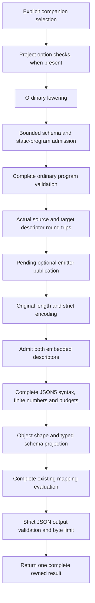

# Generated JSON5 companion contract

JSON5 companions are an explicit, additive generation profile. The shared admission policy is implemented separately from the syntax normalizers; generated runtime adapters, emitter selection and CLI selection remain pending. Ordinary JSON APIs, descriptor codecs and generated artifacts keep their existing behavior.

This page describes the narrow profile in [#141](https://github.com/DeandreT/ferrule/issues/141), within the [#96](https://github.com/DeandreT/ferrule/issues/96) sequence. It does not claim executed public JSON5 mapping coverage.

## Shared admission APIs

`codegen_schema::json5_profile` provides `validate_schema`, `encode_schema` and `decode_schema`. The first performs a borrowed schema census and validates the closed-object profile. Encoding additionally proves the actual complete descriptor round trip through the unchanged codec. Decoding retains the complete strict parse and its byte/depth errors, then checks decoded key identities in the original payload before accepting its collapsed value. Duplicate descriptor fields, including escaped aliases, are refused. Raw keys and defaults are checked before the ordinary decoder can discard unknown metadata.

`codegen` provides `validate_json5_format_options`, `prepare_json5_boundary` and `validate_json5_boundary`. Preparation returns `Json5BoundaryProfile` with the complete source and target descriptors. Validation delegates to preparation and discards that profile. Refusals use `Json5ProfileError` or `Json5BoundaryPolicyError`; schema-side ownership and original descriptor/program-validation causes remain available through `Error::source`.

Project format options are not retained by the lowered program. A caller with a Project must validate both sets of options before ordinary lowering, then prepare the lowered program. A caller with an existing Program must prepare that program directly. Neither API enables an adapter: explicit selection by a future emitter or CLI is required. Stored `json_document` and `json5` Boolean identities may vary without selecting this profile.

## Eligible schemas and programs

Both source and target must have a closed, nonrepeating Group root. Nested Groups are allowed; each scalar leaf has exactly one String, Int, Float or Bool type. A scalar leaf may be nullable. Required names must be nonempty, unique and declared among that Group's unique children. Required-name presence is enforced by the later typed reader; policy admission does not execute an input.

All other schema metadata must have its ordinary constructor default. The policy refuses open objects, scalar unions, alternatives, repeated or recursive nodes, nullable Groups, XML metadata, constraints, fixed/default/generated values and database metadata. Raw descriptors with unknown node/kind keys or nondefault unsupported metadata are refused. Existing ordinary descriptor callers retain their current handling of ignored fields.

The program must have one primary input and one primary target, with no XML boundary, extra named/dynamic inputs or extra targets. Every target scope must use static Group construction, without repetition or iteration. Its bindings and nested scopes must refer to distinct declared scalar or Group children, with exact scalar target domains. Existing expressions, user functions, ordered global failure rules, lazy branches, graph exceptions and context values remain subject to complete ordinary program validation.

Format options admit their ordinary defaults plus the two JSON identity Booleans. Physical formats, repair dependencies, tabular/workbook controls, XML policies, local file sets, JSON Lines, unresolved-schema references and other nondefault options are refused. Every current SchemaNode, FormatOptions, Program, TargetScope, Binding and construction variant has an explicit decision; adding a typed field or variant requires a new policy decision.

## Policy limits

These limits apply independently to each schema:

| Resource | Maximum | Unit |
| --- | ---: | --- |
| Schema nodes | 4,096 | Root and all declared descendants |
| Logical levels | 64 | Root is level 1 |
| Individual name | 4,096 | UTF-8 bytes |
| Combined names | 1,048,576 | Node names plus every required-name occurrence, in UTF-8 bytes |
| Actual descriptor | 1,048,576 | Complete encoded bytes, including any supported version prefix |

The borrowed census precedes schema copying and descriptor encoding. Required-name and child counts are checked before bounded set allocation. Raw descriptor length is checked before strict JSON parsing; that bounded parse allocates a raw value tree before the descriptor census and typed decode. After it succeeds, an original-text walk tracks decoded keys separately for each object, skipping complete strings so punctuation in values is not mistaken for structure. Those sets are bounded by the complete descriptor length and unchanged strict-reader depth. Each decoded key is limited to 4,096 UTF-8 bytes before set insertion or error retention. This descriptor rule does not change last-value-wins duplicates in mapping input.

The logical-level cap is an upper bound, not a promise that all trees at that depth can be encoded or decoded. A nested Group introduces several JSON containers. The unchanged descriptor codec and strict JSON reader can reject a tree before the logical cap is reached. Preparation requires an actual codec round trip and preserves that typed refusal before a future emitter publishes artifacts. The schema census does not introduce an expression-work or process-memory guarantee; ordinary program validation remains separate.

## Generation and runtime stages

The generation path is implemented through the shared policy. Runtime boxes below describe the pending companion contract, including source/target descriptor admission before syntax normalization and projection.

The pure normalizers accept 46 of the shared 75 syntax records and refuse 29 at Syntax. Six syntactically valid records are later refused at Input by the public profile, leaving 40 successful public cases. These are contract inventories, not executed public-host results. Root arrays, undeclared fields, required presence, null/type adaptation and numeric representability belong to typed projection rather than pure syntax refusal.

The planned public surface has four singular methods per backend: text and bytes, each with and without the existing execution context. Outputs remain strict JSON. Named/plural/loader routes and broader schemas are outside this increment. Invalid original encoding, syntax, schema projection, mapping and output failures must retain their original typed causes; a mapping failure must not be converted into a parser failure.

## Increment checklist

- [x] Define additive shared schema, descriptor, program and option policy APIs.
- [x] Keep ordinary codecs and lowering intact and retain typed original causes.
- [x] Refuse duplicate decoded descriptor keys without changing mapping input duplicates.
- [x] Run duplicate-field, escaped-alias, quoted-string and original-error precedence controls.
- [x] Run focused and complete affected policy suites, formatting and strict warnings.
- [ ] Integrate explicit Rust companions after the shared policy and Rust syntax increment.
- [ ] Integrate explicit C# companions after the shared policy and C# syntax increment.
- [ ] Add explicit CLI selection and prove unchanged default artifacts and atomic refusal.
- [ ] Compile both public host cohorts and finish all small controls before opt-in resource runs.
- [ ] Qualify serial original/normalized/output exact and one-over resource cases.

The checklist separates source implementation from execution. Passing syntax or policy controls alone does not qualify generated public adapters, broader format support, native metadata, desktop controls or process memory.
