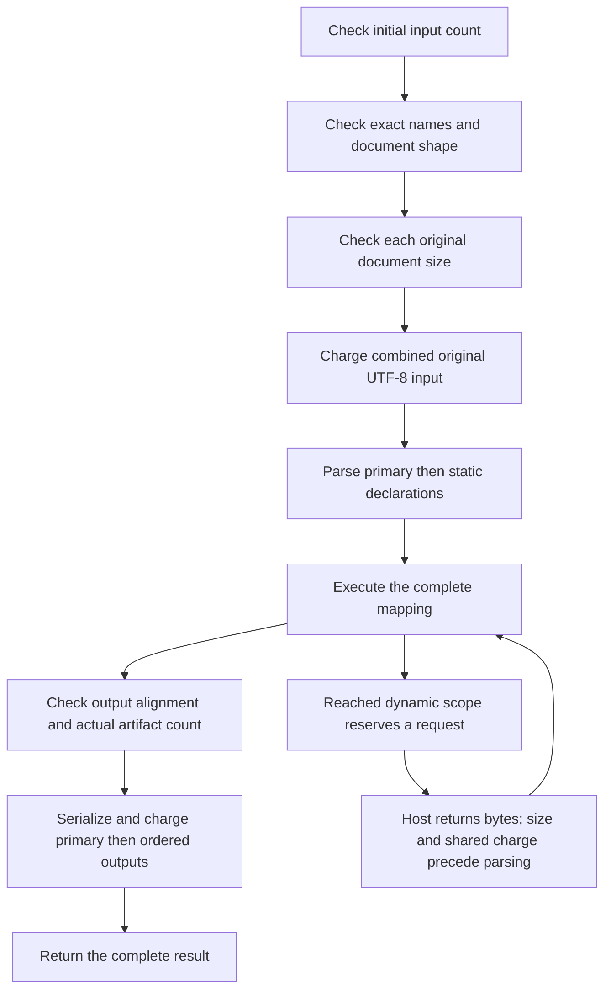

# Generated XML qualification index

This index maps the current public Rust and C# XML document APIs to their source
tests, retained execution and remaining verification work. A source fixture is
evidence that a test has been written; it is not evidence that generation,
compilation or execution passed. The compiled results below have separate local
execution records. This documentation change reruns no mappings and changes no
conformance-survey status. The index is finite, rather than a complete parity
inventory.

Use the [XML host guide](code-generation.md#xml-host-boundary) for signatures and
examples. The authoritative adapter dispatch and admission are
[`XmlOutputMode`](../crates/codegen/src/model.rs) and
[`validate_boundary`](../crates/codegen/src/validate/xml.rs). The two emitters are
[`codegen-rust::xml_api`](../crates/codegen-rust/src/xml_api.rs) and
[`codegen-csharp::mapping::xml_api`](../crates/codegen-csharp/src/mapping/xml_api.rs).
Successful typed or JSON generation does not by itself establish an XML adapter.

## Route families

Every row has text and UTF-8 byte inputs and an execution-context variant.
The table shows the text method without a context. In Rust, replace
`execute_xml` with `execute_xml_bytes` for the byte method. In C#, replace
`ExecuteXml` with `ExecuteXmlBytes`. Input bytes and returned bytes are distinct
coverage cells even when one call exercises both.

| Input domain and output form | Rust text method | C# text method | Source fixture family |
| --- | --- | --- | --- |
| Structured or admitted RootView primary → one primary document | `execute_xml` | `ExecuteXml` | [structured_xml_public](../crates/cli/tests/code_generation/structured_xml_public.rs), [xml_text](../crates/cli/tests/code_generation/xml_text.rs) |
| Primary → primary plus static named documents | `execute_xml_outputs` | `ExecuteXmlOutputs` | [xml_output_sets](../crates/cli/tests/code_generation/xml_output_sets.rs) |
| Primary plus complete static named inputs → primary or static output set | `execute_xml_with_sources`, `execute_xml_outputs_with_sources` | `ExecuteXmlWithSources`, `ExecuteXmlOutputsWithSources` | [xml_input_sets](../crates/cli/tests/code_generation/xml_input_sets.rs), [rootview_named_inputs](../crates/cli/tests/code_generation/rootview_named_inputs.rs) |
| Structured primary, optional static inputs and dynamic named loader → primary or static output set | `execute_xml_with_sources_and_dynamic_source_loader`, `execute_xml_outputs_with_sources_and_dynamic_source_loader` | `ExecuteXmlWithSourcesAndDynamicSourceLoader`, `ExecuteXmlOutputsWithSourcesAndDynamicSourceLoader` | [xml_dynamic_inputs](../crates/cli/tests/code_generation/xml_dynamic_inputs.rs) |
| Structured primary → ordered primary document list | `execute_xml_documents` | `ExecuteXmlDocuments` | [xml_dynamic_outputs](../crates/cli/tests/code_generation/xml_dynamic_outputs.rs) |
| Structured primary plus static named inputs → primary document list | `execute_xml_documents_with_sources` | `ExecuteXmlDocumentsWithSources` | [xml_input_document_sets](../crates/cli/tests/code_generation/xml_input_document_sets.rs) |
| Structured primary, optional static inputs and dynamic named loader → primary document list | `execute_xml_documents_with_sources_and_dynamic_source_loader` | `ExecuteXmlDocumentsWithSourcesAndDynamicSourceLoader` | [xml_dynamic_input_document_sets](../crates/cli/tests/code_generation/xml_dynamic_input_document_sets.rs) |
| Structured primary → static primary plus named document lists | `execute_xml_document_outputs` | `ExecuteXmlDocumentOutputs` | [xml_mixed_document_outputs](../crates/cli/tests/code_generation/xml_mixed_document_outputs.rs), [xml_multiple_named_document_outputs](../crates/cli/tests/code_generation/xml_multiple_named_document_outputs.rs) |
| Structured primary plus static named inputs → static primary plus named document lists | `execute_xml_document_outputs_with_sources` | `ExecuteXmlDocumentOutputsWithSources` | [xml_input_document_outputs](../crates/cli/tests/code_generation/xml_input_document_outputs.rs) |
| Structured primary, optional static inputs and dynamic named loader → static primary plus named document lists | `execute_xml_document_outputs_with_sources_and_dynamic_source_loader` | `ExecuteXmlDocumentOutputsWithSourcesAndDynamicSourceLoader` | [xml_dynamic_input_document_outputs](../crates/cli/tests/code_generation/xml_dynamic_input_document_outputs.rs), [validation child](../crates/cli/tests/code_generation/xml_dynamic_input_document_outputs/validation.rs) |
| Structured primary, no named inputs → static primary, one static named document and one or more named document lists | `execute_xml_mixed_outputs` | `ExecuteXmlMixedOutputs` | [xml_mixed_named_outputs](../crates/cli/tests/code_generation/xml_mixed_named_outputs.rs) |

Context names follow three rules:

| Method family | Rust context spelling | C# context spelling |
| --- | --- | --- |
| No `with_sources` suffix | Append `_with_context` | Same method, context overload |
| Static `with_sources` suffix | Append `_and_context` | Same method, context overload |
| Dynamic loader suffix | Replace `_with_sources_and_dynamic_source_loader` with `_with_sources_context_and_dynamic_source_loader` | Replace `WithSourcesAndDynamicSourceLoader` with `WithSourcesContextAndDynamicSourceLoader` |

Context reads remain lazy. An overload's existence does not mean a runtime value
or parameter is evaluated. C# null argument/list/accessor guards are also distinct
from wrapped XML input and mapping failures.

### Input admission

`Structured` admits closed ordinary groups, repetition, attributes, scalar text
and String/Int/Float/Bool leaves, including admitted nillable scalars. Each named
input has its own embedded schema. Unsupported alternatives, generic/mixed
content, runtime-named input fields and other advanced shapes do not gain this
reader merely because their typed mapping lowers. See
[structured transport source tests](../crates/codegen/src/tests/structured_xml_transport.rs)
and [transport-emission tests](../crates/codegen/src/tests/structured_xml_transport_emission.rs).

`RootView` is a separate closed observed-primary profile. Its zero-named route
retains eight entry points: singular/output-set × text/bytes × context/no context.
Admitted static Structured named inputs add eight source-aware entry points,
giving sixteen signatures in the
[Rust](../crates/codegen-rust/src/xml_api/named_inputs.rs) and
[C#](../crates/codegen-csharp/src/mapping/xml_api/named_inputs.rs) emitter tests.
An observed primary can also use the separately proved flat static named-output
and combined static-input/static-output shapes. Dynamic inputs or document-list
outputs and observed named-input profiles remain outside RootView admission.
The [observed-input guide](code-generation.md#observed-root-view-input) records
the restrictions; the sixteen-signature count is not a count of all combinations.

Document-list output modes require the proved primary repeating-group driver
and closed member schema. Mixed static/list outputs currently require no named
inputs and exactly one static named declaration. The table does not imply that
all input and output forms compose freely. Invalid explicit policies return a
typed validation/emission failure; unsupported ordinary optional boundaries can
retain the typed/JSON core without XML methods.

## Phase order, resources and ownership

For source-aware Structured calls, the high-level order is:

The host owns the loader's I/O and any publication of returned documents.
Generated libraries do not open output paths or schema-hint locations. Logical
member paths remain opaque and ordered, including duplicate paths. A singular
static-output call still maps and serializes the complete set before selecting
primary. A failure returns no partial result; this is an API-result property,
not a claim about an external application's filesystem publication.

| Resource | Unit and maximum | Counting/priority rule | Source controls |
| --- | --- | --- | --- |
| Each input/output document | Original or serialized UTF-8 bytes; 64 MiB | Byte input size precedes decoding. Each static input size is checked before the combined sum. | [boundary tests](../crates/codegen-runtime/src/xml_boundary/tests.rs), [C# input/runtime tests](../runtime/csharp/Ferrule.Runtime.SmokeTests/XmlTests.cs) |
| Initial/dynamic input count | Documents; 4,096 | Includes primary and statics; each dynamic request reserves a slot before its callback. Repeated loads count again. | [input_set](../crates/codegen-runtime/src/xml_boundary/input_set.rs), [dynamic_inputs](../crates/codegen-runtime/src/xml_boundary/dynamic_inputs.rs) |
| Combined input | Original UTF-8 bytes; 256 MiB | Primary, static declaration order, then reached dynamic requests; independent of output. Returned dynamic bytes charge before parsing. | [input_set](../crates/codegen-runtime/src/xml_boundary/input_set.rs), [C# dynamic document tests](../runtime/csharp/Ferrule.Runtime.SmokeTests/XmlDynamicInputDocumentSetTests.cs) |
| Output count | Actual documents; 4,096 | Static sets include primary; primary lists can be empty; named lists include primary plus members; mixed outputs count primary + static named + all members. Check after mapping and before writers. | [output_set](../crates/codegen-runtime/src/xml_boundary/output_set.rs), [document_set](../crates/codegen-runtime/src/xml_boundary/document_set.rs), [mixed host count cases](../crates/cli/tests/code_generation/xml_mixed_named_outputs.rs) |
| Combined output | Serialized UTF-8 bytes; 256 MiB | Charge before retaining/converting the next document; excludes opaque paths. | [document_outputs](../crates/codegen-runtime/src/xml_boundary/document_outputs.rs), [C# document-output tests](../runtime/csharp/Ferrule.Runtime.SmokeTests/XmlDocumentOutputsTests.cs) |
| Embedded schema / literal hint descriptor | UTF-8 bytes; 8 MiB / 2 MiB | Separate setup limits; hint locations are metadata, not I/O instructions. | [Rust boundary](../crates/codegen-runtime/src/xml_boundary.rs), [C# output](../runtime/csharp/Ferrule.Runtime/FerruleXml.Output.cs) |
| Structured parser/projection | Separate depth, node, field/String-byte, namespace and work ledgers | Per document; not an aggregate Instance or RSS limit. Descriptor JSON depth is separate from logical schema depth. | [limit table](code-generation.md#output-and-limits), [C# structured reader](../runtime/csharp/Ferrule.Runtime/FerruleXml.Input.Structured.cs) |

MiB means 1,048,576 bytes. Text APIs count UTF-8; C# can reject invalid UTF-16
while measuring text. Input ledgers do not count decoded mapping allocations,
and output ledgers do not bound the typed outputs already constructed. These are
eager APIs, with no streaming or peak-memory guarantee.

### Error wrappers

The inner boundary distinguishes `Schema`, `DocumentLimit`, `Utf8`, `Input`,
`Mapping` and `Output`. Preserve the wrapper, phase owner, original boundary and
complete typed cause chain together; category text alone cannot establish parity.
Rust uses the standard `Error::source`; C# retains the boundary as
`InnerException`. Per-document `DocumentLimit` has document bytes/limit. Set
refusals instead retain a resource cause with `resource`, `observed_count` and
`limit`; the boundary's per-document byte fields remain unset.

| Route | Rust error / C# exception | Owner information |
| --- | --- | --- |
| Singular without sources | `XmlBoundaryError` / `FerruleXmlBoundaryException` | Original boundary; no source-aware wrapper |
| Static output set without sources | `XmlOutputSetError` / `FerruleXmlOutputSetException` | Primary or named output declaration for serializer failures |
| Static/dynamic source-aware primary or set | `XmlExecutionError` / `FerruleXmlExecutionException` | Exclusive input/output owner; optional authenticated dynamic request |
| Primary list | `XmlDocumentExecutionError` / `FerruleXmlDocumentExecutionException` | Final primary member index and path |
| Static sources → primary list | `XmlInputDocumentExecutionError` / `FerruleXmlInputDocumentExecutionException` | Input declaration or final primary member |
| Dynamic sources → primary list | `XmlDynamicInputDocumentExecutionError` / `FerruleXmlDynamicInputDocumentExecutionException` | Input/member plus optional authenticated request |
| Static primary + named lists | `XmlDocumentOutputsExecutionError` / `FerruleXmlDocumentOutputsExecutionException` | Primary or named declaration/final member/path |
| Static sources → primary + named lists | `XmlInputDocumentOutputsExecutionError` / `FerruleXmlInputDocumentOutputsExecutionException` | Input declaration or existing output owner |
| Dynamic sources → primary + named lists | `XmlDynamicInputDocumentOutputsExecutionError` / `FerruleXmlDynamicInputDocumentOutputsExecutionException` | Input/output owner plus optional authenticated request |
| Static primary + mixed static/list named outputs | `XmlMixedExecutionError` / `XmlMixedExecutionException` | Primary, static named declaration, or final named member/path |

Whole-set name errors and mapping failures have no guessed document owner.
Output alignment/count and document-list serializer schema setup are unowned.
Input descriptor errors in source-aware routes retain their input declaration.
A dynamic request is present only for an adapter's own recovered product-input
refusal: original declaration index, source, path, one-based reservation ordinal
and whether the host callback ran. A host error, similar text or externally
thrown XML exception cannot fabricate that channel. Recovery requires the
original Rust marker allocation or C# private exception identity; the adapter
is terminal after a failed load.

## Written controls and retained execution

The linked source families contain real generated Rust/C# hosts, distinct text
and byte calls, context variants, manual physical/typed output comparisons, and
original wrapper/cause assertions. They also contain generation/admission tests
and direct budget tests. Those levels must be recorded separately: calling a
budget with a supplied size does not exercise a generated parser or writer with
a document of that size.

The following previously retained finite cohorts can be reused after checking
their exact source/project/tool bindings. This index does not rerun them or
claim that they qualify every route in the table on a new source revision.

| Retained cohort | Bounded result scope | Exclusions |
| --- | --- | --- |
| Fourteen strict-imported item-error projects | 56 XML calls per backend: text/bytes × context/no context; 140 total typed/JSON/XML calls per backend; four complete XML writer oracles | No named-input loader, list-output or combined-resource coverage is inferred. Native error/publication categories remain separate. |
| Seven original signed-integer/global-rule projects, with explicit XML-adapter clones | 64 XML calls per backend; 156 total calls per backend across original and XML profiles; three XML and three JSON writer oracles | Original default format and explicit XML adapters are distinct. This does not establish named-input/list resource boundaries. |
| Nine saved ordinary designs replayed locally | Three full successful typed/XML-content/XSD checks and six exact global-rule messages | This is import/local replay evidence, not generated-host XML evidence. Root schema annotations, numeric categories and failed native publication remain explicit differences. |

An XML expression such as `Node::XmlSerialize`, a typed host whose result is later
written by an external XML writer, or a JSON host with an XML-shaped schema is
not a physical XML-input API call. The
[XML expression tests](../crates/codegen-rust/src/tests/xml_serialize.rs) and
[C# expression tests](../crates/codegen-csharp/tests/xml_serialize_dotnet.rs)
remain useful evidence for their own layer.

## Compiled resource qualification

The following finite checks were qualified locally and merged by **2026-10-08**,
through [PR #139](https://github.com/DeandreT/ferrule/pull/139). Generated Rust and
C# libraries were compiled and called through their public XML APIs. The retained
records include full original results before assertions, independent output or
typed-error checks, and exact source/corpus/host guards after execution. These are
local compiled-host results; no hosted-CI pass or coverage of every route in the
index is inferred.

Call counts below total **both backends**. Each ordinary small test is separate
from the opt-in boundary test. The latter runs its own fresh small prerequisites
before physical boundary calls; those prerequisites are included in its total.

| Check | Separate ordinary small calls | Opt-in test: own small + physical calls | Physical observations per backend |
| --- | ---: | ---: | ---: |
| Combined static input bytes | 64 | 64 + 80 = 144 | 40 |
| Combined primary-list output bytes | 8 | 8 + 16 = 24 | 8 |
| Dynamic input request count | 16 | 16 + 16 = 32 | 8 |
| Late mapping exception versus mixed-output count | 24 | 24 + 24 = 48 | 12 |

- [x] **[Combined static input bytes](https://github.com/DeandreT/ferrule/issues/116)**
  ([source controls](../crates/cli/tests/code_generation/xml_input_sets/combined_bytes.rs),
  [PR #131](https://github.com/DeandreT/ferrule/pull/131)). Eight routes per
  backend cover singular/output-set × text/bytes × context/no context, with all
  four static declarations counted, including unused inputs. The physical calls
  produced 32 successes at exactly 256 MiB, 32 refusals at one byte over and 16
  later-document-limit refusals. Combined refusals retain named declaration `3`,
  name `d`, and `xml_input_set_utf8_bytes` observed `268435457`, limit `268435456`,
  even when supplied names are reversed. A malformed primary paired with a later
  document of 64 MiB plus one byte retains that document's `DocumentLimit` before
  parsing the primary. Refusals preserve the original wrapper/cause and return
  no result.
- [x] **[Combined primary-list output bytes](https://github.com/DeandreT/ferrule/issues/117)**
  ([source controls](../crates/cli/tests/code_generation/xml_dynamic_outputs/combined_output_bytes.rs),
  [PR #137](https://github.com/DeandreT/ferrule/pull/137)). Four routes per
  backend cover text/bytes × context/no context for one primary document list.
  Five documents, each within 64 MiB, total exactly 256 MiB on success. One extra
  byte fails at primary member index `4` with opaque path `same.xml` and
  `xml_output_set_utf8_bytes` observed `268435457`, limit `268435456`. Duplicate
  paths, full successful document bytes and original cause identity are checked;
  failures return no partial envelope. This does not qualify named/static output
  combinations at the same byte boundary.
- [x] **[Dynamic input request count](https://github.com/DeandreT/ferrule/issues/118)**
  ([source controls](../crates/cli/tests/code_generation/xml_dynamic_inputs/request_count.rs),
  [PR #138](https://github.com/DeandreT/ferrule/pull/138)). Four singular-loader
  routes per backend cover text/bytes × context/no context. Primary plus static
  `rates` declaration `0` plus 4,094 actual `catalog` declaration `1` callbacks
  reach 4,096 documents; every dynamic path is `same.xml`. Request ordinal 4,095
  reserves document 4,097 and refuses before its callback, leaving 4,094 actual
  callbacks. The refusal retains named input index `1`, name `catalog`, the
  request's declaration/path/ordinal and `callback_invoked=false`, plus the
  original public boundary/resource cause. No private adapter-marker identity or
  list-output loader coverage is inferred.
- [x] **[Late graph exception versus mixed-output count](https://github.com/DeandreT/ferrule/issues/119)**
  ([source controls](../crates/cli/tests/code_generation/xml_mixed_named_outputs/late_mapping_count.rs),
  [PR #139](https://github.com/DeandreT/ferrule/pull/139)). Four routes per
  backend cover mixed text/bytes × context/no context with no named inputs and
  no global failure rules. The outputs are primary `Summary`, static `receipt`
  declaration `0`, and `items` declaration `1` members with duplicate path
  `same.xml`. With 4,094 passing rows, all 4,096 artifacts and 375,712 document
  bytes match. With 4,095 passing rows, the unowned `Output` refusal retains
  `xml_output_artifact_count` observed `4097`, limit `4096`. Selecting lazy graph
  Raise on the final row instead retains the unowned `Mapping` boundary and
  `MappingException` node `4`, message `Some("late")`, before count or writers.
  Failure calls return no result. This is the graph-error priority case, not a
  global failure-rule ordering qualification.

The [memory guide](memory-and-limits.md#compiled-xml-host-observations) records
whole-host memory observations from these same physical calls. Boundary byte
counts and host memory are different units. Retain each cohort's exact source,
project/input, compiler result and raw output/error chain when reusing it on a
new revision. Broader route combinations, input formats and repeated performance
measurements remain separate work; JSON, typed and XML calls remain distinct.
