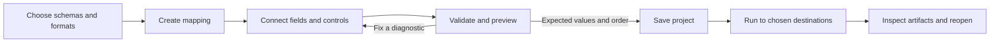

# Your First Mapping

Start with one input, one output, and a few fields. A saved project contains
the schemas and mapping; data files and the adjacent canvas-layout file have
separate roles. See [Project files](project-files.md) for persistence details.

## Choose a workflow

| You want to… | Start here |
| --- | --- |
| Build and inspect a mapping visually | Native editor steps below |
| Run an existing mapping in a script | [README CLI example](../README.md#quick-start) |
| Run from host-owned bytes | [Payload API](../README.md#quick-start) and [memory limits](memory-and-limits.md) |
| Embed generated Rust or C# code | [Code generation](code-generation.md) and [runnable hosts](../examples/codegen/) |
| Connect several mappings | [Mapping pipelines](mapping-pipelines.md) |
| Bring in an existing `.mfd` design | [Import and compatibility checks](mfd-interop.md) |

## Create and preview in the native editor

Launch the editor from the repository:

```sh
cargo +nightly run -p gui
```

- [ ] Choose **File → New** to open the New Mapping window.
- [ ] Choose a source schema or layout and a target schema or layout. For a
  delimited source, **Choose CSV...** can derive a small editable row schema.
- [ ] Review field names, types, and format settings before choosing **Create**.
  Scroll the New Mapping window when its controls extend below the viewport.
- [ ] Connect source fields to compatible target fields. Use
  **Auto-connect fields...** for a proposed match, then review it.
- [ ] Add functions and scope controls only where the mapping needs them.
  Compact node headers retain full identities in hover text; the pencil opens
  details or editable properties without expanding the closed canvas.
- [ ] Save the project, then use **Preview...** with a small representative
  input. Preview returns results without publishing output files.
- [ ] Inspect validation and preview diagnostics, including missing values and
  the selected row or expression that caused a failure.
- [ ] Run with explicit input and output destinations when the preview is
  correct. Reopen the saved project to check its mapping and layout.

Check disconnected required pins deliberately: they can yield an absent value
rather than an intended default. Saving a draft and successfully executing it are separate checks.
Undo/redo and dirty-state prompts help preserve work during schema changes,
imports, and closing.



## Add compact source and runtime nodes

Right-click empty canvas space and search the node palette. Connect the node's
output to a target or another expression; use its pencil to open the settings.
Availability follows the selected source and mapping context.

| Palette entry | Use |
| --- | --- |
| **Mapping path** | Path of the mapping currently executing |
| **Main mapping path** | Path of the top-level mapping for the run |
| **Run date and time** | One timestamp captured at the start of the run |
| **Source document path** | XML file-set member path: its resolved location when available, otherwise its stored portable path |
| **Source property by name** | Connect a computed property name and choose a supported open scalar source object |
| **Serialize source as XML** | Choose a supported source element and produce XML text with declaration and indentation settings |

Document-path nodes require a primary local XML file set. Document-path,
source-property and source-serialization creation are available on the main
and named-target canvases, outside isolated functions. Preview a multi-document
example to check which document is active in the scope where the node is used.

The XML source picker offers bounded ordinary groups without crossing a
repeating ancestor; a selected element can contain repeated child values.
Serialization uses the active mapping context. Opening details preserves
imported settings; explicitly choosing an element replaces the source selection
while retaining declaration, indentation and namespace settings. Preview the
result in its intended scope before running the complete mapping.

## Calculate an Aggregate value per collection item

An Aggregate keeps its compact Sigma header. On the main or a named-target
canvas, open its pencil and choose the collection and operation. Turn on
**Calculate each value**, then connect the expression to the **values** input.
For example, connect a quantity-times-price expression to sum line totals.
Collection aggregates are unavailable in isolated functions.

**String join** takes its delimiter through the separate **arg** input;
**Item at** takes a one-based index there. These arguments evaluate once in the
surrounding parent context, after the collection values have been evaluated.
Turning **Calculate each value** off preserves the stored field selection for
field-based operations. Inspect imported expressions before changing their
mode; opening the properties alone preserves them.

Per-item expression evaluation is eager: **Count** and **Item at** still
observe errors from any evaluated item, including items after the requested
index. They do not skip a failing expression merely because its value is not
needed for the final result. Preview a small collection with a late failing
item and check the parent delimiter or index before running a complete mapping.

Automated local checks cover computed-value editing, real wiring,
persistence, and Preview. Normal desktop and broader authoring coverage
remain tracked in the [roadmap](../ROADMAP.md#current-priorities).

## Choose Value map input conversion

On a main, named-target, or function canvas, open a **Value map** pencil and
choose **Input conversion**: **unchanged**, **string**, **int**, **float**, or
**bool**. The choice applies to the arriving value before table matching.
Opening the properties or changing this choice preserves existing table values,
their types, and the Default setting.

For example, a table key entered as `1` is text. If the arriving value is the
integer `1`, choose **string** to match that text key. Leave **unchanged** to
keep its original type. Table cells edited here are text; **int**, **float**, and
**bool** are also useful for matching imported maps whose keys already have
those types. Choosing a conversion does not change the table's key types.

Matching uses the first matching key in table order. If conversion cannot be
made, matching uses the original arriving value. If no key matches, the result
is **Default** when enabled, or an absent value when no Default is set. An
empty-text Default is distinct from having no Default. An absent input remains
absent and can match an existing absent-value key.

Preview representative values, an unmatched value, and a missing value before
running. Local checks cover the real conversion controls, imported-value
preservation, locked editing, history, save/reopen, and Preview. Normal desktop
and broader authoring coverage remain tracked in the
[roadmap](../ROADMAP.md#current-priorities).

## Add computed JSON properties

On the main or a named-target canvas, select the target object in **Scopes**
and use **Computed properties**. The target must be an ordinary JSON document
whose object schema allows additional properties of one **String**, **Int**,
**Float**, or **Bool** type. Nested target objects are supported along a static
path whose parent scopes use ordinary construction without iteration,
filtering, grouping, sorting, or windows.

Prepare the source fields and expressions on the canvas first. Choose
**+ property**, then select **Name expression** and **Value expression**.
The name must evaluate to a String; an empty String is a valid property name.
For example, a name expression producing `display_name` and a value expression
producing `Ada` add the property `"display_name": "Ada"`. Choose
**Remove property 1** (or the displayed row number) to remove a listed property.
Each named target keeps its own property list.

Properties evaluate in their listed order after the fixed field bindings.
Names declared by fixed schema fields remain reserved even when those fields
are not written. A duplicate or reserved name fails the mapping. An absent
(`Null`) value is omitted from JSON, but its name still occupies a property
entry during mapping, so a later duplicate still fails.

Imported properties outside this subset remain visible and read-only rather
than being repaired. Repeating owners, group/array/union or arbitrary JSON
property values, and other scope construction or iteration controls are outside
this editor. It is unavailable in isolated functions and embedded stage views.
Save and reopen the project to check the property choices, then use **Preview...**
with representative names, values, and duplicate-name cases before running.
Automated local checks cover the real computed-property controls, ordered
names and values, locked editing, history, save/reopen, and Preview. Normal
desktop and broader target-shape coverage remain separate work in the
[roadmap](../ROADMAP.md#current-priorities).

## Set up a flat workbook table

The New Mapping workbook setup covers one flat worksheet table per boundary.
Choose a flat XSD or JSON Schema first: one closed, non-repeating row group
whose children are ordinary scalar fields. Nested groups, alternatives,
computed fields, and XML attributes/text are outside this wizard's subset.
The format adapter has additional layouts described in [Supported formats](formats.md).

For example, save this as `row.schema.json` and choose it for both sides:

```json
{
  "type": "object",
  "properties": {
    "Name": { "type": "string" },
    "Count": { "type": "integer" }
  },
  "required": ["Name", "Count"],
  "additionalProperties": false
}
```

Use the following worksheet settings:

| Setting | Source example | Target example |
| --- | --- | --- |
| File | `incoming.xlsx` | `results.xlsx` |
| Sheet name | `Incoming` | `Results` |
| Header choice | **Skip header row** | **Write header row** |
| Header row | `1` | `1` |
| `Name` column | `1` (A) | `1` (A) |
| `Count` column | `3` (C) | `3` (C) |

Choose **Configure workbook** independently for Source and Target. Columns and
rows are numbered from one. With a header enabled, the row setting identifies
the header; otherwise it identifies the first data row. Target header text is
editable independently of the schema's field names. Blank source sheet names
read the first sheet; blank target sheet names use the default sheet.
Data paths are optional during setup and can be supplied when running.

Workbook setup preserves the selected schema and does not read a workbook to
guess its fields. Check a real small workbook after creating the mapping;
the physical columns, sheet, and header settings must agree with the file.
The wizard and small-viewport controls have automated local coverage. The
normal Linux desktop setup, create/save, and reopen workflow is also
[qualified for one eight-field flat-row fixture](qualification/flat-workbook-desktop-2026-10-08.md)
at 1200 × 800 and 1200 × 760 window sizes. The check preserves the complete
project, worksheet settings, and layout; it does not execute the mapping or
read or write a workbook. Other desktop workflows remain separate gates in
the [roadmap](../ROADMAP.md#current-priorities).

## Import and generate deliberately

Default `.mfd` import is intended to recover an editable project with actionable
warnings. Read those warnings before running. Strict executable import and
strict native export are separate admission checks; neither alone proves
execution in an external application.

**Preserve row error order** is an explicit, session-only import choice for
the bounded item-ordered exception profile. It is off by default. A global
failure rule checks its collection before targets; a graph Raise happens only
when its expression is reached. Use the [exception contract](mfd-interop.md#global-failure-priority-and-strict-native-export)
when choosing between them.

For code generation, validate first, then choose the language and destination in
**File → Generate Library...**. The dialog can include CSV output when eligible.
Rust needs the runtime crate location; C# emits package-free runtime sources.
Build and call the emitted library with a small
host fixture before integrating it. Emission, compilation, and runtime
equivalence are distinct checks. See [Code generation](code-generation.md)
for exact APIs, optional CSV output, structured XML eligibility, and limits.
