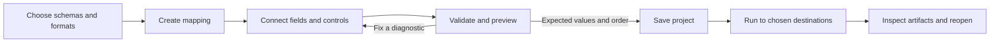

# Your First Mapping

Start with one input, one output, and a few fields. A saved project contains
the schemas and mapping; data files and the adjacent canvas-layout file have
separate roles. See [Project files](project-files.md) for persistence details.

## Choose a workflow

| You want to… | Start here |
| --- | --- |
| Build and inspect a mapping visually | Native editor steps below |
| Run an existing mapping in a script | [README CLI example](../README.md#quick-start) |
| Run from host-owned bytes | [Payload API](../README.md#quick-start) and [memory limits](memory-and-limits.md) |
| Embed generated Rust or C# code | [Code generation](code-generation.md) and [runnable hosts](../examples/codegen/) |
| Connect several mappings | [Mapping pipelines](mapping-pipelines.md) |
| Bring in an existing `.mfd` design | [Import and compatibility checks](mfd-interop.md) |

## Create and preview in the native editor

Launch the editor from the repository:

```sh
cargo +nightly run -p gui
```

- [ ] Choose **File → New** to open the New Mapping window.
- [ ] Choose a source schema or layout and a target schema or layout. For a
  delimited source, **Choose CSV...** can derive a small editable row schema.
- [ ] Review field names, types, and format settings before choosing **Create**.
  Scroll the New Mapping window when its controls extend below the viewport.
- [ ] Connect source fields to compatible target fields. Use
  **Auto-connect fields...** for a proposed match, then review it.
- [ ] Add functions and scope controls only where the mapping needs them.
  Compact node headers retain full identities in hover text; the pencil opens
  details or editable properties without expanding the closed canvas.
- [ ] Save the project, then use **Preview...** with a small representative
  input. Preview returns results without publishing output files.
- [ ] Inspect validation and preview diagnostics, including missing values and
  the selected row or expression that caused a failure.
- [ ] Run with explicit input and output destinations when the preview is
  correct. Reopen the saved project to check its mapping and layout.

Check disconnected required pins deliberately: they can yield an absent value
rather than an intended default. Saving a draft and successfully executing it are separate checks.
Undo/redo and dirty-state prompts help preserve work during schema changes,
imports, and closing.



## Set up a flat workbook table

The New Mapping workbook setup covers one flat worksheet table per boundary.
Choose a flat XSD or JSON Schema first: one closed, non-repeating row group
whose children are ordinary scalar fields. Nested groups, alternatives,
computed fields, and XML attributes/text are outside this wizard's subset.
The format adapter has additional layouts described in [Supported formats](formats.md).

For example, save this as `row.schema.json` and choose it for both sides:

```json
{
  "type": "object",
  "properties": {
    "Name": { "type": "string" },
    "Count": { "type": "integer" }
  },
  "required": ["Name", "Count"],
  "additionalProperties": false
}
```

Use the following worksheet settings:

| Setting | Source example | Target example |
| --- | --- | --- |
| File | `incoming.xlsx` | `results.xlsx` |
| Sheet name | `Incoming` | `Results` |
| Header choice | **Skip header row** | **Write header row** |
| Header row | `1` | `1` |
| `Name` column | `1` (A) | `1` (A) |
| `Count` column | `3` (C) | `3` (C) |

Choose **Configure workbook** independently for Source and Target. Columns and
rows are numbered from one. With a header enabled, the row setting identifies
the header; otherwise it identifies the first data row. Target header text is
editable independently of the schema's field names. Blank source sheet names
read the first sheet; blank target sheet names use the default sheet.
Data paths are optional during setup and can be supplied when running.

Workbook setup preserves the selected schema and does not read a workbook to
guess its fields. Check a real small workbook after creating the mapping;
the physical columns, sheet, and header settings must agree with the file.
The wizard and small-viewport controls have automated local coverage. Normal
desktop file-chooser, save, and reopen qualification is still pending; that
workflow is tracked in the [roadmap](../ROADMAP.md#current-priorities).

## Import and generate deliberately

Default `.mfd` import is intended to recover an editable project with actionable
warnings. Read those warnings before running. Strict executable import and
strict native export are separate admission checks; neither alone proves
execution in an external application.

**Preserve row error order** is an explicit, session-only import choice for
the bounded item-ordered exception profile. It is off by default. A global
failure rule checks its collection before targets; a graph Raise happens only
when its expression is reached. Use the [exception contract](mfd-interop.md#global-failure-priority-and-strict-native-export)
when choosing between them.

For code generation, validate first, then choose the language and destination in
**File → Generate Library...**. The dialog can include CSV output when eligible.
Rust needs the runtime crate location; C# emits package-free runtime sources.
Build and call the emitted library with a small
host fixture before integrating it. Emission, compilation, and runtime
equivalence are distinct checks. See [Code generation](code-generation.md)
for exact APIs, optional CSV output, structured XML eligibility, and limits.
