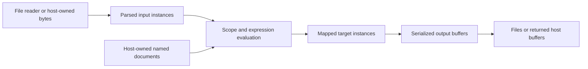

# Memory Use and Boundary Limits

Ferrule currently maps materialized instance trees. Byte and item limits protect
specific boundaries; they are not a limit on the process's total memory.
Choose the execution route before planning a large-file workload, because local
filesystem readers, payload APIs, and generated host adapters have different
contracts.

## Where memory remains live

Input instances can remain live while target rows and output buffers are built.
The filesystem CLI releases its primary input and dynamic-source cache after
evaluation and the before-publication check, before serializing selected or all
targets. Target instances own their data. Earlier parsing and mapping peaks,
allocator-retained pages, and the target/output buffers can still dominate RSS.
Joins, sorting, grouping, generated sequences, copies, multiple targets, and
retained preview or pipeline results may require additional collections or
clones. A small serialized file can still create many owned strings and tree
nodes. One very wide row has a different allocation pattern from many short rows.

Ordinary CSV filesystem reading uses a buffered CSV reader but retains every
parsed row. CSV output validates the complete rows before encoding and releases
each row's temporary formatted fields; it retains the mapped rows and the full
serialized `Vec`/`String`. C# CSV serialization likewise avoids a retained
all-row formatted cache. These changes do not make mapping or output streaming.
Text and byte APIs also have unavoidable owned result boundaries and may copy
or encode at those boundaries.

## Limits are route-specific

MiB means 1,048,576 bytes. The following are selected current contracts, not a
complete resource-safety claim. Follow the linked document for eligibility,
error ordering, and additional schema/format limits.

| Boundary | Current limit or behavior |
| --- | --- |
| New and versioned project-file persistence | 64 MiB, 127 JSON containers; legacy unmarked decoding keeps its documented compatibility behavior |
| CLI payload documents | 64 MiB per document; 256 MiB combined input budget and a separate 256 MiB output budget per run |
| CLI payload artifacts and identities | 4,096 output artifacts; 4,096 UTF-8 bytes per logical path; 256 bytes per source name |
| Generated schema-shaped JSON | 64 MiB per document; 1 MiB embedded JSON schema; generated dynamic JSON loaders also share a 256 MiB execution byte budget |
| Generated raw XML codecs and serialized XML output | 64 MiB per serialized document; 8 MiB embedded XML schema; input/output-set APIs have separate aggregate and artifact-count checks |
| Generated flat CSV output | 64 MiB encoded UTF-8 output, including headers, quoting, line endings, and optional BOM |
| Ordinary filesystem CSV | No general 64 MiB input/output cap; parsed rows and complete serialized output remain materialized |
| Ordinary JSON and JSON Lines files | Whole text is read; no general 64 MiB file cap at these ordinary readers |
| Local JSON5 input | 64 MiB and 128-container input bound; distinct from strict JSON and generated JSON APIs |
| Typed dynamic-source host loader | At most 1,000,000 loads per dynamic source and 4,096-byte logical paths; the host owns document acquisition and its byte budgets |
| Literal, fixed-length, regex, and integer-range generated sequences | At most 1,000,000 generated items; regex has additional pattern and compiled-program bounds |
| PDF extraction input | 8 MiB before reading; event/node/value/depth caps apply later, and do not isolate upstream decompression or recursive content traversal |

See [Project files](project-files.md), [Supported formats](formats.md),
[Code generation](code-generation.md), and the
[payload API](../README.md#quick-start) for the full boundary contracts.
Relevant implementations include
[payload budgets](../crates/cli/src/payload.rs),
[ordinary CSV encoding](../crates/format-csv/src/lib.rs),
[bounded CSV encoding](../crates/format-csv/src/bounded.rs), and
[generated typed/JSON loaders](../crates/codegen-runtime/src/dynamic_source.rs).

The generated CSV text/byte companions call the existing ordinary typed
mapping once, then serialize its flat primary result. Supplying a typed dynamic
loader does not acquire the JSON loader's input byte limits. Named input checks
and mapping failures still happen before CSV serialization. Ordinary filesystem
CSV remains uncapped; choosing stdin/stdout transport also does not turn the
interpreter into a row-at-a-time engine.

Typed `Instance`/`FerruleInstance` inputs do not inherit a serialized-document
byte cap. In particular, legacy singular XML wrappers take typed inputs and
render XML output; their names do not imply bounded XML input decoding.

A serialized-byte limit may be checked after some parsing, formatting, or
mapping allocations. Buffer capacity can exceed logical length. Multiple live
buffers, runtime overhead, JIT/GC, allocator behavior, and host-owned inputs
remain outside an individual output-byte limit.

## Plan and measure a large-file run

- [ ] Record the route, backend, build profile, input format, row count,
  field width, Unicode/quoting, and selected targets.
- [ ] Check the limits for that route and the largest single row/document;
  do not substitute a payload limit for an ordinary filesystem contract.
- [ ] Start with a representative small case and compare full values/bytes,
  including late validation failures and destination preservation.
- [ ] Measure many short rows and one wide row separately. Keep inputs and
  output publication policy identical across comparisons.
- [ ] Distinguish sampled RSS, sampled high-water values, and a process-lifetime
  peak; a point sample is not an API-call peak. Keep whole-process CPU and wall
  time separate from call-bracket timing.
- [ ] Retain individual trials and repeats, including regressions. State
  debug/release, warm/cold, setup/publication, and measurement-phase limits.
- [ ] Check disk space for inputs, artifacts, compilation, and retained results.

This page describes source contracts and measurement practice. It supplies no
universal improvement claim or total-RAM cap. The separate
[filesystem input-lifetime measurement](performance/filesystem-input-lifetime-2026-10-07.md)
records eight normal-debug observations, exact output checks, and the workloads
where early input release did and did not reduce the observed process peak.
