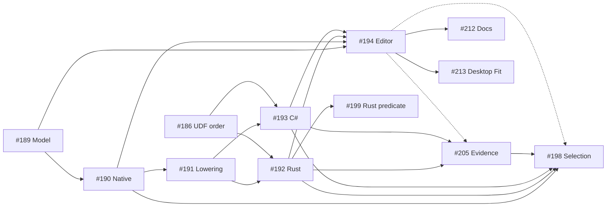

# Parallel Work

The [coordination issue](https://github.com/DeandreT/ferrule/issues/89) tracks
bounded work from the [roadmap](../ROADMAP.md). Issues define the problem,
in/out of scope, likely files and acceptance checks; this page helps contributors
choose a lane and avoid conflicting changes.

## Claim a lane

1. Read the issue and its linked contracts. Check current assignees and comments;
   the table below is a snapshot, not a replacement for the live issue.
2. Assign the issue to yourself before starting. Maintainer work is assigned to
   `DeandreT`; an unassigned `help wanted` issue is available. If you cannot set
   an assignee, ask the maintainer to assign you in the issue before proceeding.
3. State the files or modules you plan to own and any shared verification slot
   you will need. Agree on overlapping edits before changing the same source.
4. Keep one bounded result per PR and link its issue. For a newly discovered
   gap, open a scoped issue before implementing it; do not silently widen the
   issue you claimed.
5. Leave concise updates in first person (I/me): result, evidence link, blocker,
   and next step. Release ownership when pausing or handing off so another
   contributor can take it.

## Ownership and readiness

Snapshot: 2026-10-09 13:13:15 UTC, against merged main
[`0a645d3`](https://github.com/DeandreT/ferrule/commit/0a645d3e2d98207c87f3ad59229ebfc49580e11a).
Completed rows record merged increments; active maintainer lanes are assigned to
`DeandreT`. Unassigned `help wanted` lanes remain available. Available does not
mean the implementation contract has already been agreed; design-first issues
settle their contract before code changes. Check the live issue for later updates.
The map contains 72 work lanes plus the #89 coordination row. The current
refresh is #212; final two parallel-diagram renders are complete. Publication
status is tracked in #212.
The verified #194/#210 merge and two identity host calls are recorded below.
The earlier #182/#187 snapshot remains dated history. The preceding three diagrams
rendered as three SVGs and six PNGs with owned helper cleanup; the complete map
requires zoom. The final revised parallel diagrams rendered as two SVGs and four
PNGs with owned helper cleanup. Their current map needs horizontal scrolling or
zoom at 1200 pixels; the complete map's labels need zoom. The unchanged roadmap
fence reuses its earlier rendered evidence. Source acceptance,
local checks, generated calls and physical GUI workflows have
separate gates; recent hosted jobs did not start under the account billing/spending
restriction and are not green checks.

| Issue | Owner | Next gate | Primary ownership / coordination |
| --- | --- | --- | --- |
| [#89 Coordination](https://github.com/DeandreT/ferrule/issues/89) | Complete; #109 merged | Live issue map; current documentation snapshot in #212 | Docs; coordinate all overlaps |
| [#90 Computed JSON properties](https://github.com/DeandreT/ferrule/issues/90) | Complete; #110 merged | Local GUI checks complete; desktop separate | Scope inspector, workspace and GUI tests |
| [#91 Isolated Value map conversion](https://github.com/DeandreT/ferrule/issues/91) | Complete; [#123](https://github.com/DeandreT/ferrule/pull/123) merged | Local conversion gates complete; ordinary #113 remains a distinct context | Runtime helpers and both emitters |
| [#92 Workbook desktop persistence](https://github.com/DeandreT/ferrule/issues/92) | Complete; [#132](https://github.com/DeandreT/ferrule/pull/132) merged | Flat fixture create/save/reopen complete; other workflows separate | Desktop lane; #98 extends primary source setup |
| [#93 XML root annotations](https://github.com/DeandreT/ferrule/issues/93) | DeandreT; active | Metadata observation pending | XML/.mfd metadata; shared display |
| [#94 JSON object conformance cells](https://github.com/DeandreT/ferrule/issues/94) | Complete; [#129](https://github.com/DeandreT/ferrule/pull/129) merged | Proposal/validator checks complete; no Supported cells | Conformance docs and validator fixtures; survey unchanged |
| [#95 Generated XML limit coverage](https://github.com/DeandreT/ferrule/issues/95) | Complete; [#121](https://github.com/DeandreT/ferrule/pull/121) merged | Source/link review complete; rendering unverified; cohorts recorded in #133 | XML coverage index and host guide |
| [#96 Generated JSON5 adapters](https://github.com/DeandreT/ferrule/issues/96) | Complete; initial scope closed | All initial language/public/resource increments merged | Parent contract; broader identifiers/native metadata remain separate |
| [#97 Typed Value map cells](https://github.com/DeandreT/ferrule/issues/97) | Complete; [#128](https://github.com/DeandreT/ferrule/pull/128) merged | Local editor gates complete after #91/#114; desktop separate | Cell editor; no coercion changes |
| [#98 Transposed workbook source setup](https://github.com/DeandreT/ferrule/issues/98) | Complete; [#150](https://github.com/DeandreT/ferrule/pull/150) merged | Local and scoped desktop setup/save/reopen checks complete; workbook execution checked locally | Primary-source workbook wizard; hierarchical/named setup excluded |
| [#99 Browser edit history](https://github.com/DeandreT/ferrule/issues/99) | Complete; [#178](https://github.com/DeandreT/ferrule/pull/178) merged | 43 web tests, fresh WASM and finite 132-command/34-download browser review; original oracle/cleanup limits below | Web app/history/canvas; preserve #165; #177 is separate net-zero correction |
| [#100 Required-only reference siblings](https://github.com/DeandreT/ferrule/issues/100) | Complete; native [#170](https://github.com/DeandreT/ferrule/pull/170) and generated [#174](https://github.com/DeandreT/ferrule/pull/174) merged | Exact native/generated presence subset qualified; broader composition separate | JSON Schema presence subset only; coordinate #101; no general intersection |
| [#101 String-or-Int range constraints](https://github.com/DeandreT/ferrule/issues/101) | Complete; [#183](https://github.com/DeandreT/ferrule/pull/183) merged | Exact native/direct/generated contract; all 152 compiled calls and scoped checks pass | Exact String-or-Int IntegerRange only; IR/JSON constraints and both validators; broader unions separate |
| [#102 Scalar-sequence composition](https://github.com/DeandreT/ferrule/issues/102) | Complete; [#188](https://github.com/DeandreT/ferrule/pull/188) merged | Reviewed design plus 37 proposed feature literals and two legacy controls; execution in separate lanes | [Design](design/scalar-sequence-composition.md) and [full corpus](design/fixtures/scalar-filter-map-v1.json); no implementation in #102 |
| [#103 Typed SQLite query boundary](https://github.com/DeandreT/ferrule/issues/103) | Unassigned | Read-only query contract first | Boundary model, SQLite and CLI input |
| [#104 PDF extraction isolation](https://github.com/DeandreT/ferrule/issues/104) | Unassigned | Portable worker/limit contract first | PDF, CLI and applicable preview worker |
| [#105 Offline mapping bundle export](https://github.com/DeandreT/ferrule/issues/105) | Unassigned | Bundle contract first | CLI staging, resources and path codecs |
| [#106 JSON5 interchange metadata](https://github.com/DeandreT/ferrule/issues/106) | Unassigned | Observe saved metadata before implementation | Metadata lane; coordinate display with #93 |
| [#107 JSON output-set memory trials](https://github.com/DeandreT/ferrule/issues/107) | Complete; [#185](https://github.com/DeandreT/ferrule/pull/185) merged | Eight normal-dev measurements, eight separate verifiers and twelve complete documents pass; [report](performance/json-output-set-memory.md) retains finite limits | Fixture/host and filesystem JSON performance report only; #184 uses this baseline; no optimization |
| [#108 Mapping-path desktop workflow](https://github.com/DeandreT/ferrule/issues/108) | Unassigned | Existing implementation; desktop gate open | Desktop scenario; coordinate with #92/#93 |
| [#111 Project Float precision](https://github.com/DeandreT/ferrule/issues/111) | Complete; [#120](https://github.com/DeandreT/ferrule/pull/120) merged | Local precision gates complete; other contexts qualify separately | JSON configuration and persistence fixtures |
| [#112 C# JSON Float rounding](https://github.com/DeandreT/ferrule/issues/112) | Complete; [#120](https://github.com/DeandreT/ferrule/pull/120) merged | Local rounding gates complete in the #111 increment | C# number parser and boundary fixtures |
| [#113 Ordinary Value map JSON null](https://github.com/DeandreT/ferrule/issues/113) | Complete; [#126](https://github.com/DeandreT/ferrule/pull/126) merged | Ordinary direct-helper/public-host checks complete; isolated marker semantics preserved | Ordinary helpers; distinct from #91 |
| [#114 Enabled absent defaults](https://github.com/DeandreT/ferrule/issues/114) | Complete; [#127](https://github.com/DeandreT/ferrule/pull/127) merged | Persistence/history checks complete; legacy missing/null unchanged | Field-local model serialization and history tests |
| [#115 Status refresh](https://github.com/DeandreT/ferrule/issues/115) | Complete; [#125](https://github.com/DeandreT/ferrule/pull/125) merged | Earlier snapshot retained; superseded by #149 | Roadmap and contributor map only |
| [#116 XML input byte boundary](https://github.com/DeandreT/ferrule/issues/116) | Complete; [#131](https://github.com/DeandreT/ferrule/pull/131) merged | Small and opt-in compiled-host checks complete | Static input child; declared census/error precedence retained |
| [#117 XML output byte boundary](https://github.com/DeandreT/ferrule/issues/117) | Complete; [#137](https://github.com/DeandreT/ferrule/pull/137) merged | Small and physical exact/+1 checks complete | Primary document-list child; no partial returned results |
| [#118 XML loader count boundary](https://github.com/DeandreT/ferrule/issues/118) | Complete; [#138](https://github.com/DeandreT/ferrule/pull/138) merged | Real callback and next-reservation checks complete | Dynamic input child; no counter priming |
| [#119 XML mapping/count priority](https://github.com/DeandreT/ferrule/issues/119) | Complete; [#139](https://github.com/DeandreT/ferrule/pull/139) merged | Lazy last-row Raise before mixed count checked | Mixed output child; no pre-target global rule substitute |
| [#122 Numeric codec documentation](https://github.com/DeandreT/ferrule/issues/122) | Complete; [#124](https://github.com/DeandreT/ferrule/pull/124) merged | Source/link/Rustdoc checks complete; rendering unverified | Project-files guide, host-guide paragraph and opening Rustdoc |
| [#130 Native JSON5 nonfinite tokens](https://github.com/DeandreT/ferrule/issues/130) | Complete; [#164](https://github.com/DeandreT/ferrule/pull/164) merged | 190 native controls, 58 CLI calls and full affected suite pass; BOM accounting separate #163 | Native pre-projection admission; generated adapters and metadata excluded |
| [#133 XML qualification documentation](https://github.com/DeandreT/ferrule/issues/133) | Complete; [#147](https://github.com/DeandreT/ferrule/pull/147) merged | Source/link review of four completed cohorts and measurements | XML coverage index and memory guide; no new measurements |
| [#134 Rust JSON5 syntax](https://github.com/DeandreT/ferrule/issues/134) | Complete; [#140](https://github.com/DeandreT/ferrule/pull/140) merged | Shared syntax/scaled-limit checks complete; public projection separate | Pure normalizer and syntax controls |
| [#135 JSON5 Unicode identifiers](https://github.com/DeandreT/ferrule/issues/135) | Unassigned | Shared frozen membership tables and both-language contract first | Optional Unicode extension; initial ASCII subset stays explicit |
| [#136 C# JSON5 syntax](https://github.com/DeandreT/ferrule/issues/136) | Complete; [#146](https://github.com/DeandreT/ferrule/pull/146) merged | Shared syntax/scaled-limit checks complete; public projection separate | Package-free pure normalizer; ordinary source set unchanged |
| [#141 JSON5 closed-object eligibility](https://github.com/DeandreT/ferrule/issues/141) | Complete; [#151](https://github.com/DeandreT/ferrule/pull/151) merged | Policy checks complete with #148; public adapters separate | Shared schema/profile predicate and contract |
| [#142 Rust JSON5 adapters](https://github.com/DeandreT/ferrule/issues/142) | Complete; [#153](https://github.com/DeandreT/ferrule/pull/153) merged | Local optional codec/emitter checks complete; physical gate separate | Optional Rust APIs only; ordinary strict defaults preserved |
| [#143 C# JSON5 adapters](https://github.com/DeandreT/ferrule/issues/143) | Complete; [#155](https://github.com/DeandreT/ferrule/pull/155) merged | Local smoke/emitter/public checks complete; physical gate separate | Optional package-free C# APIs only; ordinary source set preserved |
| [#144 JSON5 generation and small hosts](https://github.com/DeandreT/ferrule/issues/144) | Complete; [#156](https://github.com/DeandreT/ferrule/pull/156) merged | All 184 small compiled public calls and CLI checks complete | Explicit CLI opt-in; 23 literal cases across four routes per language |
| [#145 JSON5 byte boundaries](https://github.com/DeandreT/ferrule/issues/145) | Complete; [#159](https://github.com/DeandreT/ferrule/pull/159) merged | All 48 physical calls pass after all 184 small prerequisites | Serial resource fixtures; whole-host RSS is not an API-only peak or RAM ceiling |
| [#148 JSON5 descriptor duplicates](https://github.com/DeandreT/ferrule/issues/148) | Complete; [#151](https://github.com/DeandreT/ferrule/pull/151) merged | Duplicate/error-priority controls complete with #141 | Descriptor decoder guard; ordinary JSON codec unchanged |
| [#149 Current status refresh](https://github.com/DeandreT/ferrule/issues/149) | Complete; [#152](https://github.com/DeandreT/ferrule/pull/152) merged | Source/link/dependency checks complete; rendering unverified; superseded by #158 | Roadmap and this map; no implementation |
| [#154 JSON5 guide refresh](https://github.com/DeandreT/ferrule/issues/154) | Complete; [#161](https://github.com/DeandreT/ferrule/pull/161) merged | Public routes, all 184 small/all 48 physical calls and whole-host RSS documented | JSON5 contract guide only; rendering unverified |
| [#157 Direct-Program Rust emission](https://github.com/DeandreT/ferrule/issues/157) | Complete; [#168](https://github.com/DeandreT/ferrule/pull/168) merged | 110 tests, three warnings-denied generated hosts and 11 public calls pass | Ordinary Rust expression retention after validation; lowering and #145 fixtures excluded |
| [#158 JSON5 progress and lanes](https://github.com/DeandreT/ferrule/issues/158) | Complete; [#162](https://github.com/DeandreT/ferrule/pull/162) merged | Earlier two-doc source/link/dependency review; rendering unverified; superseded by #173 | Roadmap and this map; separate #154 guide retained |
| [#160 C# JSON5 allocation attribution](https://github.com/DeandreT/ferrule/issues/160) | Unassigned | Matched profiling/retention plan before attribution conclusions | Generated C# benchmark/report only; exclude production optimization and filesystem #107 |
| [#163 Native JSON5 original-byte accounting](https://github.com/DeandreT/ferrule/issues/163) | Complete; [#167](https://github.com/DeandreT/ferrule/pull/167) merged | 45 small controls and eight physical calls pass; original UTF-8 bytes include the BOM | Native reader seam and corresponding memory row; no streaming/RAM claim |
| [#165 Missing browser target bindings](https://github.com/DeandreT/ferrule/issues/165) | Complete; [#166](https://github.com/DeandreT/ferrule/pull/166) merged | Eight layout cases, 38 browser tests and WASM pass; #99 must retain them | Canvas target-wire construction only; history and admission excluded |
| [#169 Generated required-reference qualification](https://github.com/DeandreT/ferrule/issues/169) | Complete; [#174](https://github.com/DeandreT/ferrule/pull/174) merged | 183 native observations, all 594 compiled calls, 23 CLI checks and capture controls pass; closes #100 generated gate | CLI qualification leaf, corpus and Rust/C# hosts; no importer or runtime fix |
| [#171 JSON required-property error precedence](https://github.com/DeandreT/ferrule/issues/171) | Complete; [#172](https://github.com/DeandreT/ferrule/pull/172) merged | 30 direct observations and native/Rust/C# suites pass; #169 compiled mapping witness passes separately | Narrow C# runtime check order and direct tests; no importer/browser edits |
| [#173 Roadmap and lane refresh](https://github.com/DeandreT/ferrule/issues/173) | Complete; [#175](https://github.com/DeandreT/ferrule/pull/175) merged | Earlier two-doc source/link/diagram review; rendering unverified; superseded by #182 | ROADMAP.md and this map only; separate from implementation |
| [#176 Applied browser target names](https://github.com/DeandreT/ferrule/issues/176) | Complete; [#181](https://github.com/DeandreT/ferrule/pull/181) merged | 45 web tests, fresh WASM, 24 actual native browser commands and two typed/byte-checked downloads | Borrowed applied schema title and existing eight layout cases; ordinary canvas/model/wires preserved |
| [#177 Coalesced browser baseline return](https://github.com/DeandreT/ferrule/issues/177) | Complete; [#179](https://github.com/DeandreT/ferrule/pull/179) merged | Exact retained baseline collapse; 45 web tests, scoped strict lint and formatting pass; no fresh browser campaign | Browser history and state-machine regressions; strict byte ledger, discarded redo and distinct focus sessions |
| [#180 Browser Fit view transform](https://github.com/DeandreT/ferrule/issues/180) | Complete; [#195](https://github.com/DeandreT/ferrule/pull/195) merged | 54 unique web tests, 12 Fit checkpoints, 66 browser commands and two complete downloads; owned cleanup required | Whole-node view transform; Project/node layout preserved; broader authoring separate |
| [#182 Browser progress and coordinated lanes](https://github.com/DeandreT/ferrule/issues/182) | Complete; [#187](https://github.com/DeandreT/ferrule/pull/187) merged | Earlier two-doc source/link/diagram review; rendering unverified; superseded by #212 | ROADMAP.md and this map only; dated main302823 snapshot retained |
| [#184 Borrowed ordinary JSON serialization](https://github.com/DeandreT/ferrule/issues/184) | Complete; [#200](https://github.com/DeandreT/ferrule/pull/200) merged | 398 scoped regressions and 126-call byte equality; eight matched fixture peaks 8.7–40.4 MiB lower | Ordinary writer/private view and [report](performance/borrowed-json-output-memory.md); full String, validation and publication preserved; no RAM cap |
| [#186 Generated scalar-UDF argument error order](https://github.com/DeandreT/ferrule/issues/186) | Complete; [#196](https://github.com/DeandreT/ferrule/pull/196) merged | All 18 compiled calls per language match independent expectations; original four mismatches/language retained | Ordinary/nested Rust/C# call rendering only; interpreter/coercion/frame/sequence/GUI policy unchanged |
| [#189 Scalar sequence model and guards](https://github.com/DeandreT/ferrule/issues/189) | Complete; [#197](https://github.com/DeandreT/ferrule/pull/197) merged | 1,759 distinct scoped regressions; model/codec/guard qualification | Two private owners, ordered captures, signatures and legacy serialization; execution separate |
| [#190 Native scalar sequence execution](https://github.com/DeandreT/ferrule/issues/190) | Complete; [#202](https://github.com/DeandreT/ferrule/pull/202) merged | All 37 frozen feature cases, two legacy controls and 1,011 distinct regressions; five local gates | Native eager construction, lazy selected mapper, positions, shared feature limits/cancellation; no global legacy budget |
| [#191 Common scalar sequence lowering](https://github.com/DeandreT/ferrule/issues/191) | Complete; [#204](https://github.com/DeandreT/ferrule/pull/204) merged | 62 complete comparisons, 497 distinct library tests and six local gates | Stage UDF roots, transitive callees and direct Program validation; backend execution separate |
| [#192 Rust scalar sequence execution](https://github.com/DeandreT/ferrule/issues/192) | Complete; [#206](https://github.com/DeandreT/ferrule/pull/206) merged | 188 public calls, 30 separate direct controls, 365 library tests and seven local gates | Rust runtime/emitter; 40 compiled plus seven static/decode profiles; preserve ordinary APIs |
| [#193 C# scalar sequence execution](https://github.com/DeandreT/ferrule/issues/193) | Complete; [#208](https://github.com/DeandreT/ferrule/pull/208) merged | 172 public calls, 35 separate direct controls, 432 library tests, 179 smoke groups and eight local steps | C# runtime/emitter and 43 frozen profiles; full errors/causes retained |
| [#194 Compact scalar sequence editor](https://github.com/DeandreT/ferrule/issues/194) | Complete; [#214](https://github.com/DeandreT/ferrule/pull/214) merged | Final fresh strict/fmt/affected-unit/build pass; historical 20 focused/742 GUI/31 web-demo crate tests; finite desktop inspection, identity Rust/C# generation and two 172-byte public String JSON host calls qualified | Descriptor controls, icons, palette/scopes/history; 16 new tests and 13 local native/Preview recipes; no all-13 physical or all-39 claim; GUI cleanup and normal host closure separate |
| [#198 Generated typed target selection](https://github.com/DeandreT/ferrule/issues/198) | DeandreT; active | 15-role final-main source accepted; #205 shared-test release before adoption; all 90 planned native/Rust/C# calls unrun | Additive typed selection and paired hosts; shared C# json5_output_tests.rs rebased after #205; ordinary all-output APIs preserved; no boundary overloads or GUI |
| [#199 Legacy Rust aggregate predicate generation](https://github.com/DeandreT/ferrule/issues/199) | Complete; [#209](https://github.com/DeandreT/ferrule/pull/209) merged | 15 native controls, 45 compiled typed/text/byte calls, 114 Rust tests and six local steps | Existing predicate helper order only; old compiler mismatch retained; frozen new sequence behavior unchanged |
| [#201 Sequence-consumer duplication](https://github.com/DeandreT/ferrule/issues/201) | Unassigned | Ownership/remapping contract, then release of #194 shared GUI files before adoption | Atomic private-owner remapping and focused history/layout controls; general clipboard/arbitrary graph copy excluded |
| [#203 Scalar sequence saved-design interchange](https://github.com/DeandreT/ferrule/issues/203) | Unassigned | Faithful representation design and synthetic fixture qualification before implementation | New design/fixtures; preserve typed refusal; coordinate display only with metadata lanes |
| [#205 Generated test artifact retention](https://github.com/DeandreT/ferrule/issues/205) | DeandreT; active | Three test-role source accepted; runtime and matched log/file-size checks unrun | Rust/C# JSON5 tests and one test-only helper; preserve complete originals/assertions; production excluded |
| [#207 Eager scalar sequence memory study](https://github.com/DeandreT/ferrule/issues/207) | DeandreT; qualified, publication in [#249](https://github.com/DeandreT/ferrule/pull/249) | All 72 measured runs, 72 separate complete verifiers and three independent backend reviews pass; [report](performance/scalar-sequence-memory.md) retains both repetitions and 36 matched pairs | Bounded native/Rust/C# fixtures and report; allocation profiling is #248; no production optimization, policy change or RAM guarantee |
| [#210 Sequence editor generation guidance](https://github.com/DeandreT/ferrule/issues/210) | Complete; [#214](https://github.com/DeandreT/ferrule/pull/214) merged | Reviewed one-sentence guidance and cohesive #194 local/finite desktop/generation qualification complete | Same editor source and cohesive GUI increment; no backend/save behavior change |
| [#211 Compact GUI frame diagnostics](https://github.com/DeandreT/ferrule/issues/211) | Unassigned | #194 helper release, then same-fixture control/outcome and log-size comparison | Test-only frame evidence; preserve complete mapping outcomes; separate from generated artifact #205 |
| [#212 Current roadmap and lane refresh](https://github.com/DeandreT/ferrule/issues/212) | DeandreT; active | Source/link/checklist/render review complete; two SVG/four PNG; final publication tracked in #212; verified #194 host/merge snapshot bound; owned cleanup and map zoom limits retained | ROADMAP.md and this map only; no implementation or gate promotion |
| [#213 Desktop Fit node bounds](https://github.com/DeandreT/ferrule/issues/213) | DeandreT; active | Private source preparation on released #194 baseline; actual geometry tests and alternate-display Fit checks unrun | Desktop workspace fit action and canvas/keyboard view transform only; main/named/function canvases; no factories/icons/model/history/browser/authoring |

Computed JSON properties retain their #110 local qualification; normal desktop
authoring remains separate. The #111/#112 precision increment merged in #120,
followed by #91 in #123, ordinary declared JSON-null matching #113 in #126, enabled
absent-default persistence #114 in #127, and typed-cell authoring #97 in #128.
Those increments preserve their distinct ordinary/isolated and persistence/UI
contracts. The original input-conversion and precision cohorts are not a claim
that every later editor workflow has desktop coverage.

The #92 ordinary flat-workbook desktop fixture is qualified in #132. The #98
primary transposed-source wizard is merged in #150 after local checks and a
separate six-phase desktop create/save/reopen workflow at 1200 × 800 / 1200 × 760.
Complete Project comparisons and saved/reopened body equality passed; workbook
execution was checked separately in local tests. Earlier collector-protocol
failures remain distinct from product behavior. Desktop workbook execution and
broader hierarchical/named setup are not claimed. Mapping-path desktop #108
remains open. Metadata lanes #93/#106 must observe
settings before changing interchange admission. #130/#163 now separately
qualify native nonfinite admission and original-byte accounting; neither observes
interchange metadata.

The #94 proposal merged in #129 with 224 independent cells: 48 Unverified,
176 Unassessed and no Supported promotion. The protected survey remains unchanged.
The source/link-reviewed #95 index and #122 numeric guide retain their earlier
rendering limitations. The four XML public-host cohorts #116–#119 are now merged;
#133/#147 records their exact gate ownership and workload-specific memory
observations in the [coverage index](generated-xml-qualification-index.md) and
[memory guide](memory-and-limits.md#compiled-xml-host-observations).
These cohorts do not establish external execution, general design coverage or a
universal RAM limit. Source reviews and emission passes remain separate from
compiled public calls.

Pure JSON5 syntax is merged in #140/#146, and the shared policy #141 with its
descriptor duplicate guard #148 is merged in #151. Explicit Rust and C#
companions are merged in #153/#155; CLI opt-in and the complete 184 small compiled
public calls are merged in #156. The 23 public cases comprise 17 representation
and six mapping/context cases, each across four routes in both languages. This
cohort is distinct from the 75-case pure syntax inventory. Ordinary strict JSON
APIs and default artifact sets stay unchanged. The complete 48 serial physical
calls in #145 are merged in #159 after a fresh complete small prerequisite
cohort: original input, normalized input and strict output exact/+1 workloads
across all eight public language/API routes. Full results/typed causes, source
and library guards, and normal process closure are retained. Whole-host RSS
includes startup, input handling, public mapping, output retention and host
checks; it establishes neither an API-only peak, a RAM ceiling nor streaming.

The [companion contract](generated-json5-contract.md) separates policy, syntax,
projection, mapping and strict output. Its #154 refresh is merged in
[#161](https://github.com/DeandreT/ferrule/pull/161), including all physical
boundary results and measured whole-host memory ranges. The unassigned
#160 benchmark/report lane will attribute generated C# allocation peaks through
matched profiling and uninstrumented controls, excluding production optimization
and the filesystem multi-output trials in #107. Direct-Program Rust retention
#157 is now merged in #168 after 110 emitter tests, three warnings-denied hosts
and 11 public calls; full validation order is preserved. Native nonfinite
admission #130 is merged in #164 after 190 controls and 58 CLI calls, preserving
the original nullable-reader failure and corrected outcomes. Original-byte/BOM
accounting #163 is merged in #167 after 45 small controls and eight physical
calls. These input-boundary checks make no streaming or total-memory promise.
Unicode identifiers #135 and native metadata #106 remain independent and
available. The initial #96 companion scope is complete and closed. Broader
identifier membership and native/desktop contracts remain separate.

The native #100 increment is merged in #170: seven focused groups and 388 JSON
tests pass, with one existing physical-resource opt-in test ignored. It admits
only the proved required-only object/object-null profile, retains each physical
resource's dialect and ordered presence, and bounds required lists and merged
sets to 256 within that subset. Unsupported shapes/assertions and undeclared new
names still refuse. Generated qualification #169 is merged in
[#174](https://github.com/DeandreT/ferrule/pull/174), completing #100's exact
native/generated acceptance. The finite cohort passes 183 native observations
and all 594 compiled calls: 297 each in Rust and C#, across nine profiles,
16 mappings and 66 cases. Each language passes its full [131, 117, 30, 16, 3]
call vector for generated JSON mappings, independent readers, ordinary typed
execution, typed writers and admission controls. The strict compiled error-order
witness passes on the native #100/#170 and runtime #171/#172 prerequisites.
All 23 owning CLI checks, scoped strict lint and formatting pass. Fourteen
harness controls retain complete originals, including 13 intentional mismatches
and a later valid control. Earlier compiler/nullability and authored expected-text
failures remain preserved separately from the final successful cohort.
The separate #171 direct-runtime correction passed 30 observations and the
affected native/Rust/C# suites. All three hosted #174 jobs completed as failures
without executing any validation step because of the account billing/spending-limit
restriction, as in #170/#172. Local verification, source review and compiled calls
remain distinct from hosted execution.

The #99 browser-history increment is merged in
[#178](https://github.com/DeandreT/ferrule/pull/178) after 43 web tests, fresh
WebAssembly and a separate finite actual browser review: 132 native commands,
34 native GUID-completed downloads and 32 public-helper matches. The two
original helper refusals are preserved; their compact draft originals were
separately qualified by complete-byte comparison. No campaign exit-0 or helper
pass is claimed for those two. The browser/server close calls fulfilled, then
remaining owned descendants needed cleanup before final closure was proven.
Earlier failures remain distinct from this bounded product acceptance. The
#165/#166 missing-binding controls remain prerequisites, without widening the
browser history claim to arbitrary editor or native-desktop parity.

The separate #177 exact coalesced baseline correction is merged in
[#179](https://github.com/DeandreT/ferrule/pull/179), with all 45 web tests, scoped
strict lint and formatting passing. It preserves the strict retained-byte ledger,
transient redo discard and distinct focus sessions; no fresh browser campaign
is claimed. Applied target titles #176 are merged in
[#181](https://github.com/DeandreT/ferrule/pull/181) after 45 web tests, fresh
WebAssembly and 24 actual native browser commands in wide/compact views, with
two complete typed and whole-byte-checked downloads. That owned browser run also
needed descendant cleanup before final closure was proven. Whole-node Fit #180
is merged in [#195](https://github.com/DeandreT/ferrule/pull/195): 54 unique web tests,
12 wide/compact Fit checkpoints, 66 browser commands and two complete verified
downloads pass. It changes only the view transform. Owned descendant cleanup
was required; normal closure was false and final closure was proven. Original
lint, startup and fixture failures remain retained.

The #101 exact String-or-Int IntegerRange contract is merged in
[#183](https://github.com/DeandreT/ferrule/pull/183). Three IR and four native
focused groups, 202 direct calls per language, all 179 C# smoke groups and all
152 compiled generated text/byte calls pass across seven mappings. Full typed,
serialized and refusal oracles cover primary and named boundaries. All 797
affected Rust checks, scoped strict warnings and formatting pass, with one
existing resource test ignored. The original native error-text oracle failure
and its source-reviewed correction remain retained. The optional full generated
catalog was explicitly stopped after early checks and owned cleanup; it is not
claimed passed. Three hosted jobs executed zero steps under the account billing
restriction. String assertions, enum/format behavior and strict Contains remain
separate from integer branch intervals; broader scalar unions are not admitted.
The #107 ordinary filesystem JSON study is merged in
[#185](https://github.com/DeandreT/ferrule/pull/185): eight normal-development-profile
measurements, eight separate verifiers and twelve complete output documents pass.
The [individual-run report](performance/json-output-set-memory.md) records
120.3–194.6 MiB whole-process peaks and all four matched second-output increases:
31.2–39.4 MiB. Both repetitions, full typed/serialized expectations, original
phase/process observations and normal closure remain recorded. The earlier
numeric-parser source finding and its bounded correction are preserved; all 45 numeric
controls pass. Three hosted jobs executed zero validation steps because of the
account billing/spending restriction. Two workloads and two repetitions do not
establish statistical significance, streaming, allocation-exclusive peaks or a
universal RAM cap. The separate #160 generated allocation scope is unchanged.

The ordinary JSON writer #184 is merged in
[#200](https://github.com/DeandreT/ferrule/pull/200). Its ordered private view borrows
ordinary target text and member names rather than constructing a complete owned
`serde_json::Value` tree before pretty rendering. The returned String, APIs,
order, null behavior, coercion, validation/errors and publication stay intact;
container metadata, arbitrary JSON and validation snapshots can still allocate.
All 398 scoped regressions and 126 complete writer-comparison calls pass.
The [matched report](performance/borrowed-json-output-memory.md) preserves the
historical #107 baseline and eight fresh original/candidate fixture comparisons,
with 16 separate verifiers and 24 complete documents. Whole-process peaks are
8.7–40.4 MiB lower for these fixtures only; source/layout/startup/cache differences
limit attribution. No streaming, exclusive allocation saving or RAM cap follows.

The reviewed [scalar sequence design](design/scalar-sequence-composition.md) and
[all 39 proposed literals](design/fixtures/scalar-filter-map-v1.json) are merged
in #102/[#188](https://github.com/DeandreT/ferrule/pull/188). These are 37 feature
cases and two legacy controls; approving a design does not execute them. Model,
codec and private-owner admission #189/#197 pass 1,759 distinct scoped regressions.
Native execution #190/#202 separately passes all 37 feature cases, two legacy
controls and 1,011 distinct regressions. Common lowering #191/#204 passes 62
complete comparisons and 497 library tests, retaining predicate/mapper roots and
transitive UDF callees. Broader nested/higher-order shapes and failure-rule
transform authoring remain outside the initial contract.

Rust #192/#206 passes 188 whole public calls and 30 separately labeled direct
controls across 40 compiled profiles plus seven static/decode controls, with 365
library tests and seven local gates. C# #193/#208 passes 172 public calls across
43 profiles, 35 direct controls, 432 library tests, 179 C# smoke groups and eight
local steps. Complete values, positions, limits, checker boundaries and typed
causes retain their finite public/direct observability scopes. A failed public
mapping does not expose a partial output. Original host/compiler/lint and fixture
failures remain distinct from the corrected cohorts. These results are not GUI,
external-interchange or whole-product qualification.

Ordinary/nested UDF argument ordering #186 is merged in
[#196](https://github.com/DeandreT/ferrule/pull/196): evaluate all raw arguments
left to right before adaptation; all 18 compiled calls per language match frozen
expectations after the original four mismatches per language. Interpreter,
coercion, frame and legacy sequence policy remain unchanged. The separate legacy
Rust aggregate helper-order fix #199 is merged in
[#209](https://github.com/DeandreT/ferrule/pull/209), with 15 independent native
controls, 45 compiled typed/text/byte calls, 114 Rust tests and six local steps.
Its original generated compiler mismatch was observed before the correction.
Recent hosted jobs did not start because of the account billing/spending
restriction; no local source or execution result is a hosted pass.

Compact GUI #194 and guidance #210 are merged in
[#214](https://github.com/DeandreT/ferrule/pull/214). The final 21-role source and
bounded fixture/style corrections are independently accepted. Earlier checks pass
20 focused tests, the complete 742-test GUI suite and 31 web-demo crate tests;
those crate checks are distinct from actual browser UI. Final source passes fresh
strict warnings after 454 required source timestamp refreshes, formatting, one
affected unit check already included in the 742-test suite, and the fresh production build.
Repeated checks do not increase the distinct totals. Earlier compiler, fixture,
strict-lint, timeout and chooser/registration failures remain preserved.

Finite desktop parts observe current-item properties at 1200 × 900 and scope
selection from 900 × 700 to 1200 × 900. Both exit 0 with owned helper cleanup,
which is separate from normal cleanup-free closure. Ordinary editor-driven
identity Rust and C# library generation also exits 0 with owned helper cleanup;
One public String JSON call from each editor-generated identity library matches
the complete independently authored 172-byte golden. The five host commands exit 0
with normal owned closure and no cleanup; this cannot replace the earlier GUI
cleanup observations. All three hosted #214 jobs executed zero validation steps
because of the account billing/spending restriction. These finite observations
do not qualify all 13 physical workflows or all 39 sequence design cases. Constant-7
controls do not prove a real parent frame. Independent document copies are in
scope; same-project duplication is #201.

Desktop Fit #213 records the observed right/bottom clipping after Fit at 900 × 700
on five graph nodes plus source/target blocks; resizing exposes the graph. It is
in private source preparation and adopts only the desktop fit action and required view-transform work
on the released #194 GUI baseline. Main, named-target and function canvases need
complete-rectangle checks; Project data, wires, saved positions and sidecars remain
unchanged. Browser Fit #180, factories/icons, history/model and authoring are excluded.

The earlier two-document refreshes #158/#162, #173/#175 and #182/#187 remain dated
records. This #212 draft updates statuses and prerequisites against verified main;
its verified #194 host/merge snapshot is now bound; the final two-diagram render
is complete. Publication status is tracked in #212. Source/link/diagram checks do not
establish additional product execution. The previous three fences rendered as
three SVGs and six PNGs with owned helper cleanup. The two revised parallel
fences rendered once as two SVGs and four PNGs with owned helper cleanup. The
current view needs horizontal scrolling or zoom at 1200 pixels; labels in the
complete map need zoom, rather than page-width reading. The unchanged roadmap
fence reuses its earlier actual rendered evidence. Overall conformance inventory
and prior memory/metadata boundaries remain open.

## Next acceptance gates

- [x] Complete #194's earlier 20 focused/742 GUI/31 web-demo crate checks and final fresh
  strict warnings, formatting, affected unit and production build gates; retain
  original failures and do not double-count repeated checks.
- [x] Observe finite desktop current-item properties and responsive scope selection,
  and generate identity Rust/C# libraries through the editor; owned helper cleanup
  was needed and the broad physical workflow scope is not complete.
- [x] Qualify the two editor-generated identity String JSON host calls against the
  complete 172-byte independent golden, with five normal exit-0 commands and
  cleanup-free owned host closure. Broader saved-input pointer/keyboard, Preview,
  save/reload and history coverage remains separate from this finite increment.
- [ ] Execute #198's frozen 90 native/Rust/C# typed-selection calls after #205's
  shared C# test-source release and fresh source binding; preserve its complete
  artifact/error evidence when rebasing `crates/codegen-csharp/src/json5_output_tests.rs`.
  Check full static input admission, global rules once, lazy selected loaders and
  counters. Its accepted 15-role source changes no ordinary all-output API.
- [ ] Agree #201's atomic private-owner remapping contract before same-project
  duplication; shared GUI adoption follows #194's release. Keep general copying out.
- [ ] Review #203's faithful saved-design representation and complete synthetic
  observations before creating narrow importer/exporter implementation issues.
- [ ] Execute #205's three test-only roles and failing-comparison retention controls,
  then compare identical focused log and retained-file sizes. Source is accepted;
  no measured log reduction, memory saving or semantic change is claimed.
- [x] Freeze and execute #207's matched native/Rust/C# fixtures: all 72 measured
  runs and 72 separate complete verifiers pass. The
  [report](performance/scalar-sequence-memory.md) retains repeats, outputs and raw
  counters; allocation attribution remains a separate #248 analysis.
- [ ] After #194 releases its frame helper, qualify #211's test-only diagnostic
  summary against the same controls and complete outcomes; log bytes are not RAM use.
- [x] Review #212's final two-doc source/links/checklists and diagram renders;
  the verified #194 host/merge snapshot is bound. The two revised parallel fences
  have two SVGs and four PNGs under the existing bounds, with owned helper cleanup.
  The unchanged roadmap render is reused; both final maps need scrolling or zoom.
  Final publication is tracked in [#212](https://github.com/DeandreT/ferrule/issues/212).
- [ ] On the released #194 GUI baseline, qualify #213's desktop Fit on complete
  rectangles at 900 × 700 / 1200 × 900, including load/resize/canvas changes and
  finite empty/single views; preserve Project/wires/positions/sidecars.

## Dependencies and shared areas

A solid arrow below is a prerequisite for the labeled checks. A dotted arrow
means coordinate shared source or verification resources; it does not block
independent design/source work. In particular, generated JSON5 adapters and
native JSON5 metadata are separate contracts, and XML annotations do not have to
finish before JSON5 observation can begin. #100/#170 and #171/#172 are
prerequisites for #169's compiled mapping checks. #99 is the retained history
baseline for #177; #176 precedes #180's applied-title Fit checks. #101 closes only
its exact native/generated profile; #107 supplies #184's matched measurement baseline.
#89 and dated status refreshes coordinate work rather than gate implementation.

The merged #102 contract precedes #189's buildable model/guards, then #190 native
execution and #191 common lowering. #192/#193 separately qualify their languages
on that baseline and the #186 UDF-order policy; #194 native authoring needs the model
and native engine, while backend actions need their respective qualified emitter.
#198 adds typed selection on qualified execution independently of GUI implementation;
its local run is scheduled after the shared GUI verification lane. Its adoption
also follows #205's release of `crates/codegen-csharp/src/json5_output_tests.rs`:
preserve #205's complete artifact/error capture while rebasing #198's test-name
and runtime-source-count changes. This solid release edge is a source handoff,
not an additional backend qualification. #199's existing Rust correction must
remain intact in shared-emitter work.

#201 settles its copying contract independently, but adopts shared GUI edits only
after #194 releases them. #203 design can proceed without editing execution/GUI
files. #205's test-only evidence change uses qualified backend baselines; #207's
measurement cohorts require qualified native/Rust/C# execution. #211 waits for
#194's new frame-helper file. #213 is claimed for private source preparation of the view-only desktop Fit gap;
shared GUI adoption follows #194's release, without a dependency on browser Fit.
#212 now binds the verified #194 host/merge snapshot and its final diagram renders;
publication status is tracked in #212 separately. Dotted resource/source coordination arrows do not prevent
independent contract or fixture preparation.

The compact view below follows the sequence work at this dated snapshot. The
status and ownership table above remains authoritative; solid arrows are
prerequisites and dotted arrows coordinate shared resources.

Complete issue dependency map (73 issues)

Labels in the complete map identify each issue and topic; status and ownership
remain in the table above. All prerequisite and coordination links are retained.

`needs` marks a prerequisite; `share` marks source or resource coordination.
The table and dependency prose above describe the scopes. Full original arrow
descriptions are retained beside their arrows in the diagram source.

```mermaid
flowchart TB
    C89["#89 Coordination"]
    C115["#115 Status"]
    C122["#122 Numeric docs"]
    C133["#133 XML docs"]
    C149["#149 Status"]
    C154["#154 JSON5 guide"]
    C158["#158 Status"]
    C173["#173 Docs"]
    C182["#182 Docs"]
    C212["#212 Snapshot docs"]
    subgraph gui["GUI and browser"]
        G90["#90 Properties"]
        G97["#97 Typed cells"]
        G98["#98 Transposed setup"]
        G99["#99 Browser history"]
        G165["#165 Missing bindings"]
        G176["#176 Target titles"]
        G177["#177 History baseline"]
        G180["#180 Browser Fit"]
        G194["#194 Sequence editor"]
        G201["#201 Duplication"]
        G210["#210 Generation help"]
        G211["#211 GUI diagnostics"]
        G213["#213 Desktop Fit"]
    end
    subgraph generated["Generated execution"]
        G91["#91 Conversion"]
        G111["#111 Float precision"]
        G112["#112 JSON rounding"]
        G113["#113 JSON null"]
        G114["#114 Absent defaults"]
        G95["#95 XML index"]
        G116["#116 XML input"]
        G117["#117 XML output"]
        G118["#118 XML load count"]
        G119["#119 XML errors"]
        G157["#157 Rust emission"]
        G169["#169 Compiled checks"]
        G171["#171 Presence errors"]
        G186["#186 UDF order"]
        G192["#192 Rust sequences"]
        G193["#193 C# sequences"]
        G198["#198 Typed selection"]
        G199["#199 Rust predicate"]
        G205["#205 Artifact evidence"]
    end
    subgraph json5["Explicit generated JSON5 companions"]
        G96["#96 JSON5 scope"]
        G134["#134 Rust JSON5 syntax"]
        G136["#136 C# JSON5 syntax"]
        G148["#148 Duplicate guard"]
        G141["#141 Eligibility"]
        G142["#142 Rust JSON5 API"]
        G143["#143 C# JSON5 API"]
        G144["#144 Small calls"]
        G145["#145 Physical calls"]
        G135["#135 Unicode names"]
    end
    subgraph schema["Schema interoperability"]
        G94["#94 Object schemas"]
        G100["#100 Reference subset"]
        G101["#101 Union ranges"]
    end
    subgraph design["Model and host contracts"]
        G102["#102 Sequence contract"]
        G189["#189 Sequence model"]
        G190["#190 Native sequences"]
        G191["#191 Common lowering"]
        G203["#203 Saved designs"]
        G207["#207 Sequence memory"]
        G103["#103 SQLite boundary"]
        G104["#104 PDF isolation"]
        G105["#105 Offline bundle"]
        G107["#107 Memory baseline"]
        G160["#160 C# allocation"]
        G184["#184 JSON writer"]
    end
    subgraph observed["Desktop, native metadata and JSON5 input"]
        G92["#92 Workbook save"]
        G93["#93 XML annotations"]
        G106["#106 JSON5 metadata"]
        G108["#108 Mapping paths"]
        G130["#130 Token admission"]
        G163["#163 Original bytes"]
    end
    C89 -.-> G94
    C89 -.-> G90
    C89 -.-> G102
    C89 -.-> G107
    C89 -.-> G184
    C89 -.-> G186
    C89 -.-> G92
    C89 -.-> C115
    C89 -.-> C122
    C89 -.-> C149
    C89 -.-> C158
    C89 -.-> C173
    C89 -.-> C182
    C89 -.-> G180
    %% original:     C158 -.->|Same two docs; later snapshot| C173
    C158 -.->|share| C173
    %% original:     G169 -.->|Separate source; coordinate status| C173
    G169 -.->|share| C173
    %% original:     G99 -.->|Separate source; coordinate status| C173
    G99 -.->|share| C173
    %% original:     C173 -.->|Same two docs; later snapshot| C182
    C173 -.->|share| C182
    %% original:     G99 -.->|Finite browser evidence status| C182
    G99 -.->|share| C182
    %% original:     G176 -.->|Applied-title evidence status| C182
    G176 -.->|share| C182
    %% original:     G177 -.->|Local correction status only| C182
    G177 -.->|share| C182
    %% original:     G180 -.->|Earlier active snapshot retained| C182
    G180 -.->|share| C182
    %% original:     G101 -.->|Exact native/generated completion| C182
    G101 -.->|share| C182
    %% original:     G107 -.->|Qualified memory baseline status| C182
    G107 -.->|share| C182
    %% original:     G102 -.->|Earlier design-only snapshot retained| C182
    G102 -.->|share| C182
    %% original:     G184 -.->|Earlier available snapshot retained| C182
    G184 -.->|share| C182
    %% original:     G186 -.->|Earlier source-gap snapshot retained| C182
    G186 -.->|share| C182
    %% original:     C149 -.->|Same two docs| C158
    C149 -.->|share| C158
    %% original:     C154 -.->|Separate guide; coordinate status| C158
    C154 -.->|share| C158
    %% original:     C115 -.->|Same two docs| C149
    C115 -.->|share| C149
    %% original:     C122 -.->|Separate docs files| C149
    C122 -.->|share| C149
    %% original:     C133 -.->|Separate docs files| C149
    C133 -.->|share| C149
    %% original:     G95 -->|Host guide follows merged index| C122
    G95 -->|needs| C122
    %% original:     G111 -->|Merged precision contract| C122
    G111 -->|needs| C122
    G112 --> C122
    %% original:     G111 -.->|One precision increment| G112
    G111 -.->|share| G112
    G111 --> G91
    G112 --> G91
    G111 --> G114
    G112 --> G114
    G91 --> G113
    %% original:     G91 -->|Isolated conversion checks| G97
    G91 -->|needs| G97
    %% original:     G114 -->|Default persistence checks| G97
    G114 -->|needs| G97
    G116 --> C133
    G117 --> C133
    G118 --> C133
    G119 --> C133
    G92 -.-> G98
    %% original:     G165 -->|Preserve missing-binding controls| G99
    G165 -->|needs| G99
    %% original:     G99 -->|Retained history baseline| G177
    G99 -->|needs| G177
    %% original:     G99 -.->|Shared web app; separate label correction| G176
    G99 -.->|share| G176
    %% original:     G176 -->|Applied titles before Fit workflow| G180
    G176 -->|needs| G180
    %% original:     G177 -.->|Preserve history tests; shared display/build| G180
    G177 -.->|share| G180
    %% original:     G100 -->|Merged native subset before compiled checks| G169
    G100 -->|needs| G169
    %% original:     G171 -->|Merged presence-first runtime before compiled checks| G169
    G171 -->|needs| G169
    G100 -.-> G101
    %% original:     G101 -.->|Shared build lane; separate source| G107
    G101 -.->|share| G107
    %% original:     G107 -->|Retained baseline before matched trials| G184
    G107 -->|needs| G184
    %% original:     G101 -.->|Shared format-json crate; separate writer scope| G184
    G101 -.->|share| G184
    %% original:     G102 -.->|Separate contract; preserve qualified UDF policy| G186
    G102 -.->|share| G186
    G101 -.-> G96
    G95 -.-> G96
    G95 -.-> G116
    G95 -.-> G117
    G95 -.-> G118
    G95 -.-> G119
    G96 -.-> G141
    G134 --> G142
    G136 --> G143
    %% original:     G148 -->|Before policy qualification and merge| G141
    G148 -->|needs| G141
    %% original:     G141 -->|Before adapter qualification| G142
    G141 -->|needs| G142
    %% original:     G141 -->|Before adapter qualification| G143
    G141 -->|needs| G143
    %% original:     G142 -.->|Shared contract; separate language files| G143
    G142 -.->|share| G143
    G142 --> G144
    G143 --> G144
    %% original:     G144 -->|All small calls before any large call| G145
    G144 -->|needs| G145
    %% original:     G142 -->|Public API guide claims| C154
    G142 -->|needs| C154
    %% original:     G143 -->|Public API guide claims| C154
    G143 -->|needs| C154
    %% original:     G144 -->|Compiled small-cohort status| C154
    G144 -->|needs| C154
    %% original:     G145 -->|Resource status only| C154
    G145 -->|needs| C154
    %% original:     G145 -->|Resource row only| C158
    G145 -->|needs| C158
    %% original:     G142 -.->|Shared Rust emitter; separate scope| G157
    G142 -.->|share| G157
    %% original:     G145 -.->|Shared workload/evidence; no optimization| G160
    G145 -.->|share| G160
    %% original:     G143 -.->|Shared C# boundary; profiling only| G160
    G143 -.->|share| G160
    G135 -.-> G96
    %% original:     G134 -->|Frozen Rust syntax prerequisite| G135
    G134 -->|needs| G135
    %% original:     G136 -->|Same C# syntax contract| G135
    G136 -->|needs| G135
    G93 -.-> G106
    G92 -.-> G108
    G93 -.-> G108
    G106 -.-> G130
    %% original:     G130 -->|Finite admission before overlapping byte seam| G163
    G130 -->|needs| G163
    C89 -.-> C212
    %% original:     C182 -.->|Same two docs; later snapshot| C212
    C182 -.->|share| C212
    %% original:     G184 -.->|Finite writer report status| C212
    G184 -.->|share| C212
    %% original:     G186 -.->|Qualified UDF order status| C212
    G186 -.->|share| C212
    %% original:     G194 -->|Fresh verified snapshot before docs publication| C212
    G194 -->|needs| C212
    %% original:     G198 -.->|Source-only status| C212
    G198 -.->|share| C212
    %% original:     G205 -.->|Test-only source status| C212
    G205 -.->|share| C212
    %% original:     G102 -->|Approved contract before model| G189
    G102 -->|needs| G189
    %% original:     G189 -->|Model and ownership before native execution| G190
    G189 -->|needs| G190
    %% original:     G190 -->|Qualified native contract before lowering adoption| G191
    G190 -->|needs| G191
    %% original:     G191 -->|Common stage roots before Rust execution| G192
    G191 -->|needs| G192
    %% original:     G191 -->|Common stage roots before C# execution| G193
    G191 -->|needs| G193
    %% original:     G186 -->|Qualified ordinary UDF order| G192
    G186 -->|needs| G192
    %% original:     G186 -->|Qualified ordinary UDF order| G193
    G186 -->|needs| G193
    %% original:     G189 -->|Model ownership before authoring| G194
    G189 -->|needs| G194
    %% original:     G190 -->|Native Preview capability| G194
    G190 -->|needs| G194
    %% original:     G192 -->|Qualified Rust generation action| G194
    G192 -->|needs| G194
    %% original:     G193 -->|Qualified C# generation action| G194
    G193 -->|needs| G194
    %% original:     G192 -->|Typed Rust execution before selection| G198
    G192 -->|needs| G198
    %% original:     G193 -->|Typed C# execution before selection| G198
    G193 -->|needs| G198
    %% original:     G190 -->|Native selection controls| G198
    G190 -->|needs| G198
    %% original:     G194 -.->|Shared verification lane; source independent| G198
    G194 -.->|share| G198
    %% original:     G199 -.->|Shared Rust emitter; preserve correction| G198
    G199 -.->|share| G198
    %% original:     G192 -->|Qualified runtime before legacy predicate checks| G199
    G192 -->|needs| G199
    %% original:     G189 -->|Private-owner contract before duplication| G201
    G189 -->|needs| G201
    %% original:     G190 -->|Native counterpart before duplicate Preview| G201
    G190 -->|needs| G201
    %% original:     G194 -->|Shared GUI files released before adoption| G201
    G194 -->|needs| G201
    %% original:     G102 -->|Frozen sequence contract| G203
    G102 -->|needs| G203
    %% original:     G189 -->|Exact descriptors| G203
    G189 -->|needs| G203
    %% original:     G190 -->|Native semantics for interchange qualification| G203
    G190 -->|needs| G203
    %% original:     G203 -.->|Shared alternate display only| G93
    G203 -.->|share| G93
    %% original:     G192 -->|Qualified Rust test baseline| G205
    G192 -->|needs| G205
    %% original:     G193 -->|Qualified C# test baseline| G205
    G193 -->|needs| G205
    %% original:     G194 -.->|Shared build lane; separate test files| G205
    G194 -.->|share| G205
    %% original:     G205 -->|Release shared C# json5_output_tests.rs before selected-target test rebase| G198
    G205 -->|needs| G198
    %% original:     G190 -->|Native measurement capability| G207
    G190 -->|needs| G207
    %% original:     G192 -->|Rust measurement capability| G207
    G192 -->|needs| G207
    %% original:     G193 -->|C# measurement capability| G207
    G193 -->|needs| G207
    %% original:     G107 -.->|Separate fixtures; coordinate measured build lane| G207
    G107 -.->|share| G207
    %% original:     G192 -->|Qualified capability before guidance| G210
    G192 -->|needs| G210
    %% original:     G193 -->|Qualified capability before guidance| G210
    G193 -->|needs| G210
    %% original:     G210 -.->|Same editor; one cohesive increment| G194
    G210 -.->|share| G194
    %% original:     G194 -->|New frame helper released before adoption| G211
    G194 -->|needs| G211
    %% original:     G205 -.->|Distinct helpers; coordinate evidence policy| G211
    G205 -.->|share| G211
    %% original:     G194 -->|Shared GUI view-transform files released before adoption| G213
    G194 -->|needs| G213
```

Shared-file changes need explicit coordination even when the issues are otherwise
independent. Examples include app/workspace and test registrations, the workbook
draft, the JSON Schema facade, generated runtime/adapter modules, and CLI input
or artifact staging. Record a bounded file/function ownership split or sequence
the edits; preserve the other issue's complete behavior and tests.

## Verification resources

- Reserve one build lane when contributors share Cargo artifacts. Check disk
  space before and after substantial builds, reuse compatible caches, and use
  bounded jobs and incremental settings. See [Development](development.md#build-space-and-desktop-isolation).
- Reserve graphical or external-application sessions separately. Use an alternate
  display and an isolated chooser/session route; never drive another contributor's
  process or the user's active desktop. Bind the executable to the tested source
  and retain owned process closure, including failed attempts.
- Keep source review, focused local tests, generated public-host calls, normal
  desktop interactions, external execution and memory trials distinct. A source
  review or an emission pass does not close an execution gate.
- Measurements need their own finite input/profile/trial plan and full output
  checks. An observed peak is not a universal RAM limit or a streaming promise.

## Complete or hand off

A PR should describe the concrete resulting behavior, link the issue and record
which acceptance checks ran, with evidence or a precise blocker for checks still
open. Update only the corresponding roadmap/conformance gate after its required
evidence exists. Preserve earlier failures and narrower supported profiles.

The [conformance inventory](../conformance/README.md) remains incomplete. Do not
rewrite the protected survey as part of ordinary feature or coordination work,
mark unknown cells supported, or infer whole-product parity from a local cohort.
The coverage index in #95 keeps helper-only and compiled public-route evidence
separate; #133 records the completed #116–#119 slices without closing every XML
gap. Design-only #102 ends with an agreed follow-on plan rather than unreviewed
code.
