# Parallel Work

The [coordination issue](https://github.com/DeandreT/ferrule/issues/89) tracks
bounded work from the [roadmap](../ROADMAP.md). Issues define the problem,
in/out of scope, likely files and acceptance checks; this page helps contributors
choose a lane and avoid conflicting changes.

## Claim a lane

1. Read the issue and its linked contracts. Check current assignees and comments;
   the table below is a snapshot, not a replacement for the live issue.
2. Assign the issue to yourself before starting. Maintainer work is assigned to
   `DeandreT`; an unassigned `help wanted` issue is available. If you cannot set
   an assignee, ask the maintainer to assign you in the issue before proceeding.
3. State the files or modules you plan to own and any shared verification slot
   you will need. Agree on overlapping edits before changing the same source.
4. Keep one bounded result per PR and link its issue. For a newly discovered
   gap, open a scoped issue before implementing it; do not silently widen the
   issue you claimed.
5. Leave concise updates in first person (I/me): result, evidence link, blocker,
   and next step. Release ownership when pausing or handing off so another
   contributor can take it.

## Ownership and readiness

Snapshot: 2026-10-08 11:39:02 UTC. Completed rows record merged increments;
active maintainer lanes are assigned to `DeandreT`. Unassigned `help wanted`
lanes remain available. Available does not mean an implementation contract has
already been agreed. Design-first issues must settle their stated contract before
code changes. Check the live issue for later status and ownership updates.

| Issue | Owner | Next gate | Primary ownership / coordination |
| --- | --- | --- | --- |
| [#89 Coordination](https://github.com/DeandreT/ferrule/issues/89) | Complete; #109 merged | Current status refresh in #149 | Docs; coordinate all overlaps |
| [#90 Computed JSON properties](https://github.com/DeandreT/ferrule/issues/90) | Complete; #110 merged | Local GUI checks complete; desktop separate | Scope inspector, workspace and GUI tests |
| [#91 Isolated Value map conversion](https://github.com/DeandreT/ferrule/issues/91) | Complete; [#123](https://github.com/DeandreT/ferrule/pull/123) merged | Local conversion gates complete; ordinary #113 remains a distinct context | Runtime helpers and both emitters |
| [#92 Workbook desktop persistence](https://github.com/DeandreT/ferrule/issues/92) | Complete; [#132](https://github.com/DeandreT/ferrule/pull/132) merged | Flat fixture create/save/reopen complete; other workflows separate | Desktop lane; #98 extends primary source setup |
| [#93 XML root annotations](https://github.com/DeandreT/ferrule/issues/93) | DeandreT; active | Metadata observation pending | XML/.mfd metadata; shared display |
| [#94 JSON object conformance cells](https://github.com/DeandreT/ferrule/issues/94) | Complete; [#129](https://github.com/DeandreT/ferrule/pull/129) merged | Proposal/validator checks complete; no Supported cells | Conformance docs and validator fixtures; survey unchanged |
| [#95 Generated XML limit coverage](https://github.com/DeandreT/ferrule/issues/95) | Complete; [#121](https://github.com/DeandreT/ferrule/pull/121) merged | Source/link review complete; rendering unverified; cohorts recorded in #133 | XML coverage index and host guide |
| [#96 Generated JSON5 adapters](https://github.com/DeandreT/ferrule/issues/96) | DeandreT; active | Syntax and shared policy merged; public adapters pending | Parent contract; coordinate #142–#145; strict JSON unchanged |
| [#97 Typed Value map cells](https://github.com/DeandreT/ferrule/issues/97) | Complete; [#128](https://github.com/DeandreT/ferrule/pull/128) merged | Local editor gates complete after #91/#114; desktop separate | Cell editor; no coercion changes |
| [#98 Transposed workbook source setup](https://github.com/DeandreT/ferrule/issues/98) | Complete; [#150](https://github.com/DeandreT/ferrule/pull/150) merged | Local and scoped desktop setup/save/reopen checks complete; workbook execution checked locally | Primary-source workbook wizard; hierarchical/named setup excluded |
| [#99 Browser edit history](https://github.com/DeandreT/ferrule/issues/99) | Unassigned | Browser history contract ready | Web app/canvas; native history unchanged |
| [#100 Required-only reference siblings](https://github.com/DeandreT/ferrule/issues/100) | Unassigned | Conservative exact subset design | JSON Schema facade; coordinate #101 |
| [#101 String-or-Int range constraints](https://github.com/DeandreT/ferrule/issues/101) | Unassigned | Model/backend contract first | IR, JSON constraints and both validators |
| [#102 Scalar-sequence composition](https://github.com/DeandreT/ferrule/issues/102) | Unassigned | Design milestone; code is a follow-on | Mapping/engine/codegen contract review |
| [#103 Typed SQLite query boundary](https://github.com/DeandreT/ferrule/issues/103) | Unassigned | Read-only query contract first | Boundary model, SQLite and CLI input |
| [#104 PDF extraction isolation](https://github.com/DeandreT/ferrule/issues/104) | Unassigned | Portable worker/limit contract first | PDF, CLI and applicable preview worker |
| [#105 Offline mapping bundle export](https://github.com/DeandreT/ferrule/issues/105) | Unassigned | Bundle contract first | CLI staging, resources and path codecs |
| [#106 JSON5 interchange metadata](https://github.com/DeandreT/ferrule/issues/106) | Unassigned | Observe saved metadata before implementation | Metadata lane; coordinate display with #93 |
| [#107 JSON output-set memory trials](https://github.com/DeandreT/ferrule/issues/107) | Unassigned | Bounded measurement plan first | Benchmark fixture/report; shared build lane |
| [#108 Mapping-path desktop workflow](https://github.com/DeandreT/ferrule/issues/108) | Unassigned | Existing implementation; desktop gate open | Desktop scenario; coordinate with #92/#93 |
| [#111 Project Float precision](https://github.com/DeandreT/ferrule/issues/111) | Complete; [#120](https://github.com/DeandreT/ferrule/pull/120) merged | Local precision gates complete; other contexts qualify separately | JSON configuration and persistence fixtures |
| [#112 C# JSON Float rounding](https://github.com/DeandreT/ferrule/issues/112) | Complete; [#120](https://github.com/DeandreT/ferrule/pull/120) merged | Local rounding gates complete in the #111 increment | C# number parser and boundary fixtures |
| [#113 Ordinary Value map JSON null](https://github.com/DeandreT/ferrule/issues/113) | Complete; [#126](https://github.com/DeandreT/ferrule/pull/126) merged | Ordinary direct-helper/public-host checks complete; isolated marker semantics preserved | Ordinary helpers; distinct from #91 |
| [#114 Enabled absent defaults](https://github.com/DeandreT/ferrule/issues/114) | Complete; [#127](https://github.com/DeandreT/ferrule/pull/127) merged | Persistence/history checks complete; legacy missing/null unchanged | Field-local model serialization and history tests |
| [#115 Status refresh](https://github.com/DeandreT/ferrule/issues/115) | Complete; [#125](https://github.com/DeandreT/ferrule/pull/125) merged | Earlier snapshot retained; superseded by #149 | Roadmap and contributor map only |
| [#116 XML input byte boundary](https://github.com/DeandreT/ferrule/issues/116) | Complete; [#131](https://github.com/DeandreT/ferrule/pull/131) merged | Small and opt-in compiled-host checks complete | Static input child; declared census/error precedence retained |
| [#117 XML output byte boundary](https://github.com/DeandreT/ferrule/issues/117) | Complete; [#137](https://github.com/DeandreT/ferrule/pull/137) merged | Small and physical exact/+1 checks complete | Primary document-list child; no partial returned results |
| [#118 XML loader count boundary](https://github.com/DeandreT/ferrule/issues/118) | Complete; [#138](https://github.com/DeandreT/ferrule/pull/138) merged | Real callback and next-reservation checks complete | Dynamic input child; no counter priming |
| [#119 XML mapping/count priority](https://github.com/DeandreT/ferrule/issues/119) | Complete; [#139](https://github.com/DeandreT/ferrule/pull/139) merged | Lazy last-row Raise before mixed count checked | Mixed output child; no pre-target global rule substitute |
| [#122 Numeric codec documentation](https://github.com/DeandreT/ferrule/issues/122) | Complete; [#124](https://github.com/DeandreT/ferrule/pull/124) merged | Source/link/Rustdoc checks complete; rendering unverified | Project-files guide, host-guide paragraph and opening Rustdoc |
| [#130 Native JSON5 nonfinite tokens](https://github.com/DeandreT/ferrule/issues/130) | Unassigned | Confirm nullable witness before changing native behavior | Native reader/nullable projection; distinct from #96 |
| [#133 XML qualification documentation](https://github.com/DeandreT/ferrule/issues/133) | Complete; [#147](https://github.com/DeandreT/ferrule/pull/147) merged | Source/link review of four completed cohorts and measurements | XML coverage index and memory guide; no new measurements |
| [#134 Rust JSON5 syntax](https://github.com/DeandreT/ferrule/issues/134) | Complete; [#140](https://github.com/DeandreT/ferrule/pull/140) merged | Shared syntax/scaled-limit checks complete; public projection separate | Pure normalizer and syntax controls |
| [#135 JSON5 Unicode identifiers](https://github.com/DeandreT/ferrule/issues/135) | Unassigned | Shared frozen membership tables and both-language contract first | Optional Unicode extension; initial ASCII subset stays explicit |
| [#136 C# JSON5 syntax](https://github.com/DeandreT/ferrule/issues/136) | Complete; [#146](https://github.com/DeandreT/ferrule/pull/146) merged | Shared syntax/scaled-limit checks complete; public projection separate | Package-free pure normalizer; ordinary source set unchanged |
| [#141 JSON5 closed-object eligibility](https://github.com/DeandreT/ferrule/issues/141) | Complete; [#151](https://github.com/DeandreT/ferrule/pull/151) merged | Policy checks complete with #148; public adapters separate | Shared schema/profile predicate and contract |
| [#142 Rust JSON5 adapters](https://github.com/DeandreT/ferrule/issues/142) | DeandreT; active | Source preparation; adapter qualification pending against committed #141/#151 policy | Optional runtime codec/emitter; syntax #134/#140 merged |
| [#143 C# JSON5 adapters](https://github.com/DeandreT/ferrule/issues/143) | DeandreT; active | Source preparation; adapter qualification pending against committed #141/#151 policy | Optional package-free codec/emitter; syntax #136/#146 merged |
| [#144 JSON5 generation and small hosts](https://github.com/DeandreT/ferrule/issues/144) | DeandreT; active | Waits for #142/#143; all 184 small public calls must pass | Explicit CLI opt-in and dedicated public hosts |
| [#145 JSON5 byte boundaries](https://github.com/DeandreT/ferrule/issues/145) | DeandreT; active | Waits for all #144 small calls before 48 opt-in physical calls | Serial resource fixtures and scoped measurements |
| [#148 JSON5 descriptor duplicates](https://github.com/DeandreT/ferrule/issues/148) | Complete; [#151](https://github.com/DeandreT/ferrule/pull/151) merged | Duplicate/error-priority controls complete with #141 | Descriptor decoder guard; ordinary JSON codec unchanged |
| [#149 Current status refresh](https://github.com/DeandreT/ferrule/issues/149) | DeandreT; active | Two-doc source/link/dependency review | Roadmap and this map; no implementation |

Computed JSON properties retain their #110 local qualification; normal desktop
authoring remains separate. The #111/#112 precision increment merged in #120,
followed by #91 in #123, ordinary declared JSON-null matching #113 in #126, enabled
absent-default persistence #114 in #127, and typed-cell authoring #97 in #128.
Those increments preserve their distinct ordinary/isolated and persistence/UI
contracts. The original input-conversion and precision cohorts are not a claim
that every later editor workflow has desktop coverage.

The #92 ordinary flat-workbook desktop fixture is qualified in #132. The #98
primary transposed-source wizard is merged in #150 after local checks and a
separate six-phase desktop create/save/reopen workflow at 1200 × 800 / 1200 × 760.
Complete Project comparisons and saved/reopened body equality passed; workbook
execution was checked separately in local tests. Earlier collector-protocol
failures remain distinct from product behavior. Desktop workbook execution and
broader hierarchical/named setup are not claimed. Mapping-path desktop #108
remains open. Metadata lanes #93/#106 must observe
settings before changing interchange admission; #130 separately verifies native
nonfinite-token behavior.

The #94 proposal merged in #129 with 224 independent cells: 48 Unverified,
176 Unassessed and no Supported promotion. The protected survey remains unchanged.
The source/link-reviewed #95 index and #122 numeric guide retain their earlier
rendering limitations. The four XML public-host cohorts #116–#119 are now merged;
#133/#147 records their exact gate ownership and workload-specific memory
observations in the [coverage index](generated-xml-qualification-index.md) and
[memory guide](memory-and-limits.md#compiled-xml-host-observations).
These cohorts do not establish external execution, general design coverage or a
universal RAM limit. Source reviews and emission passes remain separate from
compiled public calls.

Pure JSON5 syntax is merged in #140/#146. The shared policy #141 and descriptor
duplicate guard #148 are merged together in #151 after focused/full affected
policy checks, formatting and strict warnings. The [companion contract](generated-json5-contract.md)
keeps policy admission separate from generated mapping APIs. #142 and #143 can
continue parallel source preparation and their separate qualification against
that committed policy; neither language adapter is qualified yet. #144 must
complete all 184 small public calls across both languages
before #145 starts its 48 opt-in physical boundary calls. Ordinary strict JSON
APIs and artifact sets stay unchanged. Unicode identifiers #135 and native
metadata #106/#130 remain independent follow-ons.

## Dependencies and shared areas

A solid arrow below is a prerequisite for the labeled checks. A dotted arrow
means coordinate shared source or verification resources; it does not block
independent design/source work. In particular, generated JSON5 adapters and
native JSON5 metadata are separate contracts, and XML annotations do not have to
finish before JSON5 observation can begin.

```mermaid
flowchart TB
    C89["#89 Coordination: merged"]
    C115["#115 Earlier status: merged"]
    C122["#122 Numeric codec docs: merged"]
    C133["#133 XML evidence docs: merged"]
    C149["#149 Current status"]
    subgraph gui["GUI and browser"]
        G90["#90 Computed properties: merged"]
        G97["#97 Typed cells: locally qualified"]
        G98["#98 Transposed setup: qualified"]
        G99["#99 Browser history: available"]
    end
    subgraph generated["Generated execution"]
        G91["#91 Isolated conversion: merged"]
        G111["#111 Project Float precision: merged"]
        G112["#112 C# JSON rounding: merged"]
        G113["#113 Ordinary JSON null: merged"]
        G114["#114 Enabled absent defaults: merged"]
        G95["#95 XML coverage index: merged"]
        G116["#116 XML input bytes: qualified"]
        G117["#117 XML output bytes: qualified"]
        G118["#118 XML loader count: qualified"]
        G119["#119 XML error priority: qualified"]
    end
    subgraph json5["Explicit generated JSON5 companions"]
        G96["#96 Parent contract: active"]
        G134["#134 Rust syntax: merged"]
        G136["#136 C# syntax: merged"]
        G148["#148 Descriptor duplicate guard: merged"]
        G141["#141 Shared eligibility policy: merged"]
        G142["#142 Rust adapters: source preparation"]
        G143["#143 C# adapters: source preparation"]
        G144["#144 All 184 small public calls"]
        G145["#145 Later 48 physical calls"]
        G135["#135 Unicode identifiers: available"]
    end
    subgraph schema["Schema interoperability"]
        G94["#94 Object-schema proposal: merged"]
        G100["#100 Required-only siblings: available"]
        G101["#101 Union ranges: available"]
    end
    subgraph design["Model and host contracts"]
        G102["#102 Sequence composition: available"]
        G103["#103 SQLite query boundary: available"]
        G104["#104 PDF isolation: available"]
        G105["#105 Offline bundle: available"]
        G107["#107 JSON memory trials: available"]
    end
    subgraph observed["Desktop and native metadata"]
        G92["#92 Flat workbook persistence: qualified"]
        G93["#93 XML annotations: pending"]
        G106["#106 JSON5 metadata: available"]
        G108["#108 Mapping-path workflow: available"]
        G130["#130 Native nonfinite tokens: available"]
    end
    C89 -.-> G94
    C89 -.-> G90
    C89 -.-> G102
    C89 -.-> G107
    C89 -.-> G92
    C89 -.-> C115
    C89 -.-> C122
    C89 -.-> C149
    C115 -.->|Same two docs| C149
    C122 -.->|Separate docs files| C149
    C133 -.->|Separate docs files| C149
    G95 -->|Host guide follows merged index| C122
    G111 -->|Merged precision contract| C122
    G112 --> C122
    G111 -.->|One precision increment| G112
    G111 --> G91
    G112 --> G91
    G111 --> G114
    G112 --> G114
    G91 --> G113
    G91 -->|Isolated conversion checks| G97
    G114 -->|Default persistence checks| G97
    G116 --> C133
    G117 --> C133
    G118 --> C133
    G119 --> C133
    G92 -.-> G98
    G100 -.-> G101
    G101 -.-> G96
    G95 -.-> G96
    G95 -.-> G116
    G95 -.-> G117
    G95 -.-> G118
    G95 -.-> G119
    G96 -.-> G141
    G134 --> G142
    G136 --> G143
    G148 -->|Before policy qualification and merge| G141
    G141 -->|Before adapter qualification| G142
    G141 -->|Before adapter qualification| G143
    G142 -.->|Shared contract; separate language files| G143
    G142 --> G144
    G143 --> G144
    G144 -->|All small calls before any large call| G145
    G135 -.-> G96
    G93 -.-> G106
    G92 -.-> G108
    G93 -.-> G108
    G106 -.-> G130
```

Shared-file changes need explicit coordination even when the issues are otherwise
independent. Examples include app/workspace and test registrations, the workbook
draft, the JSON Schema facade, generated runtime/adapter modules, and CLI input
or artifact staging. Record a bounded file/function ownership split or sequence
the edits; preserve the other issue's complete behavior and tests.

## Verification resources

- Reserve one build lane when contributors share Cargo artifacts. Check disk
  space before and after substantial builds, reuse compatible caches, and use
  bounded jobs and incremental settings. See [Development](development.md#build-space-and-desktop-isolation).
- Reserve graphical or external-application sessions separately. Use an alternate
  display and an isolated chooser/session route; never drive another contributor's
  process or the user's active desktop. Bind the executable to the tested source
  and retain owned process closure, including failed attempts.
- Keep source review, focused local tests, generated public-host calls, normal
  desktop interactions, external execution and memory trials distinct. A source
  review or an emission pass does not close an execution gate.
- Measurements need their own finite input/profile/trial plan and full output
  checks. An observed peak is not a universal RAM limit or a streaming promise.

## Complete or hand off

A PR should describe the concrete resulting behavior, link the issue and record
which acceptance checks ran, with evidence or a precise blocker for checks still
open. Update only the corresponding roadmap/conformance gate after its required
evidence exists. Preserve earlier failures and narrower supported profiles.

The [conformance inventory](../conformance/README.md) remains incomplete. Do not
rewrite the protected survey as part of ordinary feature or coordination work,
mark unknown cells supported, or infer whole-product parity from a local cohort.
The coverage index in #95 keeps helper-only and compiled public-route evidence
separate; #133 records the completed #116–#119 slices without closing every XML
gap. Design-only #102 ends with an agreed follow-on plan rather than unreviewed
code.
