# Parallel Work

The [coordination issue](https://github.com/DeandreT/ferrule/issues/89) tracks
bounded work from the [roadmap](../ROADMAP.md). Issues define the problem,
in/out of scope, likely files and acceptance checks; this page helps contributors
choose a lane and avoid conflicting changes.

## Claim a lane

1. Read the issue and its linked contracts. Check current assignees and comments;
   the table below is a snapshot, not a replacement for the live issue.
2. Assign the issue to yourself before starting. Maintainer work is assigned to
   `DeandreT`; an unassigned `help wanted` issue is available. If you cannot set
   an assignee, ask the maintainer to assign you in the issue before proceeding.
3. State the files or modules you plan to own and any shared verification slot
   you will need. Agree on overlapping edits before changing the same source.
4. Keep one bounded result per PR and link its issue. For a newly discovered
   gap, open a scoped issue before implementing it; do not silently widen the
   issue you claimed.
5. Leave concise updates in first person (I/me): result, evidence link, blocker,
   and next step. Release ownership when pausing or handing off so another
   contributor can take it.

## Ownership and readiness

Snapshot: 2026-10-08 05:22:51 UTC. Completed rows record merged increments;
active maintainer lanes are assigned to `DeandreT`. Unassigned `help wanted`
lanes remain available. Available does not mean an implementation contract has
already been agreed. Design-first issues must settle their stated contract before
code changes. Check the live issue for later status and ownership updates.

| Issue | Owner | Next gate | Primary ownership / coordination |
| --- | --- | --- | --- |
| [#89 Coordination](https://github.com/DeandreT/ferrule/issues/89) | Complete; #109 merged | Follow-up status in #115 | Docs; coordinate all overlaps |
| [#90 Computed JSON properties](https://github.com/DeandreT/ferrule/issues/90) | Complete; #110 merged | Local GUI checks complete; desktop separate | Scope inspector, workspace and GUI tests |
| [#91 Isolated Value map conversion](https://github.com/DeandreT/ferrule/issues/91) | Complete; [#123](https://github.com/DeandreT/ferrule/pull/123) merged | Local conversion gates complete; ordinary JSON-null #113 remains separate | Runtime helpers and both emitters |
| [#92 Workbook desktop persistence](https://github.com/DeandreT/ferrule/issues/92) | DeandreT; active | Desktop save/reopen pending | Desktop lane; setup fixes only if proved |
| [#93 XML root annotations](https://github.com/DeandreT/ferrule/issues/93) | DeandreT; active | Metadata observation pending | XML/.mfd metadata; shared display |
| [#94 JSON object conformance cells](https://github.com/DeandreT/ferrule/issues/94) | DeandreT; active | Source reviewed; validator checks pending | Conformance docs and validator fixtures |
| [#95 Generated XML limit coverage](https://github.com/DeandreT/ferrule/issues/95) | Complete; [#121](https://github.com/DeandreT/ferrule/pull/121) merged | Source/link review complete; rendering unverified; #116–#119 remain open | XML coverage index and host guide |
| [#96 Generated JSON5 adapters](https://github.com/DeandreT/ferrule/issues/96) | Unassigned | Contract first; strict JSON unchanged | Both emitters/runtimes; coordinate #95/#101 |
| [#97 Typed Value map cells](https://github.com/DeandreT/ferrule/issues/97) | DeandreT; active | Source reviewed; execution needs #91/#114 | Cell editor; exclude coercion changes |
| [#98 Transposed workbook source setup](https://github.com/DeandreT/ferrule/issues/98) | Unassigned | Primary-source UI slice ready | Workbook draft; coordinate #92 |
| [#99 Browser edit history](https://github.com/DeandreT/ferrule/issues/99) | Unassigned | Browser history contract ready | Web app/canvas; native history unchanged |
| [#100 Required-only reference siblings](https://github.com/DeandreT/ferrule/issues/100) | Unassigned | Conservative exact subset design | JSON Schema facade; coordinate #101 |
| [#101 String-or-Int range constraints](https://github.com/DeandreT/ferrule/issues/101) | Unassigned | Model/backend contract first | IR, JSON constraints and both validators |
| [#102 Scalar-sequence composition](https://github.com/DeandreT/ferrule/issues/102) | Unassigned | Design milestone; code is a follow-on | Mapping/engine/codegen contract review |
| [#103 Typed SQLite query boundary](https://github.com/DeandreT/ferrule/issues/103) | Unassigned | Read-only query contract first | Boundary model, SQLite and CLI input |
| [#104 PDF extraction isolation](https://github.com/DeandreT/ferrule/issues/104) | Unassigned | Portable worker/limit contract first | PDF, CLI and applicable preview worker |
| [#105 Offline mapping bundle export](https://github.com/DeandreT/ferrule/issues/105) | Unassigned | Bundle contract first | CLI staging, resources and path codecs |
| [#106 JSON5 interchange metadata](https://github.com/DeandreT/ferrule/issues/106) | Unassigned | Observe saved metadata before implementation | Metadata lane; coordinate display with #93 |
| [#107 JSON output-set memory trials](https://github.com/DeandreT/ferrule/issues/107) | Unassigned | Bounded measurement plan first | Benchmark fixture/report; shared build lane |
| [#108 Mapping-path desktop workflow](https://github.com/DeandreT/ferrule/issues/108) | Unassigned | Existing implementation; desktop gate open | Desktop scenario; coordinate with #92/#93 |
| [#111 Project Float precision](https://github.com/DeandreT/ferrule/issues/111) | Complete; [#120](https://github.com/DeandreT/ferrule/pull/120) merged | Local precision gates complete; other contexts qualify separately | JSON configuration and persistence fixtures |
| [#112 C# JSON Float rounding](https://github.com/DeandreT/ferrule/issues/112) | Complete; [#120](https://github.com/DeandreT/ferrule/pull/120) merged | Local rounding gates complete in the #111 increment | C# number parser and boundary fixtures |
| [#113 Ordinary Value map JSON null](https://github.com/DeandreT/ferrule/issues/113) | DeandreT; active | Source authored; separate increment after #91 | Ordinary helpers and compiled-host controls |
| [#114 Enabled absent defaults](https://github.com/DeandreT/ferrule/issues/114) | DeandreT; active | Source authored; persistence/history checks pending | Scoped model serialization and history tests |
| [#115 Status refresh](https://github.com/DeandreT/ferrule/issues/115) | DeandreT; active | Verify live snapshot and dependency links | Roadmap and contributor map only |
| [#116 XML input byte boundary](https://github.com/DeandreT/ferrule/issues/116) | Unassigned | Opt-in compiled-host qualification | Static input child and separate fixtures |
| [#117 XML output byte boundary](https://github.com/DeandreT/ferrule/issues/117) | Unassigned | Small writer prototype before large hosts | Primary document-list child and fixtures |
| [#118 XML loader count boundary](https://github.com/DeandreT/ferrule/issues/118) | Unassigned | Real callbacks; counter helpers stay separate | Dynamic input child and fixtures |
| [#119 XML mapping/count priority](https://github.com/DeandreT/ferrule/issues/119) | Unassigned | Last-row Raise versus actual count | Mixed output child and fixtures |
| [#122 Numeric codec documentation](https://github.com/DeandreT/ferrule/issues/122) | Complete; [#124](https://github.com/DeandreT/ferrule/pull/124) merged | Source/link/Rustdoc checks complete; rendering unverified | Project-files guide, host-guide paragraph, codegen-schema opening Rustdoc; coordinate #95/#115 |

Computed JSON properties passed their local GUI checks and merged in #110;
normal desktop qualification remains separate. The #111/#112 precision increment
merged in #120 after focused checks, full workspace tests, fresh warning checks,
formatting, the normal build, C# runtime smoke, and compiled JSON boundary checks.
The #91 conversion increment merged in #123 after current runtime/generator
checks, both warning checks, formatting, and the normal build. The earlier public
Rust/C# witness and C# runtime smoke were retained with a byte-identical
current-source bridge. Ordinary JSON-null matching in #113 remains pending.
The #95 coverage index merged in #121 after source/link review; it does not close
#116–#119, and its rendering remains unverified. Other source reviews do not
establish execution. The docs-only #122 correction merged in #124 after source
and formatting checks; rendering remains unverified. Its three guide/comment
roles stayed separate from #115's roadmap and contributor files.
The workbook and mapping-path desktop lanes qualify existing implementations;
metadata lanes must observe settings before changing interchange admission.

## Dependencies and shared areas

A solid arrow below is a prerequisite for the labeled checks. A dotted arrow
means coordinate shared source or verification resources; it does not block
independent design/source work. In particular, generated JSON5 adapters and
native JSON5 metadata are separate contracts, and XML annotations do not have to
finish before JSON5 observation can begin.

```mermaid
flowchart TB
    C89["#89 Coordination: merged"]
    C115["#115 Status refresh"]
    C122["#122 Numeric codec docs: merged"]
    subgraph gui["GUI and browser"]
        G90["#90 Computed properties"]
        G97["#97 Typed Value map cells"]
        G98["#98 Transposed workbook setup"]
        G99["#99 Browser history"]
    end
    subgraph generated["Generated execution"]
        G91["#91 Isolated conversion: merged"]
        G111["#111 Project Float precision: merged"]
        G112["#112 C# JSON rounding: merged"]
        G113["#113 Ordinary JSON null"]
        G114["#114 Enabled absent defaults"]
        G95["#95 XML coverage index: merged"]
        G116["#116 XML input bytes"]
        G117["#117 XML output bytes"]
        G118["#118 XML loader count"]
        G119["#119 XML error priority"]
        G96["#96 JSON5 adapters"]
    end
    subgraph schema["Schema interoperability"]
        G94["#94 Object-schema cells"]
        G100["#100 Required-only siblings"]
        G101["#101 Union ranges"]
    end
    subgraph design["Model and host contracts"]
        G102["#102 Sequence composition"]
        G103["#103 SQLite query boundary"]
        G104["#104 PDF isolation"]
        G105["#105 Offline bundle"]
        G107["#107 JSON memory trials"]
    end
    subgraph observed["Desktop and metadata qualification"]
        G92["#92 Workbook persistence"]
        G93["#93 XML annotations"]
        G106["#106 JSON5 metadata"]
        G108["#108 Mapping-path workflow"]
    end
    C89 -.-> G94
    C89 -.-> G90
    C89 -.-> G102
    C89 -.-> G107
    C89 -.-> G92
    C89 -.-> C115
    C89 -.-> C122
    C115 -.->|Separate docs files| C122
    G95 -->|Host guide follows merged index| C122
    G111 -->|Merged precision contract| C122
    G112 --> C122
    G111 -.->|One precision increment| G112
    G111 --> G91
    G112 --> G91
    G111 --> G114
    G112 --> G114
    G91 --> G113
    G91 -->|Isolated conversion checks| G97
    G114 -->|Default persistence checks| G97
    G92 -.-> G98
    G100 -.-> G101
    G101 -.-> G96
    G95 -.-> G96
    G95 -.-> G116
    G95 -.-> G117
    G95 -.-> G118
    G95 -.-> G119
    G93 -.-> G106
    G92 -.-> G108
    G93 -.-> G108
```

Shared-file changes need explicit coordination even when the issues are otherwise
independent. Examples include app/workspace and test registrations, the workbook
draft, the JSON Schema facade, generated runtime/adapter modules, and CLI input
or artifact staging. Record a bounded file/function ownership split or sequence
the edits; preserve the other issue's complete behavior and tests.

## Verification resources

- Reserve one build lane when contributors share Cargo artifacts. Check disk
  space before and after substantial builds, reuse compatible caches, and use
  bounded jobs and incremental settings. See [Development](development.md#build-space-and-desktop-isolation).
- Reserve graphical or external-application sessions separately. Use an alternate
  display and an isolated chooser/session route; never drive another contributor's
  process or the user's active desktop. Bind the executable to the tested source
  and retain owned process closure, including failed attempts.
- Keep source review, focused local tests, generated public-host calls, normal
  desktop interactions, external execution and memory trials distinct. A source
  review or an emission pass does not close an execution gate.
- Measurements need their own finite input/profile/trial plan and full output
  checks. An observed peak is not a universal RAM limit or a streaming promise.

## Complete or hand off

A PR should describe the concrete resulting behavior, link the issue and record
which acceptance checks ran, with evidence or a precise blocker for checks still
open. Update only the corresponding roadmap/conformance gate after its required
evidence exists. Preserve earlier failures and narrower supported profiles.

The [conformance inventory](../conformance/README.md) remains incomplete. Do not
rewrite the protected survey as part of ordinary feature or coordination work,
mark unknown cells supported, or infer whole-product parity from a local cohort.
The coverage index in #95 opens separate issues for identified gaps; design-only
#102 likewise ends with an agreed follow-on plan rather than unreviewed code.
