# Parallel Work

The [coordination issue](https://github.com/DeandreT/ferrule/issues/89) tracks
bounded work from the [roadmap](../ROADMAP.md). Issues define the problem,
in/out of scope, likely files and acceptance checks; this page helps contributors
choose a lane and avoid conflicting changes.

## Claim a lane

1. Read the issue and its linked contracts. Check current assignees and comments;
   the table below is a snapshot, not a replacement for the live issue.
2. Assign the issue to yourself before starting. Maintainer work is assigned to
   `DeandreT`; an unassigned `help wanted` issue is available. If you cannot set
   an assignee, ask the maintainer to assign you in the issue before proceeding.
3. State the files or modules you plan to own and any shared verification slot
   you will need. Agree on overlapping edits before changing the same source.
4. Keep one bounded result per PR and link its issue. For a newly discovered
   gap, open a scoped issue before implementing it; do not silently widen the
   issue you claimed.
5. Leave concise updates in first person (I/me): result, evidence link, blocker,
   and next step. Release ownership when pausing or handing off so another
   contributor can take it.

## Ownership and readiness

Snapshot: 2026-10-08 23:03:59 UTC, against merged main
[`3028230`](https://github.com/DeandreT/ferrule/commit/30282307f3c5ef2eee15e4fdf6873c7ca4485614).
Completed rows record merged increments;
active maintainer lanes are assigned to `DeandreT`. Unassigned `help wanted`
lanes remain available. Available does not mean an implementation contract has
already been agreed. Design-first issues must settle their stated contract before
code changes. Check the live issue for later status and ownership updates.
The map contains 56 work lanes plus the #89 coordination row. The current
two-document refresh is #182; it does not block implementation. Documentation
rendering remains unverified for this refresh.

| Issue | Owner | Next gate | Primary ownership / coordination |
| --- | --- | --- | --- |
| [#89 Coordination](https://github.com/DeandreT/ferrule/issues/89) | Complete; #109 merged | Live issue map; current documentation snapshot in #182 | Docs; coordinate all overlaps |
| [#90 Computed JSON properties](https://github.com/DeandreT/ferrule/issues/90) | Complete; #110 merged | Local GUI checks complete; desktop separate | Scope inspector, workspace and GUI tests |
| [#91 Isolated Value map conversion](https://github.com/DeandreT/ferrule/issues/91) | Complete; [#123](https://github.com/DeandreT/ferrule/pull/123) merged | Local conversion gates complete; ordinary #113 remains a distinct context | Runtime helpers and both emitters |
| [#92 Workbook desktop persistence](https://github.com/DeandreT/ferrule/issues/92) | Complete; [#132](https://github.com/DeandreT/ferrule/pull/132) merged | Flat fixture create/save/reopen complete; other workflows separate | Desktop lane; #98 extends primary source setup |
| [#93 XML root annotations](https://github.com/DeandreT/ferrule/issues/93) | DeandreT; active | Metadata observation pending | XML/.mfd metadata; shared display |
| [#94 JSON object conformance cells](https://github.com/DeandreT/ferrule/issues/94) | Complete; [#129](https://github.com/DeandreT/ferrule/pull/129) merged | Proposal/validator checks complete; no Supported cells | Conformance docs and validator fixtures; survey unchanged |
| [#95 Generated XML limit coverage](https://github.com/DeandreT/ferrule/issues/95) | Complete; [#121](https://github.com/DeandreT/ferrule/pull/121) merged | Source/link review complete; rendering unverified; cohorts recorded in #133 | XML coverage index and host guide |
| [#96 Generated JSON5 adapters](https://github.com/DeandreT/ferrule/issues/96) | Complete; initial scope closed | All initial language/public/resource increments merged | Parent contract; broader identifiers/native metadata remain separate |
| [#97 Typed Value map cells](https://github.com/DeandreT/ferrule/issues/97) | Complete; [#128](https://github.com/DeandreT/ferrule/pull/128) merged | Local editor gates complete after #91/#114; desktop separate | Cell editor; no coercion changes |
| [#98 Transposed workbook source setup](https://github.com/DeandreT/ferrule/issues/98) | Complete; [#150](https://github.com/DeandreT/ferrule/pull/150) merged | Local and scoped desktop setup/save/reopen checks complete; workbook execution checked locally | Primary-source workbook wizard; hierarchical/named setup excluded |
| [#99 Browser edit history](https://github.com/DeandreT/ferrule/issues/99) | Complete; [#178](https://github.com/DeandreT/ferrule/pull/178) merged | 43 web tests, fresh WASM and finite 132-command/34-download browser review; original oracle/cleanup limits below | Web app/history/canvas; preserve #165; #177 is separate net-zero correction |
| [#100 Required-only reference siblings](https://github.com/DeandreT/ferrule/issues/100) | Complete; native [#170](https://github.com/DeandreT/ferrule/pull/170) and generated [#174](https://github.com/DeandreT/ferrule/pull/174) merged | Exact native/generated presence subset qualified; broader composition separate | JSON Schema presence subset only; coordinate #101; no general intersection |
| [#101 String-or-Int range constraints](https://github.com/DeandreT/ferrule/issues/101) | Complete; [#183](https://github.com/DeandreT/ferrule/pull/183) merged | Exact native/direct/generated contract; all 152 compiled calls and scoped checks pass | Exact String-or-Int IntegerRange only; IR/JSON constraints and both validators; broader unions separate |
| [#102 Scalar-sequence composition](https://github.com/DeandreT/ferrule/issues/102) | DeandreT; active, design only | Review bounded contract and literal counterexamples; implementation is a separate follow-on | Design note and mapping/engine/codegen feasibility; no implementation in this issue |
| [#103 Typed SQLite query boundary](https://github.com/DeandreT/ferrule/issues/103) | Unassigned | Read-only query contract first | Boundary model, SQLite and CLI input |
| [#104 PDF extraction isolation](https://github.com/DeandreT/ferrule/issues/104) | Unassigned | Portable worker/limit contract first | PDF, CLI and applicable preview worker |
| [#105 Offline mapping bundle export](https://github.com/DeandreT/ferrule/issues/105) | Unassigned | Bundle contract first | CLI staging, resources and path codecs |
| [#106 JSON5 interchange metadata](https://github.com/DeandreT/ferrule/issues/106) | Unassigned | Observe saved metadata before implementation | Metadata lane; coordinate display with #93 |
| [#107 JSON output-set memory trials](https://github.com/DeandreT/ferrule/issues/107) | Complete; [#185](https://github.com/DeandreT/ferrule/pull/185) merged | Eight normal-dev measurements, eight separate verifiers and twelve complete documents pass; [report](performance/json-output-set-memory.md) retains finite limits | Fixture/host and filesystem JSON performance report only; #184 uses this baseline; no optimization |
| [#108 Mapping-path desktop workflow](https://github.com/DeandreT/ferrule/issues/108) | Unassigned | Existing implementation; desktop gate open | Desktop scenario; coordinate with #92/#93 |
| [#111 Project Float precision](https://github.com/DeandreT/ferrule/issues/111) | Complete; [#120](https://github.com/DeandreT/ferrule/pull/120) merged | Local precision gates complete; other contexts qualify separately | JSON configuration and persistence fixtures |
| [#112 C# JSON Float rounding](https://github.com/DeandreT/ferrule/issues/112) | Complete; [#120](https://github.com/DeandreT/ferrule/pull/120) merged | Local rounding gates complete in the #111 increment | C# number parser and boundary fixtures |
| [#113 Ordinary Value map JSON null](https://github.com/DeandreT/ferrule/issues/113) | Complete; [#126](https://github.com/DeandreT/ferrule/pull/126) merged | Ordinary direct-helper/public-host checks complete; isolated marker semantics preserved | Ordinary helpers; distinct from #91 |
| [#114 Enabled absent defaults](https://github.com/DeandreT/ferrule/issues/114) | Complete; [#127](https://github.com/DeandreT/ferrule/pull/127) merged | Persistence/history checks complete; legacy missing/null unchanged | Field-local model serialization and history tests |
| [#115 Status refresh](https://github.com/DeandreT/ferrule/issues/115) | Complete; [#125](https://github.com/DeandreT/ferrule/pull/125) merged | Earlier snapshot retained; superseded by #149 | Roadmap and contributor map only |
| [#116 XML input byte boundary](https://github.com/DeandreT/ferrule/issues/116) | Complete; [#131](https://github.com/DeandreT/ferrule/pull/131) merged | Small and opt-in compiled-host checks complete | Static input child; declared census/error precedence retained |
| [#117 XML output byte boundary](https://github.com/DeandreT/ferrule/issues/117) | Complete; [#137](https://github.com/DeandreT/ferrule/pull/137) merged | Small and physical exact/+1 checks complete | Primary document-list child; no partial returned results |
| [#118 XML loader count boundary](https://github.com/DeandreT/ferrule/issues/118) | Complete; [#138](https://github.com/DeandreT/ferrule/pull/138) merged | Real callback and next-reservation checks complete | Dynamic input child; no counter priming |
| [#119 XML mapping/count priority](https://github.com/DeandreT/ferrule/issues/119) | Complete; [#139](https://github.com/DeandreT/ferrule/pull/139) merged | Lazy last-row Raise before mixed count checked | Mixed output child; no pre-target global rule substitute |
| [#122 Numeric codec documentation](https://github.com/DeandreT/ferrule/issues/122) | Complete; [#124](https://github.com/DeandreT/ferrule/pull/124) merged | Source/link/Rustdoc checks complete; rendering unverified | Project-files guide, host-guide paragraph and opening Rustdoc |
| [#130 Native JSON5 nonfinite tokens](https://github.com/DeandreT/ferrule/issues/130) | Complete; [#164](https://github.com/DeandreT/ferrule/pull/164) merged | 190 native controls, 58 CLI calls and full affected suite pass; BOM accounting separate #163 | Native pre-projection admission; generated adapters and metadata excluded |
| [#133 XML qualification documentation](https://github.com/DeandreT/ferrule/issues/133) | Complete; [#147](https://github.com/DeandreT/ferrule/pull/147) merged | Source/link review of four completed cohorts and measurements | XML coverage index and memory guide; no new measurements |
| [#134 Rust JSON5 syntax](https://github.com/DeandreT/ferrule/issues/134) | Complete; [#140](https://github.com/DeandreT/ferrule/pull/140) merged | Shared syntax/scaled-limit checks complete; public projection separate | Pure normalizer and syntax controls |
| [#135 JSON5 Unicode identifiers](https://github.com/DeandreT/ferrule/issues/135) | Unassigned | Shared frozen membership tables and both-language contract first | Optional Unicode extension; initial ASCII subset stays explicit |
| [#136 C# JSON5 syntax](https://github.com/DeandreT/ferrule/issues/136) | Complete; [#146](https://github.com/DeandreT/ferrule/pull/146) merged | Shared syntax/scaled-limit checks complete; public projection separate | Package-free pure normalizer; ordinary source set unchanged |
| [#141 JSON5 closed-object eligibility](https://github.com/DeandreT/ferrule/issues/141) | Complete; [#151](https://github.com/DeandreT/ferrule/pull/151) merged | Policy checks complete with #148; public adapters separate | Shared schema/profile predicate and contract |
| [#142 Rust JSON5 adapters](https://github.com/DeandreT/ferrule/issues/142) | Complete; [#153](https://github.com/DeandreT/ferrule/pull/153) merged | Local optional codec/emitter checks complete; physical gate separate | Optional Rust APIs only; ordinary strict defaults preserved |
| [#143 C# JSON5 adapters](https://github.com/DeandreT/ferrule/issues/143) | Complete; [#155](https://github.com/DeandreT/ferrule/pull/155) merged | Local smoke/emitter/public checks complete; physical gate separate | Optional package-free C# APIs only; ordinary source set preserved |
| [#144 JSON5 generation and small hosts](https://github.com/DeandreT/ferrule/issues/144) | Complete; [#156](https://github.com/DeandreT/ferrule/pull/156) merged | All 184 small compiled public calls and CLI checks complete | Explicit CLI opt-in; 23 literal cases across four routes per language |
| [#145 JSON5 byte boundaries](https://github.com/DeandreT/ferrule/issues/145) | Complete; [#159](https://github.com/DeandreT/ferrule/pull/159) merged | All 48 physical calls pass after all 184 small prerequisites | Serial resource fixtures; whole-host RSS is not an API-only peak or RAM ceiling |
| [#148 JSON5 descriptor duplicates](https://github.com/DeandreT/ferrule/issues/148) | Complete; [#151](https://github.com/DeandreT/ferrule/pull/151) merged | Duplicate/error-priority controls complete with #141 | Descriptor decoder guard; ordinary JSON codec unchanged |
| [#149 Current status refresh](https://github.com/DeandreT/ferrule/issues/149) | Complete; [#152](https://github.com/DeandreT/ferrule/pull/152) merged | Source/link/dependency checks complete; rendering unverified; superseded by #158 | Roadmap and this map; no implementation |
| [#154 JSON5 guide refresh](https://github.com/DeandreT/ferrule/issues/154) | Complete; [#161](https://github.com/DeandreT/ferrule/pull/161) merged | Public routes, all 184 small/all 48 physical calls and whole-host RSS documented | JSON5 contract guide only; rendering unverified |
| [#157 Direct-Program Rust emission](https://github.com/DeandreT/ferrule/issues/157) | Complete; [#168](https://github.com/DeandreT/ferrule/pull/168) merged | 110 tests, three warnings-denied generated hosts and 11 public calls pass | Ordinary Rust expression retention after validation; lowering and #145 fixtures excluded |
| [#158 JSON5 progress and lanes](https://github.com/DeandreT/ferrule/issues/158) | Complete; [#162](https://github.com/DeandreT/ferrule/pull/162) merged | Earlier two-doc source/link/dependency review; rendering unverified; superseded by #173 | Roadmap and this map; separate #154 guide retained |
| [#160 C# JSON5 allocation attribution](https://github.com/DeandreT/ferrule/issues/160) | Unassigned | Matched profiling/retention plan before attribution conclusions | Generated C# benchmark/report only; exclude production optimization and filesystem #107 |
| [#163 Native JSON5 original-byte accounting](https://github.com/DeandreT/ferrule/issues/163) | Complete; [#167](https://github.com/DeandreT/ferrule/pull/167) merged | 45 small controls and eight physical calls pass; original UTF-8 bytes include the BOM | Native reader seam and corresponding memory row; no streaming/RAM claim |
| [#165 Missing browser target bindings](https://github.com/DeandreT/ferrule/issues/165) | Complete; [#166](https://github.com/DeandreT/ferrule/pull/166) merged | Eight layout cases, 38 browser tests and WASM pass; #99 must retain them | Canvas target-wire construction only; history and admission excluded |
| [#169 Generated required-reference qualification](https://github.com/DeandreT/ferrule/issues/169) | Complete; [#174](https://github.com/DeandreT/ferrule/pull/174) merged | 183 native observations, all 594 compiled calls, 23 CLI checks and capture controls pass; closes #100 generated gate | CLI qualification leaf, corpus and Rust/C# hosts; no importer or runtime fix |
| [#171 JSON required-property error precedence](https://github.com/DeandreT/ferrule/issues/171) | Complete; [#172](https://github.com/DeandreT/ferrule/pull/172) merged | 30 direct observations and native/Rust/C# suites pass; #169 compiled mapping witness passes separately | Narrow C# runtime check order and direct tests; no importer/browser edits |
| [#173 Roadmap and lane refresh](https://github.com/DeandreT/ferrule/issues/173) | Complete; [#175](https://github.com/DeandreT/ferrule/pull/175) merged | Earlier two-doc source/link/diagram review; rendering unverified; superseded by #182 | ROADMAP.md and this map only; separate from implementation |
| [#176 Applied browser target names](https://github.com/DeandreT/ferrule/issues/176) | Complete; [#181](https://github.com/DeandreT/ferrule/pull/181) merged | 45 web tests, fresh WASM, 24 actual native browser commands and two typed/byte-checked downloads | Borrowed applied schema title and existing eight layout cases; ordinary canvas/model/wires preserved |
| [#177 Coalesced browser baseline return](https://github.com/DeandreT/ferrule/issues/177) | Complete; [#179](https://github.com/DeandreT/ferrule/pull/179) merged | Exact retained baseline collapse; 45 web tests, scoped strict lint and formatting pass; no fresh browser campaign | Browser history and state-machine regressions; strict byte ledger, discarded redo and distinct focus sessions |
| [#180 Browser Fit view transform](https://github.com/DeandreT/ferrule/issues/180) | DeandreT; active | Corrected v2 source independently accepted; local/runtime/browser qualification unrun | Whole-node view transform after #176; preserve Project/node layout; shared web/display/build lanes |
| [#182 Browser progress and coordinated lanes](https://github.com/DeandreT/ferrule/issues/182) | DeandreT; active | Two-doc source/link/checklist/diagram review and focused merge; rendering unverified | ROADMAP.md and this map only; implementation and execution gates remain separate |
| [#184 Borrowed ordinary JSON serialization](https://github.com/DeandreT/ferrule/issues/184) | Unassigned | Preserve exact writer behavior, then repeat #107's eight matched trials | format-json writer/tests; remove intermediate owned Value; pretty String/API/publication unchanged; engine/input/JSON5/generated/allocator excluded |
| [#186 Generated scalar-UDF argument error order](https://github.com/DeandreT/ferrule/issues/186) | Unassigned | Validate and qualify source-derived ordinary/nested witness before emitter correction | Rust/C# call rendering and focused direct/compiled tests; interpreter/coercion/frame/sequence/GUI policy excluded |

Computed JSON properties retain their #110 local qualification; normal desktop
authoring remains separate. The #111/#112 precision increment merged in #120,
followed by #91 in #123, ordinary declared JSON-null matching #113 in #126, enabled
absent-default persistence #114 in #127, and typed-cell authoring #97 in #128.
Those increments preserve their distinct ordinary/isolated and persistence/UI
contracts. The original input-conversion and precision cohorts are not a claim
that every later editor workflow has desktop coverage.

The #92 ordinary flat-workbook desktop fixture is qualified in #132. The #98
primary transposed-source wizard is merged in #150 after local checks and a
separate six-phase desktop create/save/reopen workflow at 1200 × 800 / 1200 × 760.
Complete Project comparisons and saved/reopened body equality passed; workbook
execution was checked separately in local tests. Earlier collector-protocol
failures remain distinct from product behavior. Desktop workbook execution and
broader hierarchical/named setup are not claimed. Mapping-path desktop #108
remains open. Metadata lanes #93/#106 must observe
settings before changing interchange admission. #130/#163 now separately
qualify native nonfinite admission and original-byte accounting; neither observes
interchange metadata.

The #94 proposal merged in #129 with 224 independent cells: 48 Unverified,
176 Unassessed and no Supported promotion. The protected survey remains unchanged.
The source/link-reviewed #95 index and #122 numeric guide retain their earlier
rendering limitations. The four XML public-host cohorts #116–#119 are now merged;
#133/#147 records their exact gate ownership and workload-specific memory
observations in the [coverage index](generated-xml-qualification-index.md) and
[memory guide](memory-and-limits.md#compiled-xml-host-observations).
These cohorts do not establish external execution, general design coverage or a
universal RAM limit. Source reviews and emission passes remain separate from
compiled public calls.

Pure JSON5 syntax is merged in #140/#146, and the shared policy #141 with its
descriptor duplicate guard #148 is merged in #151. Explicit Rust and C#
companions are merged in #153/#155; CLI opt-in and the complete 184 small compiled
public calls are merged in #156. The 23 public cases comprise 17 representation
and six mapping/context cases, each across four routes in both languages. This
cohort is distinct from the 75-case pure syntax inventory. Ordinary strict JSON
APIs and default artifact sets stay unchanged. The complete 48 serial physical
calls in #145 are merged in #159 after a fresh complete small prerequisite
cohort: original input, normalized input and strict output exact/+1 workloads
across all eight public language/API routes. Full results/typed causes, source
and library guards, and normal process closure are retained. Whole-host RSS
includes startup, input handling, public mapping, output retention and host
checks; it establishes neither an API-only peak, a RAM ceiling nor streaming.

The [companion contract](generated-json5-contract.md) separates policy, syntax,
projection, mapping and strict output. Its #154 refresh is merged in
[#161](https://github.com/DeandreT/ferrule/pull/161), including all physical
boundary results and measured whole-host memory ranges. The unassigned
#160 benchmark/report lane will attribute generated C# allocation peaks through
matched profiling and uninstrumented controls, excluding production optimization
and the filesystem multi-output trials in #107. Direct-Program Rust retention
#157 is now merged in #168 after 110 emitter tests, three warnings-denied hosts
and 11 public calls; full validation order is preserved. Native nonfinite
admission #130 is merged in #164 after 190 controls and 58 CLI calls, preserving
the original nullable-reader failure and corrected outcomes. Original-byte/BOM
accounting #163 is merged in #167 after 45 small controls and eight physical
calls. These input-boundary checks make no streaming or total-memory promise.
Unicode identifiers #135 and native metadata #106 remain independent and
available. The initial #96 companion scope is complete and closed. Broader
identifier membership and native/desktop contracts remain separate.

The native #100 increment is merged in #170: seven focused groups and 388 JSON
tests pass, with one existing physical-resource opt-in test ignored. It admits
only the proved required-only object/object-null profile, retains each physical
resource's dialect and ordered presence, and bounds required lists and merged
sets to 256 within that subset. Unsupported shapes/assertions and undeclared new
names still refuse. Generated qualification #169 is merged in
[#174](https://github.com/DeandreT/ferrule/pull/174), completing #100's exact
native/generated acceptance. The finite cohort passes 183 native observations
and all 594 compiled calls: 297 each in Rust and C#, across nine profiles,
16 mappings and 66 cases. Each language passes its full [131, 117, 30, 16, 3]
call vector for generated JSON mappings, independent readers, ordinary typed
execution, typed writers and admission controls. The strict compiled error-order
witness passes on the native #100/#170 and runtime #171/#172 prerequisites.
All 23 owning CLI checks, scoped strict lint and formatting pass. Fourteen
harness controls retain complete originals, including 13 intentional mismatches
and a later valid control. Earlier compiler/nullability and authored expected-text
failures remain preserved separately from the final successful cohort.
The separate #171 direct-runtime correction passed 30 observations and the
affected native/Rust/C# suites. All three hosted #174 jobs completed as failures
without executing any validation step because of the account billing/spending-limit
restriction, as in #170/#172. Local verification, source review and compiled calls
remain distinct from hosted execution.

The #99 browser-history increment is merged in
[#178](https://github.com/DeandreT/ferrule/pull/178) after 43 web tests, fresh
WebAssembly and a separate finite actual browser review: 132 native commands,
34 native GUID-completed downloads and 32 public-helper matches. The two
original helper refusals are preserved; their compact draft originals were
separately qualified by complete-byte comparison. No campaign exit-0 or helper
pass is claimed for those two. The browser/server close calls fulfilled, then
remaining owned descendants needed cleanup before final closure was proven.
Earlier failures remain distinct from this bounded product acceptance. The
#165/#166 missing-binding controls remain prerequisites, without widening the
browser history claim to arbitrary editor or native-desktop parity.

The separate #177 exact coalesced baseline correction is merged in
[#179](https://github.com/DeandreT/ferrule/pull/179), with all 45 web tests, scoped
strict lint and formatting passing. It preserves the strict retained-byte ledger,
transient redo discard and distinct focus sessions; no fresh browser campaign
is claimed. Applied target titles #176 are merged in
[#181](https://github.com/DeandreT/ferrule/pull/181) after 45 web tests, fresh
WebAssembly and 24 actual native browser commands in wide/compact views, with
two complete typed and whole-byte-checked downloads. That owned browser run also
needed descendant cleanup before final closure was proven. #180 follows #176
for whole-node Fit measurement and a view transform only. Its corrected v2 source
is independently accepted; local, runtime and browser checks remain unrun at
this snapshot. Manual view validity and Project/node-layout preservation remain
part of its finite scope.

The #101 exact String-or-Int IntegerRange contract is merged in
[#183](https://github.com/DeandreT/ferrule/pull/183). Three IR and four native
focused groups, 202 direct calls per language, all 179 C# smoke groups and all
152 compiled generated text/byte calls pass across seven mappings. Full typed,
serialized and refusal oracles cover primary and named boundaries. All 797
affected Rust checks, scoped strict warnings and formatting pass, with one
existing resource test ignored. The original native error-text oracle failure
and its source-reviewed correction remain retained. The optional full generated
catalog was explicitly stopped after early checks and owned cleanup; it is not
claimed passed. Three hosted jobs executed zero steps under the account billing
restriction. String assertions, enum/format behavior and strict Contains remain
separate from integer branch intervals; broader scalar unions are not admitted.
The #107 ordinary filesystem JSON study is merged in
[#185](https://github.com/DeandreT/ferrule/pull/185): eight normal-development-profile
measurements, eight separate verifiers and twelve complete output documents pass.
The [individual-run report](performance/json-output-set-memory.md) records
120.3–194.6 MiB whole-process peaks and all four matched second-output increases:
31.2–39.4 MiB. Both repetitions, full typed/serialized expectations, original
phase/process observations and normal closure remain recorded. The earlier
numeric-parser source finding and its bounded correction are preserved; all 45 numeric
controls pass. Three hosted jobs executed zero validation steps because of the
account billing/spending restriction. Two workloads and two repetitions do not
establish statistical significance, streaming, allocation-exclusive peaks or a
universal RAM cap. The separate #160 generated allocation scope is unchanged.

The available #184 increment owns ordinary format-json serialization: remove the
intermediate owned `serde_json::Value` tree while keeping the returned pretty
String, APIs, member order, null omission, coercion, validation/errors, exact bytes
and publication. Engine targets, input parsing, JSON5, generated runtimes,
allocator/default changes and a general streaming API are excluded. #107's
retained measurements are its before/after comparison baseline; the report does
not assign an entire peak or paired difference to that intermediate tree.

The claimed #102 lane remains design and literal fixtures only; an agreed
sequence contract must precede separately scoped implementation. The available
#186 lane records an existing source-derived UDF argument-order difference: an
early Bool-to-Int argument followed by a reached Raise predicts different first
errors because the interpreter collects arguments before adaptation while the
emitters adapt immediately. Validation and actual runtime controls are unrun.
It owns ordinary/nested Rust/C# call rendering and focused regressions, excluding
interpreter/coercion, frame, sequence and GUI policy. This gap does not block
starting #102's design; its qualification is a separate issue.

The earlier two-document refreshes #158/#162 and #173/#175 remain recorded.
This #182 refresh updates only the status map and prerequisites; source/link/
diagram checks do not establish rendered Mermaid or product execution. The
dated baseline and all earlier memory/inventory limitations remain preserved.

## Dependencies and shared areas

A solid arrow below is a prerequisite for the labeled checks. A dotted arrow
means coordinate shared source or verification resources; it does not block
independent design/source work. In particular, generated JSON5 adapters and
native JSON5 metadata are separate contracts, and XML annotations do not have to
finish before JSON5 observation can begin. #100/#170 and #171/#172 are
prerequisites for #169's compiled mapping checks. #99 is the retained history
baseline for #177; #176 precedes #180's applied-title Fit checks. The #182
documentation lane coordinates status and shared source, not implementation
readiness. #101 closes only its exact native/generated profile. The merged #107
study supplies the before/after baseline for #184's matched measurement gate;
#89/#182 are coordination only. The separate source-derived #186 gap coordinates
with #102 design, without blocking its start or claiming runtime qualification.

```mermaid
flowchart TB
    C89["#89 Coordination: merged"]
    C115["#115 Earlier status: merged"]
    C122["#122 Numeric codec docs: merged"]
    C133["#133 XML evidence docs: merged"]
    C149["#149 Earlier status: merged"]
    C154["#154 JSON5 guide: merged"]
    C158["#158 Earlier status: merged"]
    C173["#173 Earlier docs refresh: merged"]
    C182["#182 Current docs refresh: active"]
    subgraph gui["GUI and browser"]
        G90["#90 Computed properties: merged"]
        G97["#97 Typed cells: locally qualified"]
        G98["#98 Transposed setup: qualified"]
        G99["#99 Browser history: finite workflow qualified"]
        G165["#165 Missing bindings: merged"]
        G176["#176 Applied target titles: qualified"]
        G177["#177 Coalesced baseline return: locally qualified"]
        G180["#180 Browser Fit: source accepted, execution pending"]
    end
    subgraph generated["Generated execution"]
        G91["#91 Isolated conversion: merged"]
        G111["#111 Project Float precision: merged"]
        G112["#112 C# JSON rounding: merged"]
        G113["#113 Ordinary JSON null: merged"]
        G114["#114 Enabled absent defaults: merged"]
        G95["#95 XML coverage index: merged"]
        G116["#116 XML input bytes: qualified"]
        G117["#117 XML output bytes: qualified"]
        G118["#118 XML loader count: qualified"]
        G119["#119 XML error priority: qualified"]
        G157["#157 Direct-Program Rust emission: qualified"]
        G169["#169 Compiled qualification: merged"]
        G171["#171 Direct runtime error order: qualified"]
        G186["#186 UDF argument order: source gap, available"]
    end
    subgraph json5["Explicit generated JSON5 companions"]
        G96["#96 Initial companion scope: complete"]
        G134["#134 Rust syntax: merged"]
        G136["#136 C# syntax: merged"]
        G148["#148 Descriptor duplicate guard: merged"]
        G141["#141 Shared eligibility policy: merged"]
        G142["#142 Rust adapters: merged"]
        G143["#143 C# adapters: merged"]
        G144["#144 All 184 small calls: qualified"]
        G145["#145 All 48 physical calls: qualified"]
        G135["#135 Unicode identifiers: available"]
    end
    subgraph schema["Schema interoperability"]
        G94["#94 Object-schema proposal: merged"]
        G100["#100 Exact native/generated subset: complete"]
        G101["#101 Exact union ranges: native/generated complete"]
    end
    subgraph design["Model and host contracts"]
        G102["#102 Sequence composition: claimed design only"]
        G103["#103 SQLite query boundary: available"]
        G104["#104 PDF isolation: available"]
        G105["#105 Offline bundle: available"]
        G107["#107 JSON memory study: qualified baseline"]
        G160["#160 C# allocation attribution: available"]
        G184["#184 Ordinary JSON writer: available"]
    end
    subgraph observed["Desktop, native metadata and JSON5 input"]
        G92["#92 Flat workbook persistence: qualified"]
        G93["#93 XML annotations: pending"]
        G106["#106 JSON5 metadata: available"]
        G108["#108 Mapping-path workflow: available"]
        G130["#130 Native token admission: qualified"]
        G163["#163 Native original bytes: qualified"]
    end
    C89 -.-> G94
    C89 -.-> G90
    C89 -.-> G102
    C89 -.-> G107
    C89 -.-> G184
    C89 -.-> G186
    C89 -.-> G92
    C89 -.-> C115
    C89 -.-> C122
    C89 -.-> C149
    C89 -.-> C158
    C89 -.-> C173
    C89 -.-> C182
    C89 -.-> G180
    C158 -.->|Same two docs; later snapshot| C173
    G169 -.->|Separate source; coordinate status| C173
    G99 -.->|Separate source; coordinate status| C173
    C173 -.->|Same two docs; later snapshot| C182
    G99 -.->|Finite browser evidence status| C182
    G176 -.->|Applied-title evidence status| C182
    G177 -.->|Local correction status only| C182
    G180 -.->|Active view-transform status| C182
    G101 -.->|Exact native/generated completion| C182
    G107 -.->|Qualified memory baseline status| C182
    G102 -.->|Design-only ownership status| C182
    G184 -.->|Available writer scope status| C182
    G186 -.->|Source gap; execution unrun| C182
    C149 -.->|Same two docs| C158
    C154 -.->|Separate guide; coordinate status| C158
    C115 -.->|Same two docs| C149
    C122 -.->|Separate docs files| C149
    C133 -.->|Separate docs files| C149
    G95 -->|Host guide follows merged index| C122
    G111 -->|Merged precision contract| C122
    G112 --> C122
    G111 -.->|One precision increment| G112
    G111 --> G91
    G112 --> G91
    G111 --> G114
    G112 --> G114
    G91 --> G113
    G91 -->|Isolated conversion checks| G97
    G114 -->|Default persistence checks| G97
    G116 --> C133
    G117 --> C133
    G118 --> C133
    G119 --> C133
    G92 -.-> G98
    G165 -->|Preserve missing-binding controls| G99
    G99 -->|Retained history baseline| G177
    G99 -.->|Shared web app; separate label correction| G176
    G176 -->|Applied titles before Fit workflow| G180
    G177 -.->|Preserve history tests; shared display/build| G180
    G100 -->|Merged native subset before compiled checks| G169
    G171 -->|Merged presence-first runtime before compiled checks| G169
    G100 -.-> G101
    G101 -.->|Shared build lane; separate source| G107
    G107 -->|Retained baseline before matched trials| G184
    G101 -.->|Shared format-json crate; separate writer scope| G184
    G102 -.->|Separate UDF gap; design can begin| G186
    G101 -.-> G96
    G95 -.-> G96
    G95 -.-> G116
    G95 -.-> G117
    G95 -.-> G118
    G95 -.-> G119
    G96 -.-> G141
    G134 --> G142
    G136 --> G143
    G148 -->|Before policy qualification and merge| G141
    G141 -->|Before adapter qualification| G142
    G141 -->|Before adapter qualification| G143
    G142 -.->|Shared contract; separate language files| G143
    G142 --> G144
    G143 --> G144
    G144 -->|All small calls before any large call| G145
    G142 -->|Public API guide claims| C154
    G143 -->|Public API guide claims| C154
    G144 -->|Compiled small-cohort status| C154
    G145 -->|Resource status only| C154
    G145 -->|Resource row only| C158
    G142 -.->|Shared Rust emitter; separate scope| G157
    G145 -.->|Shared workload/evidence; no optimization| G160
    G143 -.->|Shared C# boundary; profiling only| G160
    G135 -.-> G96
    G134 -->|Frozen Rust syntax prerequisite| G135
    G136 -->|Same C# syntax contract| G135
    G93 -.-> G106
    G92 -.-> G108
    G93 -.-> G108
    G106 -.-> G130
    G130 -->|Finite admission before overlapping byte seam| G163
```

Shared-file changes need explicit coordination even when the issues are otherwise
independent. Examples include app/workspace and test registrations, the workbook
draft, the JSON Schema facade, generated runtime/adapter modules, and CLI input
or artifact staging. Record a bounded file/function ownership split or sequence
the edits; preserve the other issue's complete behavior and tests.

## Verification resources

- Reserve one build lane when contributors share Cargo artifacts. Check disk
  space before and after substantial builds, reuse compatible caches, and use
  bounded jobs and incremental settings. See [Development](development.md#build-space-and-desktop-isolation).
- Reserve graphical or external-application sessions separately. Use an alternate
  display and an isolated chooser/session route; never drive another contributor's
  process or the user's active desktop. Bind the executable to the tested source
  and retain owned process closure, including failed attempts.
- Keep source review, focused local tests, generated public-host calls, normal
  desktop interactions, external execution and memory trials distinct. A source
  review or an emission pass does not close an execution gate.
- Measurements need their own finite input/profile/trial plan and full output
  checks. An observed peak is not a universal RAM limit or a streaming promise.

## Complete or hand off

A PR should describe the concrete resulting behavior, link the issue and record
which acceptance checks ran, with evidence or a precise blocker for checks still
open. Update only the corresponding roadmap/conformance gate after its required
evidence exists. Preserve earlier failures and narrower supported profiles.

The [conformance inventory](../conformance/README.md) remains incomplete. Do not
rewrite the protected survey as part of ordinary feature or coordination work,
mark unknown cells supported, or infer whole-product parity from a local cohort.
The coverage index in #95 keeps helper-only and compiled public-route evidence
separate; #133 records the completed #116–#119 slices without closing every XML
gap. Design-only #102 ends with an agreed follow-on plan rather than unreviewed
code.
