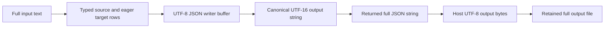

# Generated C# scalar-sequence memory profile

For the fixed 128-item workload, returning the captured string produced
33,558,419 bytes of JSON and reached 390,980–391,520 KiB (about 382 MiB)
ordinary managed-process peak RSS. Returning the integers produced 4,007 bytes
and reached 35,540–35,984 KiB (about 35 MiB). Allocation traces record string,
JSON serialization and buffer work, but do not establish an exact allocation
ledger or the cause of the whole-process peak.

This report addresses [#248](https://github.com/DeandreT/ferrule/issues/248).
It adds eight diagnostic observations to the
[72-row memory study](scalar-sequence-memory.md); those baseline rows remain
separate. The fixed generated subject, input and independent output literals
were unchanged throughout this campaign. No production optimization, streaming
implementation or new memory budget was introduced.

## Fixed workload and qualification

The input contains `Count:Int64 = 128`, then `Capture:String` with 262,144 ASCII
`x` bytes. Generate `1..=Count`, evaluate the capture once, keep every item and
map either the integer item or that capture. Numeric output contains ordered
values 1 through 128. Capture output repeats the complete string 128 times,
giving 33,554,432 bytes (32 MiB) of logical string content before JSON formatting.
The input is 262,171 bytes. Both outputs are two-space pretty UTF-8 JSON with a
final LF and no BOM.

The complete typed result is ordered `Group(Rows:Repeated(Group(Value)))`.
Numeric values have the Int64 tag; capture values have the String tag. All 129
Group origins are Unknown, with null identity and literal metadata. Every field,
item, value, origin and output byte was checked against independent frozen
expectations. No other backend supplied an oracle.

- [x] All eight measured calls and eight separate untimed verifiers exited
  successfully with complete retained output comparisons through EOF.
- [x] All four post-closure trace decoders completed; four independent actual
  review packets accepted the bounded observations.
- [x] All 20 command owners closed normally without cleanup, with their own
  source and protected-corpus guards preserved.

The public [fixture contract](../../examples/performance/scalar-sequences/fixtures.json)
and [measurement host](../../examples/performance/scalar-sequences/CSharpHost.cs)
describe the ordinary route. This campaign used the already built Debug
`net10.0` C# subject from that study: 958,976 bytes, SHA-256
`19431e927048359bf99042f21748184d62d3fe19e872712f74e5d1722bed0679`.
Collection completed on 2026-10-10 UTC, using Linux x86_64, `dotnet-trace`
10.0.750501 and a decoder pinned to TraceEvent 3.2.8. Full raw files, command
results, input/oracles, tools, binary and source identities are retained in the
verification archive; this table is a transcription, not a replacement for it.

## Eight observations and their measurement scopes

| Order | Mode | Repeat | GNU time scope | Peak RSS KiB | User s | System s | Wall s |
| ---: | --- | ---: | --- | ---: | ---: | ---: | ---: |
| 1 | Numeric | 1 | Managed child | 35,540 | 0.08 | 0.02 | 0.22 |
| 2 | Numeric | 1 | Collector + child tree | 40,696 | 0.22 | 0.04 | 0.42 |
| 3 | Capture | 1 | Managed child | 391,520 | 0.33 | 0.07 | 0.66 |
| 4 | Capture | 1 | Collector + child tree | 395,940 | 0.48 | 0.10 | 0.80 |
| 5 | Capture | 2 | Managed child | 390,980 | 0.30 | 0.06 | 0.51 |
| 6 | Capture | 2 | Collector + child tree | 396,260 | 0.47 | 0.09 | 0.76 |
| 7 | Numeric | 2 | Managed child | 35,984 | 0.08 | 0.01 | 0.15 |
| 8 | Numeric | 2 | Collector + child tree | 40,856 | 0.21 | 0.05 | 0.35 |

Repeat 1 ran numeric then capture; repeat 2 ran capture then numeric. Within
both modes the ordinary call preceded the traced call. These are two ordered
repetitions, without averaging, randomization or a claim of statistical
significance. GNU time's elapsed readings have coarse resolution.

The ordinary rows time the managed child. Traced rows time the collector command
and its managed-child tree. Their maxima are different scopes and are not a
simultaneous sum of collector and child memory. Subtracting those peaks does not
measure exact host tracing overhead. The observed ordinary wall ranges were
0.15–0.22 s for numeric and 0.51–0.66 s for capture; traced command ranges were
0.35–0.42 s and 0.76–0.80 s. Within the matched repetitions, traced-command wall
readings exceeded the preceding ordinary reading by 0.20/0.20 s for numeric and
0.14/0.25 s for capture. The observed 0.14–0.25 s range is a command-level
difference that includes collector work and possible perturbation. It does not
isolate mapping overhead or bound tracing cost for other inputs or hosts.

Both scopes include startup, input handling, the public JSON mapping,
serialization and writing the full returned output. Traced timing also includes
collector startup, collection/drain and rundown. Code generation, compilation,
fixture materialization, the separate verifier and post-closure decoder are
outside measurement. Output file I/O used mounted network storage. There was
no forced collection, cache flush, allocator replacement or optimization override.

The host also retained three `/proc` snapshots of its own managed process:
before the call, after the call and after writing. VmRSS and cumulative VmHWM
are sparse boundary observations, rather than stage peaks or the outer owner's
memory. Each snapshot retains the actual process identity and birth record.
Stopwatch readings were not aligned with EventPipe timestamps, so trace events
cannot be assigned to those three boundaries or to exact mapping stages.

Source guards cover four historical repository inventories, containing 2,205,
2,220, 2,220 and 2,215 files respectively. Each command preserved its own admitted
inventory; the fixed compiled subject and ten bound subject/input/oracle files
remained identical across all eight rows. This does not qualify every intervening
or current repository tree as the measured implementation.

## What the allocation traces expose

| Order | Mode | Repeat | NetTrace bytes | Allocation ticks | Raw events | Typed events | Other raw events retained |
| ---: | --- | ---: | ---: | ---: | ---: | ---: | ---: |
| 2 | Numeric | 1 | 646,386 | 22 | 2,590 | 2,585 | 5 |
| 4 | Capture | 1 | 690,706 | 161 | 2,935 | 2,928 | 7 |
| 6 | Capture | 2 | 693,282 | 161 | 2,949 | 2,942 | 7 |
| 8 | Numeric | 2 | 646,246 | 22 | 2,590 | 2,585 | 5 |

The collector used the existing `gc-verbose` profile, a 64 MiB event buffer and
default rundown. Raw version-4 `GCAllocationTick` payloads were checked against
the converted fields and complete recorded stacks. Event matching used complete
identity and payload fields, including timestamps and raw floating-point bits;
ordinal position was not the matching key. The typed event counts refer to the
matched raw/converted subset; the remaining five or seven raw events were also
retained. No loss, truncation, missing stack or unresolved frame was reported in
these four retained decodes. That bounded observation is not a guarantee that
sampling records every allocation.

Capture runs each recorded 161 allocation ticks, including 136 ticks whose
triggering type was `System.String`; the byte-array triggering-type counts were
16 and 17. These are tick records, not counts of every object allocated. Allocation
byte weights and the triggering object's size are separate fields. They do not
form an exact allocator ledger, live-heap measurement or RSS attribution.

Recorded stacks include ordinary JSON serialization, UTF-8 writer buffer growth,
output-string canonicalization, string decoding, `StringBuilder.ToString` and
host UTF-8 encoding. They also include input parsing, runtime/startup work and
the host's own phase diagnostics. Categories can overlap in one stack and cannot
be added as disjoint totals. The traces support investigating these paths; they
do not isolate filter/map allocation cost, establish a dominant cause, or prove
when objects became unreachable or were collected.

## Buffering and large-file implications

The retained generated source follows this complete-document path. The diagram
shows processing order; it does not assert simultaneous lifetimes or a peak-memory
allocation model.

[Serialization](../../runtime/csharp/Ferrule.Runtime/Json/FerruleJson.cs)
uses an `ArrayBufferWriter<byte>` and `Utf8JsonWriter` for the complete output.
[Canonicalization](../../runtime/csharp/Ferrule.Runtime/Json/FerruleJson.Canonical.cs)
reads those bytes, obtains string values and builds the canonical string with a
`StringBuilder`. The host receives the full string, encodes it into a full UTF-8
byte array and writes that array. The retained source supports possible costs
from these representations; their live overlap and reclamation timing require
separate evidence.

C# values hold immutable string references. Repeating the captured value therefore
does not, by itself, prove 128 distinct capture-string allocations. It still
requires 128 strings' worth of logical content in this returned JSON document.
The numeric control uses the same large capture input but returns small integers;
that difference separates output amplification from input width for this one
fixed workload.

The runtime's 64 MiB JSON document limit constrains encoded documents, rather
than whole-process RSS or all values in a mapping. In the retained serializer,
the output-byte check follows writer-buffer and canonical-string construction.
This successful output was below that document limit while ordinary RSS was
about 382 MiB. The 64 MiB diagnostic event buffer and observed 256 MiB trace-file
guard likewise are not process-memory ceilings. Trace-file polling is a soft
observed threshold, not a perfect hard file cap.

Massive-file planning must account for input representation, eager target values,
format buffers, returned documents and retained output storage separately. More
kept items or wider returned captures can amplify output content even when the
source document is small. Multiple documents and other graphs are outside this
single-output experiment. The separate verifier's typed/byte retention and the
archive's disk footprint are outside the timed child. No result here establishes
a RAM guarantee, general scalability boundary, streaming behavior or an approved
production optimization.
