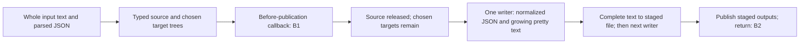

# Filesystem JSON output-set memory: 2026-10-08

A second output added 31.2–39.4 MiB to the measured process peak in four matched
pairs. Many-small-row peaks were 155.1–194.6 MiB; single-wide-value peaks were
120.3–152.4 MiB. All eight separate verifiers passed, checking twelve complete
output documents. These are observations from one ordinary debug-build workload,
not a universal memory bound or a statistically established result.
Scope: [#107](https://github.com/DeandreT/ferrule/issues/107).

## Workload and build

One ordinary filesystem JSON-to-JSON Project copies ordered `Rows` groups,
each containing `Id:Int` then `Text:String`. Selected-primary runs publish
`primary.json`; ordinary all-target runs publish Primary then the named `mirror`
at `named.json`. Both outputs have the same independently authored byte oracle.
Document `records_written` is 1, including the many-row workload. Static
`primary_outputs` is empty; the complete artifact list has one or two entries.

| Shape | Rows | Text UTF-8 bytes per row | Input bytes | Each output bytes |
| --- | ---: | ---: | ---: | ---: |
| Many small rows | 32,768 | 1,024 | 34,296,997 | 35,148,973 |
| Single wide value | 1 | 33,554,432 | 33,554,462 | 33,554,496 |

Text is the eight-digit row index, a colon, enough `x` characters to reach the
listed length, and a semicolon: 1,014 or 33,554,422 `x` bytes. Input is compact
strict JSON with final LF; the independent expected output uses two-space pretty
JSON with final LF. All bytes are UTF-8, without BOM. The identical 3,399-byte
Project bodies use fresh trial directories for the stored output paths. Fixture
generation and verification ran outside measurement.

| Fixture | Complete SHA-256 |
| --- | --- |
| Project | `19050a3cf66bfcad8c56d72d9236d71f32769406a9a765d5e0e4b7f170a323f6` |
| Many input | `972c7bb93619653e698f95fd9c3bc103a2f840ffcc26d2c1c74b347e5f6de66b` |
| Many expected / every published many output | `27303a4d26ce742df757e8e5bf76b7efe7ee938bb61c0fa01e8ee949f099793c` |
| Wide input | `b9e29419ced6496de1b9f8236988eadf2e7a0b82752e499d341a3c885e8a726f` |
| Wide expected / every published wide output | `2cee8faec100279f7fb386bdbdd659f64eacb863acfe4a66468364000f398dd3` |

| Recorded identity | Actual value |
| --- | --- |
| Source base | `6e7963cae9d74e6c96c5b02125bfa56bb11e167d` |
| Cargo.lock SHA-256 | `50584279f72d209089cf6327557323ffdc1656647a8535c3636e79616bcfffc2` |
| Benchmark source / fixture script SHA-256 | `5a9eba86dd4c7aca1c11d7ace7565f6e20e7397ab455f0752a3e5da2df4c5574` / `49387007d6f586bd63bc62883bda58d006d9dbd4da7c471380834caa90087824` |
| Compiler | Rust 1.100.0-nightly, commit `5a2be9f5f075d31e3ca5526b5b029881ce441253`, LLVM 23.1.1; x86_64 Linux |
| Compiler executable SHA-256 | `4602f29c6b0157b35b198248e361ce0d0c49c27b66ff15770f3a2c29e5415adf` |
| Benchmark executable | 378,461,056 bytes; SHA-256 `54ababde82c1f16b7dedc6953b0cfca93afb11955e2a0c3c7627485634a3aeb7` |
| GNU time | 1.10; executable SHA-256 `ccc576561484fe2c3f83bbceabfeba78408e59ac9c9a8161ad2a017b1037663d` |
| Effective build | Ordinary dev, unoptimized + debuginfo; no optimization override; shared target reused, jobs 1, incremental disabled |
| Host MemTotal | 32,773,216 KiB (31.255 GiB), unchanged in all retained before/after readings |

The actual shared build used
`CARGO_INCREMENTAL=0 cargo build --offline --locked -j 1 -p cli --example json_output_set_memory`.
Complete 2,058-body source inventories remained identical across all sixteen
measurement/verification invocations. Their canonical sorted compact JSON
SHA-256 is `8ebfcdb22d9ffaa4a0cd61069362a224568e8689def75cfdcbfcd8ab3b0553bf`.

## Repeating the workload

Run the [fixture preparer](../../scripts/performance/json_output_set_memory.py)
with a fresh absolute directory. Its `campaign.json` records all eight trials in
order, with complete `run_argv` and `verify_argv` arrays. Build the
[example host](../../crates/cli/examples/json_output_set_memory.rs) using the
command above. For each trial, pass `run_argv` after the compiled binary under
GNU `time -v`, retaining its full time output and the three printed boundary
records. Run `verify_argv` after the same binary in a separate, untimed process.
Do not time compilation or verification. Preserve each complete trial directory,
including any failure; use a new fixture directory for a new campaign. Record
source/tool identities, the effective build profile and available disk space
alongside new results before comparing them to this baseline.

## Individual trials

GNU `time -v` reports the measured child's genuine `wait4` maximum RSS,
converted from KiB to MiB. It excludes verifier and supervisor memory. CPU is
the child's user plus system time; wall is GNU time's elapsed value. Each
boundary column is **current VmRSS / cumulative VmHWM**, in MiB: B0 before
the public call; B1 evaluation complete, parsed input and all chosen targets
still live, before staging; B2 public call returned after publication. These
sparse readings cannot locate an exclusive parser, mapper or writer peak.

| # | Shape | Repeat | Outputs | Process peak MiB | B0 RSS / HWM | B1 RSS / HWM | B2 RSS / HWM | CPU / wall s | Measurement / verifier exit |
| ---: | --- | ---: | ---: | ---: | --- | --- | --- | --- | --- |
| 1 | Many | 1 | 1 | 155.1 | 10.4 / 10.4 | 122.2 / 142.4 | 122.2 / 155.1 | 1.61 / 1.62 | 0 / 0 |
| 2 | Many | 1 | 2 | 194.1 | 10.4 / 10.4 | 161.7 / 161.7 | 161.9 / 194.1 | 3.53 / 3.99 | 0 / 0 |
| 3 | Wide | 1 | 1 | 120.3 | 10.2 / 10.2 | 87.8 / 117.5 | 25.0 / 120.3 | 1.08 / 1.10 | 0 / 0 |
| 4 | Wide | 1 | 2 | 152.4 | 10.5 / 10.5 | 120.3 / 120.3 | 25.4 / 152.4 | 2.84 / 3.20 | 0 / 0 |
| 5 | Many | 2 | 2 | 194.6 | 10.2 / 10.2 | 162.4 / 162.4 | 162.5 / 194.6 | 3.13 / 3.17 | 0 / 0 |
| 6 | Many | 2 | 1 | 155.3 | 10.4 / 10.4 | 122.4 / 142.2 | 122.3 / 155.3 | 1.70 / 1.77 | 0 / 0 |
| 7 | Wide | 2 | 2 | 152.1 | 10.2 / 10.2 | 119.7 / 119.7 | 24.8 / 152.1 | 2.59 / 2.64 | 0 / 0 |
| 8 | Wide | 2 | 1 | 120.8 | 10.4 / 10.4 | 88.3 / 117.8 | 25.4 / 120.8 | 1.61 / 1.68 | 0 / 0 |

| Matched shape | Repeat | Two-output minus one-output peak |
| --- | ---: | ---: |
| Many | 1 | +39,940 KiB (+39.0 MiB; +25.15%) |
| Wide | 1 | +32,860 KiB (+32.1 MiB; +26.67%) |
| Many | 2 | +40,324 KiB (+39.4 MiB; +25.36%) |
| Wide | 2 | +31,992 KiB (+31.2 MiB; +25.86%) |

## Correctness, closure and disk

Eight separate, unmeasured verifiers passed complete ordered typed input/output
rows, selected/all-target engine outcomes, group origins, ordered `RunOutcome`
fields, and every output byte, hash and EOF. All eight primary and four named
documents matched the independent oracles. Full actual parser/engine/origin
originals preceded assertions. The accepted passive analysis preserved all
eight rows and no errors; all 45 numeric accept/refuse controls matched their
declared outcomes. Scoped example warnings and formatting checks also passed.

All sixteen measurement/verification invocations closed normally: genuine
child reaping, empty final census, lease release, unchanged source/survey and
all seven input/tool/body guards. There were no timeout, signal, cleanup or
primary/lifecycle/custody errors. The normal example build also closed normally.
Exit zero was checked alongside those original lifecycle and custody records.

Build free space was 24,980,070,400 bytes before and 25,023,070,208 after;
allocated shared target was 375,776,456,704 then 376,188,461,056 bytes.
Campaign free-space readings ranged from 24,827,129,856 to 24,878,493,696 bytes,
always above the coordinated 20 GiB reserve. The shared target stayed at
376,188,461,056 bytes throughout the sixteen invocations. Ordinary host/storage
activity means free-space differences cannot be attributed solely to this work.
The retained campaign, trial, build and tool-version originals comprise 221
files, 2,106,831,353 logical bytes (1.962 GiB) and 2,107,416,576 allocated bytes
by summed `st_blocks`. That inventory excludes immutable executables, the shared
target, private source/review packets and later analysis outputs; it is disk
evidence, not process RSS or unique physical-storage attribution.

- [x] Record the ordinary profile, compiler, complete source, fixtures and binaries.
- [x] Retain all eight time results and all twenty-four boundary observations.
- [x] Complete eight verifier runs and all twelve full-byte document comparisons.
- [x] Complete independent actual-evidence/report review.

## Source lifetimes and limits

[JSON reading and writing](../../crates/format-json/src/lib.rs) read the whole
input text, parse a JSON value, then build the typed input tree. Those parsing
allocations overlap during construction; the input text and parsed JSON value
are released when reading returns. [The filesystem run](../../crates/cli/src/lib.rs)
materializes the selected target or complete target set, calls `before_publish`
with the typed source still live, then explicitly drops that source and its
dynamic loader before the writers. This workload has no extra or dynamic inputs.

The [output batch](../../crates/cli/src/output_documents.rs) renders targets
serially while their mapped trees remain live. Each JSON normalization overlaps
the growing pretty string; normalization is released when `to_string` returns,
then the complete string is written. Staged files are disk data. Freed
allocations need not immediately reduce RSS because the allocator can retain
pages. The three observations and whole-process peak do not precisely attribute
memory to these lifetimes or bound all host RAM, filesystem cache or other tasks.

The second repetition reversed one/two order. Fixture preparation and verification
can warm filesystem caches; no cache flush, forced collection or allocator change
was made. Ordinary host activity remained possible. Startup, project/input
reading, mapping, serialization, publication and the boundary callback/record
overhead were all in the measured child scope. Two repeats do not establish
statistical significance, streaming, a universal RSS ceiling, generated-backend
behavior or full parity.

[The follow-up #184](https://github.com/DeandreT/ferrule/issues/184) scopes the
ordinary JSON writer's intermediate owned `serde_json::Value` tree:
[`to_string` currently calls `to_value` before rendering the pretty String](../../crates/format-json/src/lib.rs).
It will investigate removing that intermediate tree while preserving the returned
pretty String and complete current output/error behavior. Engine target ownership,
inputs, JSON5, generated backends, allocator and publication changes are outside
that issue. This campaign does not assign the whole peak or its pair difference
to the intermediate tree, and makes no optimization in this change. Any proposal
needs its own correctness checks and a matched comparison against these retained
workloads.
