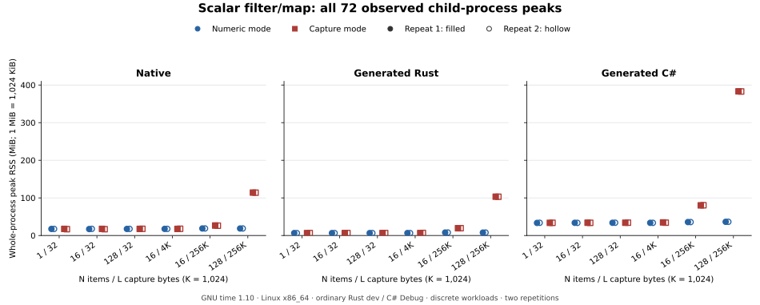
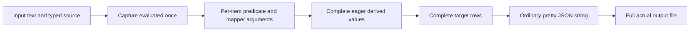

# Scalar filter/map memory measurements

The largest captured-string case produced a 32 MiB JSON document and reached
about 114 MiB whole-process peak RSS in native execution, 103 MiB in generated
Rust and 383 MiB in generated C#. All 72 measured processes exited successfully;
all 72 separate verifiers passed complete typed and byte comparisons. This is
evidence for one bounded eager workload, not a RAM guarantee for massive files.

The study addresses [#207](https://github.com/DeandreT/ferrule/issues/207).
[Every measured row](scalar-sequences/results.csv),
[all 36 matched pairs](scalar-sequences/pairs.csv) and
[the environment and executable/source hashes](scalar-sequences/environment.json)
are retained without averaging the two repetitions. Full raw process, time,
typed-outcome and file originals are retained separately by the coordinator;
these public datasets are portable transcriptions, not the raw receipt archive.

## Results

The largest dimension kept 128 items and captured 262,144 ASCII bytes. The numeric
mapping returned integers; the capture mapping returned the captured string for
each item. Numeric output was 4,007 bytes; capture output was 33,558,419 bytes.

| Backend | Repeat | Numeric peak KiB | Capture peak KiB | Capture − numeric KiB | Numeric wall s | Capture wall s |
| --- | ---: | ---: | ---: | ---: | ---: | ---: |
| Native | 1 | 19,044 | 116,808 | 97,764 | 0.05 | 1.15 |
| Native | 2 | 19,120 | 116,540 | 97,420 | 0.05 | 1.15 |
| Generated Rust | 1 | 7,828 | 105,660 | 97,832 | 0.04 | 1.12 |
| Generated Rust | 2 | 7,976 | 105,472 | 97,496 | 0.03 | 1.16 |
| Generated C# | 1 | 37,228 | 392,476 | 355,248 | 0.12 | 0.59 |
| Generated C# | 2 | 37,280 | 392,088 | 354,808 | 0.12 | 0.59 |

The plot uses a common linear MiB axis and discrete workload categories. Filled
markers are repeat 1; hollow markers are repeat 2. Small differences can overlap
at this scale; the CSV retains the exact KiB readings and signed pair differences,
including cases where capture was slightly below numeric. Timing has GNU time's
coarse resolution. These two repetitions do not establish statistical significance
or a general performance ranking between languages.

## Workload and measured boundary

The input has `Count:Int` followed by `Capture:String`, containing exactly L ASCII
`x` bytes. Generate `1..=Count`, evaluate the capture once, keep every item and map
either the integer item or the captured string. Both stages declare item, input
position and capture in that order. The output is ordered
`Group(Rows:Repeated(Group(Value:Int|String)))`; every Group origin is Unknown.
No named target, source loader, failure rule, nested function or JSON5 route is used.

| Kept items N | Capture bytes L | Input bytes | Numeric output bytes | Capture output bytes |
| ---: | ---: | ---: | ---: | ---: |
| 1 | 32 | 57 | 49 | 82 |
| 16 | 32 | 58 | 506 | 1,027 |
| 128 | 32 | 59 | 4,007 | 8,083 |
| 16 | 4,096 | 4,122 | 506 | 66,051 |
| 16 | 262,144 | 262,170 | 506 | 4,194,819 |
| 128 | 262,144 | 262,171 | 4,007 | 33,558,419 |

Input is compact UTF-8 JSON with final LF. Output is independently fixed two-space
pretty JSON with final LF and no BOM. Numeric bytes are
`19 + 29*N + sum(decimal_digits(1..N))`; capture bytes are `19 + 31*N + N*L`.
The [fixture contract](../../examples/performance/scalar-sequences/fixtures.json)
fixes complete typed recipes, byte grammar and trial order.

Six dimensions vary N at L=32, L at N=16 and one large N/L corner. Two repetitions
reverse dimension, backend and mode order. Each measured child executes exactly
one ordinary public JSON mapping and writes its returned output once. Built
native/Rust executables and an already built C# DLL are timed; fixture preparation,
code generation, compilation and the separate verifier are outside measurement.
Startup, input handling, mapping, JSON serialization and output file I/O are included.

Native execution includes ordinary saved-Project decoding. Its parsed source and
target are local to the parse/run/serialize call and drop before the host writes
the returned string; input text and the decoded Project remain in the outer host scope.
Generated calls include their existing embedded-schema handling and lifetimes.
C# collection timing is left to the runtime. These routes have different startup,
representation and retention costs, so cross-backend differences cannot be
attributed to the filter/map stage alone.

Native/Rust `Value::String` owns a String; argument adaptation and target
construction can clone strings. C# `FerruleValue` holds immutable string
references. Logical output content `N*L` therefore does not establish allocation
count or distinct physical strings. Reclaimed allocations need not promptly leave
RSS. The measurements do not identify the allocations responsible for the larger
C# peak. [#248](https://github.com/DeandreT/ferrule/issues/248) scopes that profiling
work separately, before any production optimization.

## Environment, verification and limits

Measured on 2026-10-09, baseline main `c45893255954bd725c87450410a3c4ce752fd8f1`,
Linux x86_64 kernel `7.2.7-zen1-1-zen`, Ryzen 7 5800X3D and MemTotal 32,773,216 KiB.
Native and generated Rust used ordinary unoptimized dev builds with rustc
`1.100.0-nightly (5a2be9f5f 2026-09-06)`; C# used Debug, .NET SDK 10.0.112/runtime
10.0.12 and invariant globalization. GNU time was 1.10. Builds were serial,
offline/locked for Rust, package-free for C#, with incremental compilation disabled
and host warnings denied. There was no optimization override, forced collection,
cache flush or allocator replacement. Output used mounted network storage; its
normal file I/O is included in elapsed time.

`peak_rss_kib` is GNU time's whole measured-child maximum from `wait4`, excluding
the outer coordinator, compiler and verifier. The six boundary columns separately
record self-reported `/proc/self/status` VmRSS and cumulative VmHWM before the
call, after the call and after file writing. These are sparse observations, not
parser/stage/writer phase peaks. The counters differ: in 15 native rows a boundary
VmHWM exceeds GNU time's reported maximum. Both originals are preserved; neither
is substituted for or normalized to the other.

The verifiers retain complete typed source/output outcomes, exact scalar tags and
values, ordered fields/items, Group origins, error causes and unexpected float
bits before comparisons. They compare every actual output byte through EOF to an
independent oracle; another backend is never the oracle. Root review and separate
reviewers accepted each backend's 24 measured/24 verifier cohort. All 144 calls
had normal, cleanup-free owned process closure, unchanged source/survey inputs
and at least 20 GiB free disk at admission and completion.

Two small three-item output cases per backend and six direct error-recorder
controls were qualified separately before the campaign; they are not among the
72 measured rows. Preparation failures were retained: the first native build
used a private validation-module path, and the first composed generated-Rust lock
attempt had nested workspace roots. Corrections use the public validation facade,
a Linux-only study module and study-only member-manifest packaging; complete raw
emitted artifact sets remain retained. A missing system GNU time path was resolved
by using an already qualified local GNU time binary. No failed attempt is promoted
to a successful measurement or omitted from the retained preparation evidence.

Every study document is below 64 MiB. The generated JSON document bound, native
host admission and existing item/work limits do not bound eager process RAM.
This ASCII scalar study does not cover arbitrary encodings, malformed/hostile
inputs, large structured documents, other formats, streaming, release builds,
selected-target execution, cancellation or long-lived host behavior. Filesystem
caches, ordinary machine activity, allocator retention and JIT/runtime startup
can affect results. No total-RAM ceiling, precise phase attribution, hard-time
guarantee or production memory improvement is claimed.

- [x] Independently review the bounded Projects and full fixture/oracle recipes.
- [x] Materialize and seal all full fixtures before compilation or measurement.
- [x] Qualify native/Rust/C# hosts and complete artifact/source identities.
- [x] Run all 72 matched trials and separate complete typed/byte verifiers.
- [x] Independently review every raw row and owned lifecycle record.
- [x] Complete independent dataset/prose/plot review before publication.

See [reproduction instructions](../../examples/performance/scalar-sequences/README.md).
